<h3>Linux Distribution</h3>

So, what is a Linux distribution and how does it relate to the Linux kernel?

The Linux kernel is the core of the operating system. A full Linux distribution consists of the kernel plus a number of other software tools for file-related operations, user management, and software package management. Each of these tools provides a part of the complete system. Each tool is often its own separate project, with its own developers working to perfect that piece of the system.

While the most recent Linux kernel (and earlier versions) can always be found in The Linux Kernel Archives, Linux distributions may be based on different kernel versions. For example, the very popular RHEL 8 distribution is based on the 4.18 kernel, which is not new, but is extremely stable. Other distributions may move more quickly in adopting the latest kernel releases. It is important to note that the kernel is not an all or nothing proposition, for example, RHEL/CentOS have incorporated many of the more recent kernel improvements into their older versions, as have Ubuntu, openSUSE, SLES, etc.

Examples of other essential tools and ingredients provided by distributions include the C/C++ and Clang compilers, the gdb debugger, the core system libraries applications need to link with in order to run, the low-level interface for drawing graphics on the screen, as well as the higher-level desktop environment, and the system for installing and updating the various components, including the kernel itself. And all distributions come with a rather complete suite of applications already installed.

<h3>Services Associated with Distributions</h3>

The vast variety of Linux distributions are designed to cater to many different audiences and organizations, according to their specific needs and tastes. However, large organizations, such as companies and governmental institutions and other entities, tend to choose the major commercially-supported distributions from Red Hat, SUSE, and Canonical (Ubuntu).

CentOS and CentOS Stream are popular free (as in no cost) alternatives to Red Hat Enterprise Linux (RHEL) and are often used by organizations that are comfortable operating without paid technical support. Ubuntu and Fedora are widely used by developers and are also popular in the educational realm. Scientific Linux is favored by the scientific research community for its compatibility with scientific and mathematical software packages. Both CentOS variants are binary-compatible with RHEL; i.e. in most cases, binary software packages will install properly across the distributions.

Note that CentOS is planned to disappear at the end of 2021 in favor of CentOS Stream. However, there are at least two new RHEL-derived substitutes: Alma Linux and Rocky Linux which are establishing a foothold.

Many commercial distributors, including Red Hat, Ubuntu, SUSE, and Oracle, provide long term fee-based support for their distributions, as well as hardware and software certification. All major distributors provide update services for keeping your system primed with the latest security and bug fixes, and performance enhancements, as well as provide online support resources.

<h3>The Boot Process</h3>

The Linux boot process is the procedure for initializing the system. It consists of everything that happens from when the computer power is first switched on until the user interface is fully operational.

Having a good understanding of the steps in the boot process may help you with troubleshooting problems, as well as with tailoring the computer's performance to your needs.

On the other hand, the boot process can be rather technical, and you can start using Linux without knowing all the details.

<b>NOTE</b>: <i>You may want to come back and study this section later, if you want to first get a good feel for how to use a Linux system.</i>

<h3>BIOS - The First Step</h3>

Starting an x86-based Linux system involves a number of steps. When the computer is powered on, the Basic Input/Output System (BIOS) initializes the hardware, including the screen and keyboard, and tests the main memory. This process is also called POST (Power On Self Test).

The BIOS software is stored on a ROM chip on the motherboard. After this, the remainder of the boot process is controlled by the operating system (OS).

<h3>Master Boot Record (MBR) and Boot Loader</h3>

Once the POST is completed, the system control passes from the BIOS to the boot loader. The boot loader is usually stored on one of the hard disks in the system, either in the boot sector (for traditional BIOS/MBR systems) or the EFI partition (for more recent (Unified) Extensible Firmware Interface or EFI/UEFI systems). Up to this stage, the machine does not access any mass storage media. Thereafter, information on date, time, and the most important peripherals are loaded from the CMOS values (after a technology used for the battery-powered memory store which allows the system to keep track of the date and time even when it is powered off).

A number of boot loaders exist for Linux; the most common ones are GRUB (for GRand Unified Boot loader), ISOLINUX (for booting from removable media), and DAS U-Boot (for booting on embedded devices/appliances). Most Linux boot loaders can present a user interface for choosing alternative options for booting Linux, and even other operating systems that might be installed. When booting Linux, the boot loader is responsible for loading the kernel image and the initial RAM disk or filesystem (which contains some critical files and device drivers needed to start the system) into memory.

<h3>Boot Loader in Action</h3>

The boot loader has two distinct stages:

For systems using the BIOS/MBR method, the boot loader resides at the first sector of the hard disk, also known as the Master Boot Record (MBR). The size of the MBR is just 512 bytes. In this stage, the boot loader examines the partition table and finds a bootable partition. Once it finds a bootable partition, it then searches for the second stage boot loader, for example GRUB, and loads it into RAM (Random Access Memory). For systems using the EFI/UEFI method, UEFI firmware reads its Boot Manager data to determine which UEFI application is to be launched and from where (i.e. from which disk and partition the EFI partition can be found). The firmware then launches the UEFI application, for example GRUB, as defined in the boot entry in the firmware's boot manager. This procedure is more complicated, but more versatile than the older MBR methods.

<h3>Initial RAM Disk</h3>

The initramfs filesystem image contains programs and binary files that perform all actions needed to mount the proper root filesystem, like providing kernel functionality for the needed filesystem and device drivers for mass storage controllers with a facility called udev (for user device), which is responsible for figuring out which devices are present, locating the device drivers they need to operate properly, and loading them. After the root filesystem has been found, it is checked for errors and mounted.

The mount program instructs the operating system that a filesystem is ready for use, and associates it with a particular point in the overall hierarchy of the filesystem (the mount point). If this is successful, the initramfs is cleared from RAM and the init program on the root filesystem (/sbin/init) is executed.

init handles the mounting and pivoting over to the final real root filesystem. If special hardware drivers are needed before the mass storage can be accessed, they must be in the initramfs image.

<h3>Text-Mode Login</h3>

Near the end of the boot process, init starts a number of text-mode login prompts. These enable you to type your username, followed by your password, and to eventually get a command shell. However, if you are running a system with a graphical login interface, you will not see these at first.

As you will learn in Chapter 7: Command Line Operations, the terminals which run the command shells can be accessed using the ALT key plus a function key. Most distributions start six text terminals and one graphics terminal starting with F1 or F2. Within a graphical environment, switching to a text console requires pressing CTRL-ALT + the appropriate function key (with F7 or F1 leading to the GUI).

Usually, the default command shell is bash (the GNU Bourne Again Shell), but there are a number of other advanced command shells available. The shell prints a text prompt, indicating it is ready to accept commands; after the user types the command and presses Enter, the command is executed, and another prompt is displayed after the command is done.

<h3>The Linux Kernel</h3>

The boot loader loads both the kernel and an initial RAM–based file system (initramfs) into memory, so it can be used directly by the kernel.

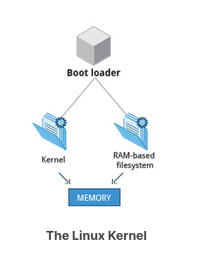

When the kernel is loaded in RAM, it immediately initializes and configures the computer’s memory and also configures all the hardware attached to the system. This includes all processors, I/O subsystems, storage devices, etc. The kernel also loads some necessary user space applications.

<h3>/sbin/init and Services</h3>

Once the kernel has set up all its hardware and mounted the root filesystem, the kernel runs /sbin/init. This then becomes the initial process, which then starts other processes to get the system running. Most other processes on the system trace their origin ultimately to init; exceptions include the so-called kernel processes. These are started by the kernel directly, and their job is to manage internal operating system details.

Besides starting the system, init is responsible for keeping the system running and for shutting it down cleanly. One of its responsibilities is to act when necessary as a manager for all non-kernel processes; it cleans up after them upon completion, and restarts user login services as needed when users log in and out, and does the same for other background system services.

Traditionally, this process startup was done using conventions that date back to the 1980s and the System V variety of UNIX. This serial process had the system passing through a sequence of runlevels containing collections of scripts that start and stop services. Each runlevel supported a different mode of running the system. Within each runlevel, individual services could be set to run, or to be shut down if running.

However, all major distributions have moved away from this sequential runlevel method of system initialization, although they usually emulate many System V utilities for compatibility purposes. Next, we discuss the new methods, of which systemd has become dominant.

<h3>Startup Alternatives</h3>

SysVinit viewed things as a serial process, divided into a series of sequential stages. Each stage required completion before the next could proceed. Thus, startup did not easily take advantage of the parallel processing that could be done on multiple processors or cores.

Furthermore, shutdown and reboot was seen as a relatively rare event; exactly how long it took was not considered important. This is no longer true, especially with mobile devices and embedded Linux systems. Some modern methods, such as the use of containers, can require almost instantaneous startup times. Thus, systems now require methods with faster and enhanced capabilities. Finally, the older methods required rather complicated startup scripts, which were difficult to keep universal across distribution versions, kernel versions, architectures, and types of systems. The two main alternatives developed were:

Upstart

            Developed by Ubuntu and first included in 2006
            Adopted in Fedora 9 (in 2008) and in RHEL 6 and its clones

systemd

            Adopted by Fedora first (in 2011)
            Adopted by RHEL 7 and SUSE 
            Replaced Upstart in Ubuntu 16.04

While the migration to systemd was rather controversial, it has been adopted by all major distributions, and so we will not discuss the older System V method or Upstart, which has become a dead end. Regardless of how one feels about the controversies or the technical methods of systemd, almost universal adoption has made learning how to work on Linux systems simpler, as there are fewer differences among distributions. We enumerate systemd features next.

<h3>systemd Features</h3>

Systems with systemd start up faster than those with earlier init methods. This is largely because it replaces a serialized set of steps with aggressive parallelization techniques, which permits multiple services to be initiated simultaneously.

Complicated startup shell scripts are replaced with simpler configuration files, which enumerate what has to be done before a service is started, how to execute service startup, and what conditions the service should indicate have been accomplished when startup is finished. One thing to note is that /sbin/init now just points to /lib/systemd/systemd; i.e. systemd takes over the init process.

One systemd command (systemctl) is used for most basic tasks. While we have not yet talked about working at the command line, here is a brief listing of its use:

- Starting, stopping, restarting a service (using httpd, the Apache web server, as an example) on a currently running system:
    `$ sudo systemctl start|stop|restart httpd.service`
- Enabling or disabling a system service from starting up at system boot:
            `$ sudo systemctl enable|disable httpd.service`

    In most cases, the .service can be omitted. There are many technical differences with older methods that lie beyond the scope of our discussion.  

<h3>Linux Filesystems</h3>

Think of a refrigerator that has multiple shelves that can be used for storing various items. These shelves help you organize the grocery items by shape, size, type, etc. The same concept applies to a filesystem, which is the embodiment of a method of storing and organizing arbitrary collections of data in a human-usable form.

Different types of filesystems supported by Linux:

- Conventional disk filesystems: ext3, ext4, XFS, Btrfs, JFS, NTFS, vfat, exfat, etc.
- Flash storage filesystems: ubifs, jffs2, yaffs, etc.
- Database filesystems
- Special purpose filesystems: procfs, sysfs, tmpfs, squashfs, debugfs, fuse, etc.

This section will describe the standard filesystem layout shared by most Linux distributions.

<h3>Partitions and Filesystems</h3>

A partition is a physically contiguous section of a disk, or what appears to be so in some advanced setups.

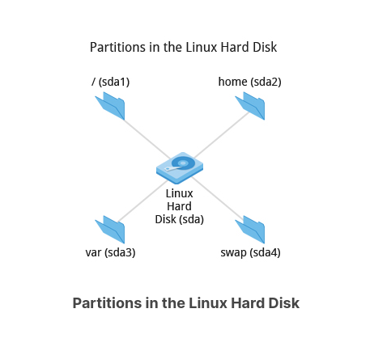

A filesystem is a method of storing/finding files on a hard disk (usually in a partition).

One can think of a partition as a container in which a filesystem resides, although in some circumstances, a filesystem can span more than one partition if one uses symbolic links, which we will discuss much later.

<h3>The Filesystem Hierarchy Standard</h3>

Linux systems store their important files according to a standard layout called the Filesystem Hierarchy Standard (FHS), which has long been maintained by the Linux Foundation. For more information, take a look at the following document: "Filesystem Hierarchy Standard" created by LSB Workgroup. Having a standard is designed to ensure that users, administrators, and developers can move between distributions without having to re-learn how the system is organized.

Linux uses the ‘/’ character to separate paths (unlike Windows, which uses ‘\’), and does not have drive letters. Multiple drives and/or partitions are mounted as directories in the single filesystem. Removable media such as USB drives and CDs and DVDs will show up as mounted at /run/media/yourusername/disklabel for recent Linux systems, or under /media for older distributions. For example, if your username is student a USB pen drive labeled FEDORA might end up being found at /run/media/student/FEDORA, and a file README.txt on that disc would be at /run/media/student/FEDORA/README.txt.

<h3>More About the Filesystem Hierarchy Standard</h3>

All Linux filesystem names are case-sensitive, so /boot, /Boot, and /BOOT represent three different directories (or folders). Many distributions distinguish between core utilities needed for proper system operation and other programs, and place the latter in directories under /usr (think user). To get a sense for how the other programs are organized, find the /usr directory in the diagram from the previous page and compare the subdirectories with those that exist directly under the system root directory (/).

<h3>Questions to Ask When Choosing a Distribution</h3>

Some questions worth thinking about before deciding on a distribution include:

- What is the main function of the system (server or desktop)?
- What types of packages are important to the organization? For example, web server, word processing, etc.
- How much hard disk space is required and how much is available? For example, when installing Linux on an embedded device, space is usually constrained.
- How often are packages updated?
- How long is the support cycle for each release? For example, LTS releases have long-term support.
- Do you need kernel customization from the vendor or a third party?
- What hardware are you running on? For example, it might be X86, ARM, PPC, etc.
- Do you need long-term stability? Can you accept (or need) a more volatile cutting edge system running the latest software?

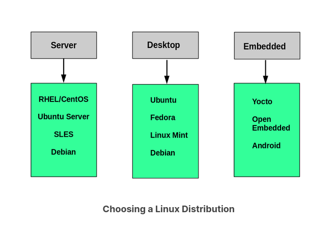

<h3>Linux Installation: Planning</h3>

The partition layout needs to be decided at the time of installation; it can be difficult to change later. While Linux systems handle multiple partitions by mounting them at specific points in the filesystem, and you can always modify the design later, it is always easier to try and get it right to begin with.

Nearly all installers provide a reasonable default layout, with either all space dedicated to normal files on one big partition and a smaller swap partition, or with separate partitions for some space-sensitive areas like /home and /var. You may need to override the defaults and do something different if you have special needs, or if you want to use more than one disk.

<h3>Linux Installation: Software Choices</h3>

All installations include the bare minimum software for running a Linux distribution.

Most installers also provide options for adding categories of software. Common applications (such as the Firefox web browser and LibreOffice office suite), developer tools (like the vi and emacs text editors, which we will explore later in this course), and other popular services, (such as the Apache web server tools or MySQL database) are usually included. In addition, for any system with a graphical desktop, a chosen desktop (such as GNOME or KDE) is installed by default.

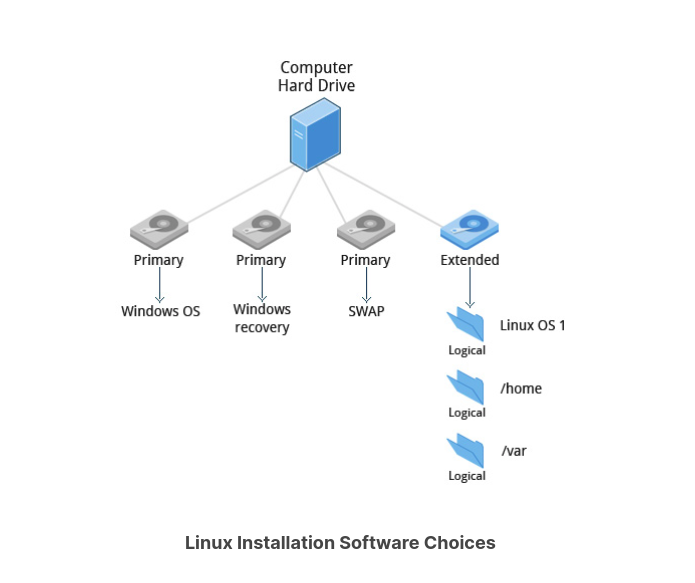

All installers set up some initial security features on the new system. One basic step consists of setting the password for the superuser (root) and setting up an initial user. In some cases (such as Ubuntu), only an initial user is set up; direct root login is not configured and root access requires logging in first as a normal user and then using sudo, as we will describe later. Some distributions will also install more advanced security frameworks, such as SELinux or AppArmor. For example, all Red Hat-based systems including Fedora and CentOS always use SELinux by default, and Ubuntu comes with AppArmor up and running.

<h3>Linux Installation: Install Source</h3>

Like other operating systems, Linux distributions are provided on removable media such as USB drives and CDs or DVDs. Most Linux distributions also support booting a small image and downloading the rest of the system over the network. These small images are usable on media, or as network boot images, in which case it is possible to perform an install without using any local media.

Many installers can do an installation completely automatically, using a configuration file to specify installation options. This file is called a Kickstart file for Red Hat-based systems, an AutoYAST profile for SUSE-based systems, and a Preseed file for Debian-based systems.

Each distribution provides its own documentation and tools for creating and managing these files.

<h3>Linux Installation: The Process</h3>

The actual installation process is pretty similar for all distributions.

After booting from the installation media, the installer starts and asks questions about how the system should be set up. These questions are skipped if an automatic installation file is provided. Then, the installation is performed.

Finally, the computer reboots into the newly-installed system. On some distributions, additional questions are asked after the system reboots.

Most installers have the option of downloading and installing updates as part of the installation process; this requires Internet access. Otherwise, the system uses its normal update mechanism to retrieve those updates after the installation is done.

<b>NOTE</b>: <i>We will be demonstrating the installation process in each of the three Linux distribution families we cover in this course. You can view a demonstration for the distribution type of your choice.</i>

<h3>Linux Installation: The Warning</h3>

<b>IMPORTANT!</b>

The demonstrations show how to install Linux directly on your machine, erasing everything that was there. While the demonstrations will not alter your computer, following these procedures in real life will erase all current data.

The Linux Foundation has a document: "Preparing Your Computer for Linux Training" (see below) that describes alternate methods of installing Linux without over-writing existing data. You may want to consult it, if you need to preserve the information on your hard disk.

These alternate methods are:

1. Re-partitioning your hard disk to free up enough room to permit dual boot (side-by-side) installation of Linux, along with your present operating system.
2. Using a host machine hypervisor program (such as VMWare's products or Oracle Virtual Box) to install a client Linux Virtual Machine.
3. Booting off of and using a Live CD or USB stick and not writing to the hard disk at all.

The first method is sometimes complicated and should be done when your confidence is high and you understand the steps involved. The second and third methods are quite safe and make it difficult to damage your system.

<h3>Chapter Summary</h3>

You have completed Chapter 3. Let’s summarize the key concepts covered:

- A partition is a logical part of the disk.
- A filesystem is a method of storing/finding files on a hard disk.
- By dividing the hard disk into partitions, data can be grouped and separated as needed. When a failure or mistake occurs, only the data in the affected partition will be damaged, while the data on the other partitions will likely survive.
- The boot process has multiple steps, starting with BIOS, which triggers the boot loader to start up the Linux kernel. From there, the initramfs filesystem is invoked, which triggers the init program to complete the startup process.
- Determining the appropriate distribution to deploy requires that you match your specific system needs to the capabilities of the different distributions.

<h3>Learning Objectives</h3>

By the end of this chapter, you should be able to:

- Manage graphical interface sessions.
- Perform basic operations using the graphical interface.
- Change the graphical desktop to suit your needs.

### Graphical Desktop

You can use either a Command Line Interface (CLI) or a Graphical User Interface (GUI) when using Linux. To work at the CLI, you have to remember which programs and commands are used to perform tasks, and how to quickly and accurately obtain more information about their use and options. On the other hand, using the GUI is often quick and easy. It allows you to interact with your system through graphical icons and screens. For repetitive tasks, the CLI is often more efficient, while the GUI is easier to navigate if you do not remember all the details or do something only rarely. 

We will learn how to manage sessions using the GUI for the three Linux distribution families that we cover the most in this course: Red Hat (CentOS, Fedora), SUSE (openSUSE), and Debian (Ubuntu, Mint). Since we are using the GNOME-based variant of openSUSE rather than the KDE-based one, all are actually quite similar. If you are using KDE (or other Linux desktops such as XFCE), your experience will vary somewhat from what is shown, but not in any intrinsically difficult way, as user interfaces have converged to certain well-known behaviors on modern operating systems. In subsequent sections of this course we will concentrate in great detail on the command line interface, which is pretty much the same on all distributions.

### X Window System

Generally, in a Linux desktop system, the X Window System is loaded as one of the final steps in the boot process. It is often just called X.

A service called the Display Manager keeps track of the displays being provided and loads the X server (so-called, because it provides graphical services to applications, sometimes called X clients). The display manager also handles graphical logins and starts the appropriate desktop environment after a user logs in.

X is rather old software; it dates back to the mid 1980s and, as such, has certain deficiencies on modern systems (for example, with security), as it has been stretched rather far from its original purposes. A newer system, known as Wayland, is gradually superseding it and is the default display system for Fedora, RHEL 8, and other recent distributions.  For the most part, it looks just like X to the user, although under the hood it is quite different.

### More About X

A desktop environment consists of a session manager, which starts and maintains the components of the graphical session, and the window manager, which controls the placement and movement of windows, window title-bars, and controls.

Although these can be mixed, generally a set of utilities, session manager, and window manager are used together as a unit, and together provide a seamless desktop environment.

If the display manager is not started by default in the default runlevel, you can start the graphical desktop different way, after logging on to a text-mode console, by running startx from the command line. Or, you can start the display manager (gdm, lightdm, kdm, xdm, etc.) manually from the command line. This differs from running startx as the display managers will project a sign in screen. We discuss them next.

### GUI Startup

When you install a desktop environment, the X display manager starts at the end of the boot process. It is responsible for starting the graphics system, logging in the user, and starting the user’s desktop environment. You can often select from a choice of desktop environments when logging in to the system.

The default display manager for GNOME is called gdm. Other popular display managers include lightdm (used on Ubuntu before version 18.04 LTS) and kdm (associated with KDE).

### GNOME Desktop Environment

GNOME is a popular desktop environment with an easy-to-use graphical user interface. It is bundled as the default desktop environment for most Linux distributions, including Red Hat Enterprise Linux (RHEL), Fedora, CentOS, SUSE Linux Enterprise, Ubuntu and Debian. GNOME has menu-based navigation and is sometimes an easy transition to accomplish for Windows users. However, as you will see, the look and feel can be quite different across distributions, even if they are all using GNOME.

Another common desktop environment very important in the history of Linux and also widely used is KDE, which has often been used in conjunction with SUSE and openSUSE. Other alternatives for a desktop environment include Unity (present on older Ubuntu, but still based on GNOME), XFCE and LXDE. As previously mentioned, most desktop environments follow a similar structure to GNOME, and we will restrict ourselves mostly to it to keep things less complex.

### Graphical Desktop Background

Each Linux distribution comes with its own set of desktop backgrounds. You can change the default by choosing a new wallpaper or selecting a custom picture to be set as the desktop background. If you do not want to use an image as the background, you can select a color to be displayed on the desktop instead.

In addition, you can also change the desktop theme, which changes the look and feel of the Linux system. The theme also defines the appearance of application windows.

### Customizing the Desktop Background

To change the background, you can right click anywhere on the desktop and choose Change Background. 

### gnome-tweaks

Most common settings, both personal and system-wide, are to be found by clicking in the upper right-hand corner, on either a gear or other obvious icon, depending on your Linux distribution.

However, there are many settings which many users would like to modify which are not thereby accessible; the default settings utility is unfortunately rather limited in modern GNOME-based distributions. Unfortunately, the quest for simplicity has actually made it difficult to adapt your system to your tastes and needs.  

Fortunately, there is a standard utility, gnome-tweaks, which exposes many more setting options. It also permits you to easily install extensions by external parties. Not all Linux distributions install this tool by default, but it is always available (older distributions used the name gnome-tweak-tool). You may have to run it by hitting Alt-F2 and then typing in the name. You may want to add it to your Favorites list as we shall discuss.

As discussed in the next chapter, some recent distributions have taken most of the functionality out of this tool and placed it in a new one, called gnome-extensions-app.

In the screenshot below, the keyboard mapping is being adjusted so the useless CapsLock key can be used as an additional Ctrl key; this saves users who use Ctrl a lot (such as emacs aficionados) from getting physically damaged by pinkie strain.

### Changing the Theme

The visual appearance of applications (the buttons, scroll bars, widgets, and other graphical components) are controlled by a theme. GNOME comes with a set of different themes which can change the way your applications look. 

The exact method for changing your theme may depend on your distribution. For older GNOME-based distributions, you can simply run gnome-tweaks, as shown in the screenshot from Ubuntu. However, as mentioned earlier, if you don't find it there, you will need to look at gnome-extensions-app, which can now configure themes. This requires installing even more software and going to external websites, so it is unlikely to be seen as an improvement by many users.

There are other options to get additional themes beyond the default selection. You can download and install themes from the GNOME's Wiki website.

### Lab 4.1: Customizing the Desktop

Despite the length of this section, we will not do very elaborate step-by-step lab exercises, because of the diversity of Linux distributions and versions, and because they each customize their desktops, even if the underlying code base is the same. Trying to give exact instructions is an exercise in futility; not only are there many variations, they are susceptible to change every time a new version of a Linux distribution is released.

For the most part, this is not a problem. Graphical interfaces are designed to be easy to navigate and figure out, and they really do not vary very much, not only from one distribution to another, but even between operating systems. So, the only way you can get more adept at working efficiently on your desktop is to simply explore, play, and modify. The same points will apply to the next chapter, on graphical system configuration.

Linux is so customizable that very few people who use it stay with the default look and feel of the desktop. You may as well get started now in making your desktop reflect your likes and personality.

- Start by changing the desktop background to something that better suits yours tastes; perhaps one of the provided backgrounds, a solid color of your choice, or a personal picture that you can transfer onto your Linux environment.
- Next, select a theme from the available themes for your distribution that, again, suits your tastes and personality. Have fun and explore with this exercise.

Click the link below to view a solution to the Lab exercise.

### Logging In and Out

The next screen shows a demonstration for logging in and out on the major Linux distribution families we concentrate on in this course. Note that evolution has brought us to a stage where it little matters which distribution you choose, as they are all rather similar.

### Locking the Screen

It is often a good idea to lock your screen to prevent other people from accessing your session while you are away from your computer.

<i><b>NOTE</b>: This does not suspend the computer; all your applications and processes continue to run while the screen is locked.</i>

There are two ways to lock your screen:

- Using the graphical interface
Clicking in the upper-right corner of the desktop, and then clicking on the lock icon.
- Using the keyboard shortcut SUPER-L 
(The SUPER key is also known as the Windows key). 

The keyboard shortcut for locking the screen can be modified by altering keyboard settings, the exact prescription varying by distribution, but not hard to ascertain.

To re-enter the desktop session you just need to provide your password again.

The screenshot below shows how to lock the screen for Ubuntu. The details vary little in modern distributions.

### Switching Users

Linux is a true multi-user operating system, which allows more than one user to be simultaneously logged in. If more than one person uses the system, it is best for each person to have their own user account and password. This allows for individualized settings, home directories, and other files. Users can take turns using the machine, while keeping everyone's sessions alive, or even be logged in simultaneously through the network.

### Shutting Down and Restarting

Besides normal daily starting and stopping of the computer, a system restart may be required as part of certain major system updates, generally only those involving installing a new Linux kernel.

Initiating the shutdown process from the graphical desktop is rather trivial on all current Linux distributions, with very little variation. We will discuss later how to do this from the command line, using the shutdown command.

In all cases, you click on either a settings (gear) or a power icon and follow the prompts. 

### Shutting Down and Restarting on GNOME

To shut down the computer in any recent GNOME-based Linux distribution, perform the following steps:

1. Click either the Power or the Gear icon in the upper-right corner of the screen.
2. Click on Power Off, Restart, or Cancel. If you do nothing, the system will shutdown in 60 seconds.

Shutdown, reboot, and logout operations will ask for confirmation before going ahead. This is because many applications will not save their data properly when terminated this way.

Always save your documents and data before restarting, shutting down, or logging out. 

### Suspending

All modern computers support Suspend (or Sleep) Mode when you want to stop using your computer for a while. Suspend Mode saves the current system state and allows you to resume your session more quickly while remaining on, but uses very little power in the sleeping state. It works by keeping your system’s applications, desktop, and so on, in system RAM, but turning off all of the other hardware. This shortens the time for a full system start-up as well as conserves battery power. One should note that modern Linux distributions actually boot so fast that the amount of time saved is often minor.

### Suspending the System

To suspend the system, the procedure starts the same as that for shutdown or locking the screen.  

The method is quite simple and universal in most recent GNOME-based distributions. If you click on the Power icon and hold for a short time and release, you will get the double line icon displayed below, which you then click to suspend the system. Some distributions, including Ubuntu, may still show a separate Suspend icon instead of using the above method.

<i><b>NOTE</b>: To wake your system and resume your session, move the mouse or press any button on the keyboard. The system will wake up with the screen locked, just as if you had manually locked it; type in your password to resume.</i>

### Basic Operations

Even experienced users can forget the precise command that launches an application, or exactly what options and arguments it requires. Fortunately, Linux allows you to quickly open applications using the graphical interface.

Applications are found at different places in Linux (and within GNOME):

- From the Applications menu in the upper-left corner.
- From the Activities menu in the upper-left corner.
- In some Ubuntu versions, from the Dash button in the upper-left corner.
- For KDE, and some other environments, applications can be opened from the button in the lower-left corner.

### Locating Applications

Unlike other operating systems, the initial install of Linux usually comes with a wide range of applications and software archives that contain thousands of programs that enable you to accomplish a wide variety of tasks with your computer. For most key tasks, a default application is usually already installed. However, you can always install more applications and try different options.

For example, Firefox is popular as the default browser in many Linux distributions, while Epiphany, Konqueror, and Chromium (the open source base for Google Chrome) are usually available for install from software repositories. Proprietary web browsers, such as Opera and Chrome, are also available.

Locating applications from the GNOME and KDE menus is easy, as they are neatly organized in functional submenus.

### Default Applications

Multiple applications are available to accomplish various tasks and to open a file of a given type. For example, you can click on a web address while reading an email and launch a browser such as Firefox or Chrome.

To set default applications, enter the Settings menu (on all recent Linux distributions) and then click on either Default Applications or Details > Default Applications. The exact list will vary from what is shown here in the Ubuntu screenshot according to what is actually installed and available on your system.

### File Manager

Each distribution implements the Nautilus (File Manager) utility, which is used to navigate the file system. It can locate files and, when a file is clicked upon, either it will run if it is a program, or an associated application will be launched using the file as data. This behavior is completely familiar to anyone who has used other operating systems.

To start the file manager you will have to click on its icon (a file cabinet) which is easily found, usually under Favorites or Accessories. It will have the name Files.

This will open a window with your Home directory displayed. The left panel of the File Manager window holds a list of commonly used directories, such as Desktop, Documents, Downloads and Pictures.

You can click the Magnifying Glass icon on the top-right to search for files or directories (folders).

### Home Directories

The File Manager lets you access different locations on your computer and the network, including the <b>Home</b> directory, <b>Desktop, Documents, Pictures,</b> and other <b>Other Locations</b>. 

Every user with an account on the system will have a home directory, usually created under <b>/home</b>, and usually named according to the user, such as <b>/home/student</b>.

By default, files the user saves will be placed in a directory tree starting there. Account creation, whether during system installation or at a later time, when a new user is added, also induces default directories to be created under the user's home directory, such as Documents, Desktop, and Downloads.

In the screenshot shown for Ubuntu, we have chosen the list format and are also showing hidden files (those starting with a period). See if you can do the same on your distribution.

### Viewing Files

The File Manager allows you to view files and directories in more than one way.

You can switch between the Icons and List formats, either by clicking the familiar icons in the top bar, or you can press CTRL-1 or CTRL-2 respectively.

In addition, you can also arrange the files and directories by name, size, type, or modification date for further sorting. To do so, click View and select Arrange Items.

Another useful option is to show hidden files (sometimes imprecisely called system files), which are usually configuration files that are hidden by default and whose name starts with a dot. To show hidden files, select Show Hidden Files from the menu or press CTRL-H.

The file browser provides multiple ways to customize your window view to facilitate easy drag and drop file operations. You can also alter the size of the icons by selecting Zoom In and Zoom Out under the View menu.

### Searching for Files

The File Manager includes a great search tool inside the file browser window.

1. Click Search in the toolbar (to bring up a text box).
2. Enter the keyword in the text box. This causes the system to perform a recursive search from the current directory for any file or directory which contains a part of this keyword.

To open the File Manager from the command line, on most systems simply type nautilus.

The shortcut key to get to the search text box is CTRL-F. You can exit the search text box view by clicking the Search button or CTRL-F again.

Another quick way to access a specific directory is to press CTRL-L, which will give you a Location text box to type in a path to a directory.

### More About Searching for Files

You can refine your search beyond the initial keyword by providing dropdown menus to further filter the search.

1. Based on Location or File Type, select additional criteria from the dropdown.
2. To regenerate the search, click the Reload button.
3. To add multiple search criteria, click the + button and select Additional Search Criteria.

For example, if you want to find a PDF file containing the word Linux in your home directory, navigate to your home directory and search for the word “Linux”. You should see that the default search criterion limits the search to your home directory already. To finish the job, click the + button to add another search criterion, select File Type for the type of criterion, and select PDF under the File Type dropdown.

### Editing a File

Editing any text file through the graphical interface is easy in the GNOME desktop environment. Simply double-click the file on the desktop or in the Nautilus file browser window to open the file with the default text editor.

The default text editor in GNOME is gedit. It is simple yet powerful, ideal for editing documents, making quick notes, and programming. Although gedit is designed as a general purpose text editor, it offers additional features for spell checking, highlighting, file listings and statistics.

### Removing a File

Deleting a file in Nautilus will automatically move the deleted files to the .local/share/Trash/files/ directory (a trash can of sorts) under the user's home directory. There are several ways to delete files and directories using Nautilus.

1. Select all the files and directories that you want to delete.
2. Press CTRL-Delete on your keyboard, or right-click the file.
3. Select Move to Trash.

Note that you may have a Delete Permanently option which bypasses the trash folder, and that this option may be visible all the time or only in list (rather than) icon mode.

### More About Removing a File

To permanently delete a file:

1. On the left panel inside a Nautilus file browser window, right-click on the Trash directory.
2. Select Empty Trash.

Alternatively, select the file or directory you want to permanently delete and press Shift-Delete.

As a precaution, you should never delete your Home directory, as doing so will most likely erase all your GNOME configuration files and possibly prevent you from logging in. Many personal system and program configurations are stored under your home directory.

### Chapter Summary

You have completed Chapter 4. Let's summarize the key concepts covered:

- GNOME is a popular desktop environment and graphical user interface that runs on top of the Linux operating system.
- The default display manager for GNOME is called gdm.
- The gdm display manager presents the user with the login screen, which prompts for the login username and password.
- Logging out through the desktop environment kills all processes in your current X session and returns to the display manager login screen.
- Linux enables users to switch between logged-in sessions.
- Suspending puts the computer into sleep mode.
- For each key task, there is generally a default application installed.
- Every user created in the system will have a home directory.
- The Places menu contains entries that allow you to access different parts of the computer and the network.
- Nautilus gives three formats to view files.
- Most text editors are located in the Accessories submenu.
- Each Linux distribution comes with its own set of desktop backgrounds.
- GNOME comes with a set of different themes which can change the way your applications look.

### System Settings

The System Settings panel allows you to control most of the basic configuration options and desktop settings, such as specifying the screen resolution, managing network connections, or changing the date and time of the system.

For the GNOME Desktop Manager, one clicks on the upper right-hand corner and then selects the tools image (screwdriver crossed with a wrench or a gear). Depending on your distribution, you may find other ways to get into the settings configuration as well. You will also find variation in the menu layout between Linux distributions and versions, so you may have to hunt for the settings you need to examine or modify.

### System Settings Menus

To get deeper into configuration, one can click on the Devices on the previous menu in order to configure items like the display, the keyboard, the printers, etc.

One can also click on the Users icon (which may be under Details) to set values for system users, such as their login picture, password, etc.

### gnome-tweaks

A lot of personalized configuration settings do not appear on the settings menus. Instead, you have to launch a tool called either gnome-tweaks (or gnome-tweak-tool on older Linux distributions). We have not really discussed working at the command line yet, but you can always launch a program such as this by doing Alt-F2 and typing in the command. Some distributions have a link to the tweaks menus in the settings, but for some mysterious reason, many obscure this tool's existence, and it becomes hard to discover how to modify even rather basic desktop attributes and behavior.

Important things you can do with this tool include selecting a theme, configuring extensions which you can get from your distribution or download from the Internet, control fonts, modify the keyboard layout, and set which programs start when you login.

The most recent GNOME versions have removed a lot of the functionality of gnome-tweaks; extensions now have to be configured using a new app called gnome-extensions-app. The reasoning for this is obscure.

The screenshot here is from a Red Hat system with quite a few extensions installed, but not all being used.

### Display Settings

Clicking on Settings > Displays (or Settings > Devices > Displays) will expose the most common settings for changing  the desktop appearance. These settings function independently of the specific display drivers you are running. The exact appearance will depend enormously on how many monitors you have and other factors, such as Linux distribution and particular version.

If your system uses a proprietary video card driver (usually from nVidia or AMD), you will probably have a separate configuration program for that driver. This program may give more configuration options, but may also be more complicated, and might require sysadmin (root) access. If possible, you should configure the settings in the Displays panel rather than with the proprietary program.

The X server, which actually provides the GUI, uses /etc/X11/xorg.conf as its configuration file if it exists; In modern Linux distributions, this file is usually present only in unusual circumstances, such as when certain less common graphic drivers are in use. Changing this configuration file directly is usually for more advanced users.

### Setting Resolution and Configuring Multiple Screens

While your system will usually figure out the best resolution for your screen automatically, it may get this wrong in some cases, or you might want to change the resolution to meet your needs.

You can accomplish this using the Displays panel. The switch to the new resolution will be effective when you click Apply, and then confirm that the resolution is working. In case the selected resolution fails to work or you are just not happy with the appearance, the system will switch back to the original resolution after a short timeout. Once again, the exact appearance of the configuration screen will vary a lot between distributions and versions, but usually is rather intuitive and easy, once you find the configuration menus.

In most cases, the configuration for multiple displays is set up automatically as one big screen spanning all monitors, using a reasonable guess for screen layout. If the screen layout is not as desired, a check box can turn on mirrored mode, where the same display is seen on all monitors. Clicking on a particular monitor image lets you configure the resolution of each one, and whether they make one big screen, or mirror the same video, etc.

### Date and Time Settings

By default, Linux always uses Coordinated Universal Time (UTC) for its own internal timekeeping. Displayed or stored time values rely on the system time zone setting to get the proper time. UTC is similar to, but more accurate than, Greenwich Mean Time (GMT).

If you click on the time displayed on the top panel, you can adjust the format with which the date and time is shown; on some distributions, you can also alter the values.

The more detailed date and time settings can be selected from the Date & Time window in the System Settings Menu.

The "automatic" settings are referring to the use of Network Time Protocol (NTP), which we discuss next.

### Network Time Protocol

The Network Time Protocol (NTP) is the most popular and reliable protocol for setting the local time by consulting established Internet servers. Linux distributions always come with a working NTP setup, which refers to specific time servers run or relied on by the distribution. This means that no setup, beyond "on" or "off", is generally required for network time synchronization.

#### Lab 5.1: Getting and Setting Screen Resolution

Find out the current screen resolution for your desktop.

Change it to something else, and change it back to its original value.

NOTE: You can also ascertain your current resolution by typing at the command line:

`student:/tmp> $ xdpyinfo | grep dim`
`dimensions: 3200x1080 pixels (847x286 millimeters)`

### Network Configuration

All Linux distributions have network configuration files, but file formats and locations can differ from one distribution to another. Hand editing of these files can handle quite complicated setups, but is not very dynamic or easy to learn and use. Network Manager was developed to make things easier and more uniform across distributions. It can list all available networks (both wired and wireless), allow the choice of a wired, wireless, or mobile broadband network, handle passwords, and set up Virtual Private Networks (VPNs). Except for unusual situations, it is generally best to let Network Manager establish your connections and keep track of your settings.

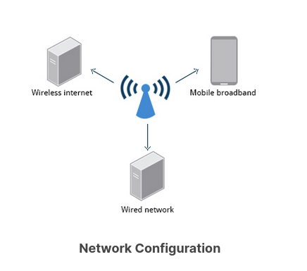

### Wired and Wireless Connections

Wired connections usually do not require complicated or manual configuration. The hardware interface and signal presence are automatically detected, and then Network Manager sets the actual network settings via Dynamic Host Configuration Protocol (DHCP).

For static configurations that do not use DHCP, manual setup can also be done easily through Network Manager. You can also change the Ethernet Media Access Control (MAC) address if your hardware supports it. The MAC address is a unique hexadecimal number of your network card.

Wireless networks are usually not connected by default. You can view the list of available wireless networks and see which one (if any) you are currently connected to by using Network Manager. You can then add, edit, or remove known wireless networks, and also specify which ones you want connected by default when present.

### Configuring Wireless Connections

To configure a wireless network in any recent GNOME-based distribution:

Click on the upper-right corner of the top panel, which brings up a settings and/or network window. While the exact appearance will depend on Linux distribution and version, it will always be possible to click on a Wi-Fi submenu, as long as the hardware is present.

Select the wireless network you wish to connect to. If it is a secure network, the first time it will request that you enter the appropriate password. By default, the password will be saved for subsequent connections.

If you click on Wi-Fi Settings, you will bring up the third screenshot. If you click on the Gear icon for any connection, you can configure it in more detail.

Older and other Linux distributions may look quite a bit different in detail, but the steps and choices are essentially identical, as they are all running Network Manager with perhaps somewhat different clothing.

### Mobile Broadband and VPN Connections

You can set up a mobile broadband connection with Network Manager, which will launch a wizard to set up the connection details for each connection.

Once the configuration is done, the network is configured automatically each time the broadband network is attached.

Network Manager can also manage your VPN connections.

It supports many VPN technologies, such as native IPSec, Cisco OpenConnect (via either the Cisco client or a native open source client), Microsoft PPTP, and OpenVPN.

You might get support for VPN as a separate package from your distributor. You need to install this package if your preferred VPN is not supported.

### Installing and Updating Software

Each package in a Linux distribution provides one piece of the system, such as the Linux kernel, the C compiler, utilities for manipulating text or configuring the network, or for your favorite web browsers and email clients.

Packages often depend on each other. For example, because your email client can communicate using SSL/TLS, it will depend on a package which provides the ability to encrypt and decrypt SSL and TLS communication, and will not install unless that package is also installed at the same time.

All systems have a lower-level utility which handles the details of unpacking a package and putting the pieces in the right places. Most of the time, you will be working with a higher-level utility which knows how to download packages from the Internet and can manage dependencies and groups for you.

In this section, you will learn how to install and update software in Linux using the Debian packaging system (used by systems such as Ubuntu as well) and RPM packaging systems (which is used by both Red Hat and SUSE family systems). These are the main ones in use although there are others which work well for other distributions which are less used.

### Debian Packaging

Let’s look at the Package Management for the Debian family system.

dpkg is the underlying package manager for these systems. It can install, remove, and build packages. Unlike higher-level package management systems, it does not automatically download and install packages and satisfy their dependencies.

For Debian-based systems, the higher-level package management system is the Advanced Package Tool (APT) system of utilities. Generally, while each distribution within the Debian family uses APT, it creates its own user interface on top of it (for example, apt and apt-get, synaptic, gnome-software, Ubuntu Software Center, etc). Although apt repositories are generally compatible with each other, the software they contain generally is not. Therefore, most repositories target a particular distribution (like Ubuntu), and often software distributors ship with multiple repositories to support multiple distributions. Demonstrations are shown later in this section.

### Red Hat Package Manager (RPM)

Red Hat Package Manager (RPM) is the other package management system popular on Linux distributions. It was developed by Red Hat, and adopted by a number of other distributions, including SUSE/openSUSE, Mageia, CentOS, Oracle Linux, and others.

The higher-level package manager differs between distributions. Red Hat family distributions historically use RHEL/CentOS and Fedora uses dnf, while retaining good backwards compatibility with the older yum program. SUSE family distributions such as openSUSE also use RPM, but use the zypper interface.

### openSUSE’s YaST Software Management

The Yet another Setup Tool (YaST) software manager is similar to other graphical package managers. It is an RPM-based application. You can add, remove, or update packages using this application very easily. To access the YaST software manager:

1. Click Activities
2. In the Search box, type YaST
3. Click the YaST icon
4. Click Software Management

You can also find YaST by clicking on Applications > Other-YaST, which is a strange place to put it.

openSUSE’s YaST software management application is similar to the graphical package managers in other distributions. A demonstration of the YaST software manager is shown later in this section.

### Chapter Summary

You have completed Chapter 5. Let's summarize the key concepts covered:

- You can control basic configuration options and desktop settings through the System Settings panel.
- Linux always uses Coordinated Universal Time (UTC) for its own internal time-keeping. You can set the date and time settings from the System Settings window.
- The Network Time Protocol is the most popular and reliable protocol for setting the local time via Internet servers.
- The Displays panel allows you to change the resolution of your display and configure multiple screens.
- Network Manager can present available wireless networks, allow the choice of a wireless or mobile broadband network, handle passwords, and set up VPNs.
- dpkg and RPM are the most popular package management systems used on Linux distributions.
- Debian distributions use dpkg and apt-based utilities for package management.
- RPM was developed by Red Hat, and adopted by a number of other distributions, including the openSUSE, Mandriva, CentOS, Oracle Linux, and others.

### Internet Applications

he Internet is a global network that allows users around the world to perform multiple tasks, such as searching for data, communicating through emails and online shopping. Obviously, you need to use network-aware applications to take advantage of the Internet. These include:

- Web browsers
- Email clients
- Streaming media applications
- Internet Relay Chats
- Conferencing software

### Web Browsers

As discussed in the Graphical Interface chapter, Linux offers a wide variety of web browsers, both graphical and text-based, including:

- Firefox
- Google Chrome
- Chromium
- Epiphany (renamed web)
- Konqueror
- linx, lynx, w3m
- Opera

### Email Applications

Email applications allow for sending, receiving, and reading messages over the Internet. Linux systems offer a wide number of email clients, both graphical and text-based. In addition, many users simply use their browsers to access their email accounts.

Most email clients use the Internet Message Access Protocol (IMAP) or the older Post Office Protocol (POP) to access emails stored on a remote mail server. Most email applications also display HTML (HyperText Markup Language) formatted emails that display objects, such as pictures and hyperlinks. The features of advanced email applications include the ability of importing address books/contact lists, configuration information, and emails from other email applications.

Linux supports the following types of email applications:

- Graphical email clients, such as Thunderbird, Evolution, and Claws Mail.
- Text mode email clients, such as Mutt and mail.
- All web browser-based clients, such as Gmail, Yahoo Mail, and Office 365.

### Other Internet Applications

Linux systems provide many other applications for performing Internet-related tasks. These include:

### Office Applications

Most day-to-day computer systems have productivity applications (sometimes called office suites) available or installed. Each suite is a collection of closely coupled programs used to create and edit different kinds of files such as:

- Text (articles, books, reports, etc.)
- Spreadsheets
- Presentations
- Graphical objects.

Most Linux distributions offer LibreOffice, an open source office suite that started in 2010 and has evolved from OpenOffice. While other office suites are available as we have listed, LibreOffice is the most mature, widely used and intensely developed.

In addition, Linux users have full access to Internet-based office suites such as Google Docs and Microsoft Office 365.

### LibreOffice Components

The component applications included in LibreOffice are:

- Writer: Word Processing
- Calc: Spreadsheets
- Impress: Presentations
- Draw: Create and edit graphics and diagrams.

The LibreOffice applications can read and write non-native document formats, such as those used by Microsoft Office. Usually, fidelity is maintained quite well, but complicated documents might have some imperfect conversions.

### Development Applications

Linux distributions come with a complete set of applications and tools that are needed by those developing or maintaining both user applications and the kernel itself.

These tools are tightly integrated and include:

- Advanced editors customized for programmers' needs, such as vi and emacs.
- Compilers (such as gcc and clang for programs in C and C++) for every computer language that has ever existed, including very popular new ones such as Golang and Rust.
- Debuggers such as gdb and various graphical front ends to it and many other debugging tools (such as Valgrind).
- Performance measuring and monitoring programs, some with easy to use graphical interfaces, others more arcane and meant to be used only by serious experienced development engineers.
- Complete Integrated Development Environments (IDE's) such as Eclipse and Visual Studio Code that put all these tools together.

On other operating systems, these tools have to be obtained and installed separately, often at a high cost, while on Linux they are all available at no cost through standard package installation systems.

### Sound Players

Multimedia applications are used to listen to music, watch videos, etc., as well as to present and view text and graphics. Linux systems offer a number of sound player applications, including:

Of course, Linux systems can also connect with commercial online music streaming services, such as Pandora and Spotify through web browsers.

### Movie Players

Movie (video) players can portray input from many different sources, either local to the machine or on the Internet.

Linux systems offer a number of movie players, including:

- VLC
- MPlayer
- Xine
- Totem

### Movie Editors

Movie editors are used to edit videos or movies. Linux systems offer a number of movie editors, including: 

### GIMP (GNU Image Manipulation Program)

Graphic editors allow you to create, edit, view, and organize images of various formats, like Joint Photographic Experts Group (JPEG or JPG), Portable Network Graphics (PNG), Graphics Interchange Format (GIF), and Tagged Image File Format (TIFF).

The GNU Image Manipulation Program (GIMP) is a feature-rich image retouching and editing tool similar to Adobe Photoshop and is available on all Linux distributions. Some features of the GIMP are:

- It can handle any image file format.
- It has many special purpose plugins and filters.
- It provides extensive information about the image, such as layers, channels, and histograms.

### Graphics Utilities

In addition to GIMP, there are other graphics utilities that help perform various image-related tasks, including:

### Chapter Summary

You have completed Chapter 6. Let’s summarize the key concepts covered:

- Linux offers a wide variety of Internet applications, such as web browsers, email clients, online media applications, and others.
- Web browsers supported by Linux can be either graphical or text-based, such as Firefox, Google Chrome, Epiphany, w3m, lynx, and others.
- Linux supports graphical email clients, such as Thunderbird, Evolution, and Claws Mail, and text mode email clients, such as Mutt and mail.
- Linux systems provide many other applications for performing Internet-related tasks, such as Filezilla, XChat, Pidgin, and others.
- Most Linux distributions offer LibreOffice to create and edit different kinds of documents.
- Linux systems offer entire suites of development applications and tools, including compilers and debuggers.
- Linux systems offer a number of sound players including Amarok, Audacity, and Rhythmbox.
- Linux systems offer a number of movie players, including VLC, MPlayer, Xine, and Totem.
- Linux systems offer a number of movie editors, including Kino, Cinepaint, Blender among others.
- The GIMP (GNU Image Manipulation Program) utility is a feature-rich image retouching and editing tool available on all Linux distributions.
- Other graphics utilities that help perform various image-related tasks are eog, Inkscape, convert, and Scribus.

### Introduction to the Command Line

Linux system administrators spend a significant amount of their time at a command line prompt. They often automate and troubleshoot tasks in this text environment. There is a saying, "graphical user interfaces make easy tasks easier, while command line interfaces make difficult tasks possible". Linux relies heavily on the abundance of command line tools. The command line interface provides the following advantages:

- No GUI overhead is incurred.
- Virtually any and every task can be accomplished while sitting at the command line.
- You can implement scripts for often-used (or easy-to-forget) tasks and series of procedures.
- You can sign into remote machines anywhere on the Internet.
- You can initiate graphical applications directly from the command line instead of hunting through menus.
- While graphical tools may vary among Linux distributions, the command line interface does not.

### Using a Text Terminal on the Graphical Desktop

A terminal emulator program emulates (simulates) a standalone terminal within a window on the desktop. By this, we mean it behaves essentially as if you were logging into the machine at a pure text terminal with no running graphical interface. Most terminal emulator programs support multiple terminal sessions by opening additional tabs or windows.

By default, on GNOME desktop environments, the gnome-terminal application is used to emulate a text-mode terminal in a window. Other available terminal programs include:

- xterm
- konsole (default on KDE)
- terminator

### Launching Terminal Windows

To open a terminal on any system using a recent GNOME desktop click on Applications > System Tools > Terminal or Applications > Utilities > Terminal. If you do not have the Applications menu, you will have to install the appropriate gnome-shell-extension package and turn on with gnome-tweaks.

On any but some of the most recent GNOME-based distributions, you can always open a terminal by right-clicking anywhere on the desktop background and selecting Open in Terminal. If this does not work you will once again need to install and activate the appropriate gnome-shell-extension package.

You can also hit Alt-F2 and type in either gnome-terminal or konsole, whichever is appropriate.

Because distributions have had a history of burying opening up a command line terminal, and the place in menus may vary in the desktop GUI, It is a good idea to figure out how to "pin" the terminal icon to the panel, which might mean adding it to the Favorites grouping on GNOME systems.

### Some Basic Utilities

There are some basic command line utilities that are used constantly, and it would be impossible to proceed further without using some of them in simple form before we discuss them in more detail. A short list has to include:

- `cat`: used to type out a file (or combine files).
- `head`: used to show the first few lines of a file.
- `tail`: used to show the last few lines of a file.
- `man`: used to view documentation.

The screenshot shows elementary uses of these programs. Note the use of the pipe symbol (|) used to have one program take as input the output of another.

For the most part, we will only use these utilities in screenshots displaying various activities, before we discuss them in detail.

### The Command Line

Most input lines entered at the shell prompt have three basic elements:

- Command
- Options
- Arguments

The command is the name of the program you are executing. It may be followed by one or more options (or switches) that modify what the command may do. Options usually start with one or two dashes, for example, -p or --print, in order to differentiate them from arguments, which represent what the command operates on.

However, plenty of commands have no options, no arguments, or neither. In addition, other elements (such as setting environment variables) can also appear on the command line when launching a task.

### sudo

All the demonstrations created have a user configured with sudo capabilities to provide the user with administrative (admin) privileges when required. sudo allows users to run programs using the security privileges of another user, generally root (superuser). 

On your own systems, you may need to set up and enable sudo to work correctly. To do this, you need to follow some steps that we will not explain in much detail now, but you will learn about later in this course. When running on Ubuntu and some other recent distributions, sudo is already always set up for you during installation. On other Linux distributions, you will likely need to set up sudo to work properly for you after the initial installation.

Next, you will learn the steps to set up and run sudo on your system.

### Steps for Setting Up and Running sudo

If your system does not already have sudo set up and enabled, you need to do the following steps:

1. You will need to make modifications as the administrative, or superuser, root. While sudo will become the preferred method of doing this, we do not have it set up yet, so we will use su (which we will discuss later in detail) instead. At the command line prompt, type su and press Enter. You will then be prompted for the root password, so enter it and press Enter. You will notice that nothing is printed; this is so others cannot see the password on the screen. You should end up with a different looking prompt, often ending with ‘#’. For example:
            `$ su Password:`
            `#`
2. Now, you need to create a configuration file to enable your user account to use sudo. Typically, this file is created in the /etc/sudoers.d/ directory with the name of the file the same as your username. For example, for this demo, let’s say your username is student. After doing step 1, you would then create the configuration file for student by doing this:
            `# echo "student ALL=(ALL) ALL" > /etc/sudoers.d/student`
3. Finally, some Linux distributions will complain if you do not also change permissions on the file by doing:
            `# chmod 440 /etc/sudoers.d/student`

That should be it. For the rest of this course, if you use sudo you should be properly set up. When using sudo, by default you will be prompted to give a password (your own user password) at least the first time you do it within a specified time interval. It is possible (though very insecure) to configure sudo to not require a password or change the time window in which the password does not have to be repeated with every sudo command.

### Switching Between the GUI and the Command Line

The customizable nature of Linux allows you to drop the graphical interface (temporarily or permanently) or to start it up after the system has been running.

Most Linux distributions give an option during installation (or have more than one version of the install media) to choose between desktop (with a graphical desktop) and server (usually without one).

Linux production servers are usually installed without the GUI, and even if it is installed, usually do not launch it during system startup. Removing the graphical interface from a production server can be very helpful in maintaining a lean system, which can be easier to support and keep secure.

### Virtual Terminals

Virtual Terminals (VT) are console sessions that use the entire display and keyboard outside of a graphical environment. Such terminals are considered "virtual" because, although there can be multiple active terminals, only one terminal remains visible at a time. A VT is not quite the same as a command line terminal window; you can have many of those visible at once on a graphical desktop.

One virtual terminal (usually number one or seven) is reserved for the graphical environment, and text logins are enabled on the unused VTs. Ubuntu uses VT 7, but CentOS/RHEL and openSUSE use VT 1 for the graphical display.

An example of a situation where using VTs is helpful is when you run into problems with the graphical desktop. In this situation, you can switch to one of the text VTs and troubleshoot.

To switch between VTs, press CTRL-ALT-function key for the VT. For example, press CTRL-ALT-F6 for VT 6. Actually, you only have to press the ALT-F6 key combination if you are in a VT and want to switch to another VT.

### Turning Off the Graphical Desktop

Linux distributions can start and stop the graphical desktop in various ways. The exact method differs from distribution and among distribution versions. For the newer systemd-based distributions, the display manager is run as a service, you can stop the GUI desktop with the systemctl utility and most distributions will also work with the telinit command, as in:

`$ sudo systemctl stop gdm (or sudo telinit 3)`

and restart it (after logging into the console) with:

`$ sudo systemctl start gdm (or sudo telinit 5)`

On Ubuntu versions before 18.04 LTS, substitute lightdm for gdm.

### Killing the Graphical User Interface

Methods of bringing down the GUI:

`student:/tmp> sudo systemctl stop gdm`
`student:/tmp> sudo systemctl stop lightdm`
`student:/tmp> sudo telinit 3`

Methods of bringing the GUI back up:

`student:/tmp> sudo systemctl start gdm`
`student:/tmp> sudo systemctl start lightdm`
`student:/tmp> sudo telinit 5`

### Basic Operations

In this section, we will discuss how to accomplish basic operations from the command line. These include how to log in and log out from the system, restart or shut down the system, locate applications, access directories, identify absolute and relative paths, and explore the filesystem.

### Logging In and Out

An available text terminal will prompt for a username (with the string login:) and password. When typing your password, nothing is displayed on the terminal (not even a * to indicate that you typed in something), to prevent others from seeing your password. After you have logged into the system, you can perform basic operations.

Once your session is started (either by logging into a text terminal or via a graphical terminal program), you can also connect and log into remote systems by using Secure SHell (SSH). For example, by typing ssh student@remote-server.com, SSH would connect securely to the remote machine (remote-server.com) and give student a command line terminal window, using either a password (as with regular logins) or cryptographic key to sign in without providing a password to verify the identity.

### Rebooting and Shutting Down

The preferred method to shut down or reboot the system is to use the shutdown command. This sends a warning message, and then prevents further users from logging in. The init process will then control shutting down or rebooting the system. It is important to always shut down properly; failure to do so can result in damage to the system and/or loss of data.

The halt and poweroff commands issue shutdown -h to halt the system; reboot issues shutdown -r and causes the machine to reboot instead of just shutting down. Both rebooting and shutting down from the command line requires superuser (root) access.

When administering a multi-user system, you have the option of notifying all users prior to shutdown, as in:

`$ sudo shutdown -h 10:00` "Shutting down for scheduled maintenance."

NOTE: On recent Wayland-based Linux distributions, broadcast messages do not appear on terminal emulation sessions running on the desktop; they appear only on the VT console displays.

### Locating Applications

Depending on the specifics of your particular distribution's policy, programs and software packages can be installed in various directories. In general, executable programs and scripts should live in the /bin, /usr/bin, /sbin, /usr/sbin directories, or somewhere under /opt. They can also appear in /usr/local/bin and /usr/local/sbin, or in a directory in a user's account space, such as /home/student/bin.

One way to locate programs is to employ the which utility. For example, to find out exactly where the diff program resides on the filesystem:

`$ which diff`
/usr/bin/diff

If which does not find the program, whereis is a good alternative because it looks for packages in a broader range of system directories:

`$ whereis diff`
diff: /usr/bin/diff /usr/share/man/man1/diff.1.gz /usr/share/man/man1p/diff.1p.gz

as well as locating source and man files packaged with the program.

### Accessing Directories

When you first log into a system or open a terminal, the default directory should be your home directory. You can print the exact path of this by typing echo $HOME. Many Linux distributions actually open new graphical terminals in \$HOME/Desktop. The following commands are useful for directory navigation:

### Understanding Absolute and Relative Paths

There are two ways to identify paths:

- Absolute pathname
            An absolute pathname begins with the root directory and follows the tree, branch by branch, until it reaches the desired directory or file. Absolute paths always start with /.
- Relative pathname
            A relative pathname starts from the present working directory. Relative paths never start with /.

Multiple slashes (/) between directories and files are allowed, but all but one slash between elements in the pathname is ignored by the system. ////usr//bin is valid, but seen as /usr/bin by the system.

Most of the time, it is most convenient to use relative paths, which require less typing. Usually, you take advantage of the shortcuts provided by: . (present directory), .. (parent directory) and ~ (your home directory).

For example, suppose you are currently working in your home directory and wish to move to the /usr/bin directory. The following two ways will bring you to the same directory from your home directory:

- Absolute pathname method
            $ cd /usr/bin
- Relative pathname method
            $ cd ../../usr/bin

In this case, the absolute pathname method requires less typing.

### Exploring the Filesystem

Traversing up and down the filesystem tree can get tedious. The tree command is a good way to get a bird’s-eye view of the filesystem tree. Use tree -d to view just the directories and to suppress listing file names.

The following commands can help in exploring the filesystem:

### Hard Links

he ln utility is used to create hard links and (with the -s option) soft links, also known as symbolic links or symlinks. These two kinds of links are very useful in UNIX-based operating systems.

Suppose that file1 already exists. A hard link, called file2, is created with the command:

`$ ln file1 file2`

Note that two files now appear to exist. However, a closer inspection of the file listing shows that this is not quite true.

`$ ls -li file1 file2`

The -i option to ls prints out in the first column the inode number, which is a unique quantity for each file object. This field is the same for both of these files; what is really going on here is that it is only one file, but it has more than one name associated with it, as is indicated by the 2 that appears in the ls output. Thus, there was already another object linked to file1 before the command was executed.

Hard links are very useful and they save space, but you have to be careful with their use, sometimes in subtle ways. For one thing, if you remove either file1 or file2 in the example, the inode object (and the remaining file name) will remain, which might be undesirable, as it may lead to subtle errors later if you recreate a file of that name.

If you edit one of the files, exactly what happens depends on your editor; most editors, including vi and gedit, will retain the link by default, but it is possible that modifying one of the names may break the link and result in the creation of two objects.

`touch file1`
`ln file1 file2`
`ls -li file?`

### Soft (Symbolic) Links

Soft (or Symbolic) links are created with the -s option, as in:

`$ ln -s file1 file3`
`$ ls -li file1 file3`

Notice file3 no longer appears to be a regular file, and it clearly points to file1 and has a different inode number.

Symbolic links take no extra space on the filesystem (unless their names are very long). They are extremely convenient, as they can easily be modified to point to different places. An easy way to create a shortcut from your home directory to long pathnames is to create a symbolic link.

Unlike hard links, soft links can point to objects even on different filesystems, partitions, and/or disks and other media, which may or may not be currently available or even exist. In the case where the link does not point to a currently available or existing object, you obtain a dangling link.

`ln -s file1 file3`
`ls -li file1 file3`

### Navigating the Directory History

The `cd` command remembers where you were last, and lets you get back there with `cd` -. For remembering more than just the last directory visited, use `pushd` to change the directory instead of `cd`; this pushes your starting directory onto a list. Using `popd` will then send you back to those directories, walking in reverse order (the most recent directory will be the first one retrieved with `popd`). The list of directories is displayed with the `dirs` command.

### Working with Files

Linux provides many commands that help you with viewing the contents of a file, creating a new file or an empty file, changing the timestamp of a file, and moving, removing and renaming a file or directory. These commands help you in managing your data and files and in ensuring that the correct data is available at the correct location.

### Viewing Files

You can use the following command line utilities to view files:

### touch

touch is often used to set or update the access, change, and modify times of files. By default, it resets a file's timestamp to match the current time.

However, you can also create an empty file using touch:

`$ touch <filename>`

This is normally done to create an empty file as a placeholder for a later purpose.

touch provides several useful options. For example, the -t option allows you to set the date and timestamp of the file to a specific value, as in:

`$ touch -t 12091600 myfile`

This sets the myfile file's timestamp to 4 p.m., December 9th (12 09 1600).

### mkdir and rmdir

mkdir is used to create a directory:

- `mkdir sampdir` 
            It creates a sample directory named sampdir under the current directory. 
- `mkdir /usr/sampdir` 
            It creates a sample directory called sampdir under /usr.

Removing a directory is done with rmdir. The directory must be empty or the command will fail. To remove a directory and all of its contents you have to do rm -rf.

### Moving, Renaming or Removing a File

Note that mv does double duty, in that it can:

- Simply rename a file
- Move a file to another location, while possibly changing its name at the same time.

If you are not certain about removing files that match a pattern you supply, it is always good to run rm interactively (rm –i) to prompt before every removal.

### Renaming or Removing a Directory

`rmdir` works only on empty directories; otherwise you get an error. 

While typing `rm –rf` is a fast and easy way to remove a whole filesystem tree recursively, it is extremely dangerous and should be used with the utmost care, especially when used by root (recall that recursive means drilling down through all sub-directories, all the way down a tree).

### Modifying the Command Line Prompt

The PS1 variable is the character string that is displayed as the prompt on the command line. Most distributions set PS1 to a known default value, which is suitable in most cases. However, users may want custom information to show on the command line. For example, some system administrators require the user and the host system name to show up on the command line as in:

`student@c8 $`

This could prove useful if you are working in multiple roles and want to be always reminded of who you are and what machine you are on. The prompt above could be implemented by setting the PS1 variable to: \u@\h \$.

For example:

`$ echo $PS1`
`\$`
`$ PS1="\u@\h \$ "`
`student@c8 $ echo $PS1`
`\u@\h \$`
`student@c8 $`

By convention, most systems are set up so that the root user has a pound sign (#) as their prompt.

### Standard File Streams

When commands are executed, by default there are three standard file streams (or descriptors) always open for use: standard input (standard in or stdin), standard output (standard out or stdout) and standard error (or stderr).

Usually, stdin is your keyboard, and stdout and stderr are printed on your terminal. stderr is often redirected to an error logging file, while stdin is supplied by directing input to come from a file or from the output of a previous command through a pipe. stdout is also often redirected into a file. Since stderr is where error messages are written, usually nothing will go there.

In Linux, all open files are represented internally by what are called file descriptors. Simply put, these are represented by numbers starting at zero. stdin is file descriptor 0, stdout is file descriptor 1, and stderr is file descriptor 2. Typically, if other files are opened in addition to these three, which are opened by default, they will start at file descriptor 3 and increase from there.

On the next page and in the chapters ahead, you will see examples which alter where a running command gets its input, where it writes its output, or where it prints diagnostic (error) messages.

### I/O Redirection

Through the command shell, we can redirect the three standard file streams so that we can get input from either a file or another command, instead of from our keyboard, and we can write output and errors to files or use them to provide input for subsequent commands.

For example, if we have a program called do_something that reads from stdin and writes to stdout and stderr, we can change its input source by using the less-than sign (<) followed by the name of the file to be consumed for input data:

`$ do_something < input-file`

If you want to send the output to a file, use the greater-than sign (>) as in:

`$ do_something > output-file`

Because stderr is not the same as stdout, error messages will still be seen on the terminal windows in the above example.

If you want to redirect stderr to a separate file, you use stderr’s file descriptor number (2), the greater-than sign (>), followed by the name of the file you want to hold everything the running command writes to stderr:

`$ do_something 2> error-file`

NOTE: By the same logic, do_something 1> output-file is the same as do_something > output-file.

A special shorthand notation can send anything written to file descriptor 2 (stderr) to the same place as file descriptor 1 (stdout): 2>&1.

`$ do_something > all-output-file 2>&1`

bash permits an easier syntax for the above:

`$ do_something >& all-output-file`

### Pipes

The UNIX/Linux philosophy is to have many simple and short programs (or commands) cooperate together to produce quite complex results, rather than have one complex program with many possible options and modes of operation. In order to accomplish this, extensive use of pipes is made. You can pipe the output of one command or program into another as its input.

In order to do this, we use the vertical-bar, pipe symbol (|), between commands as in:
 
`$ command1 | command2 | command3`

The above represents what we often call a pipeline, and allows Linux to combine the actions of several commands into one. This is extraordinarily efficient because command2 and command3 do not have to wait for the previous pipeline commands to complete before they can begin hacking at the data in their input streams; on multiple CPU or core systems, the available computing power is much better utilized and things get done quicker.

Furthermore, there is no need to save output in (temporary) files between the stages in the pipeline, which saves disk space and reduces reading and writing from disk, which is often the slowest bottleneck in getting something done.

### Searching for Files

Being able to quickly find the files you are looking for will save you time and enhance productivity. You can search for files in both your home directory space, or in any other directory or location on the system.

The main tools for doing this are the locate and find utilities. We will also show how to use wildcards in bash, in order to specify any file which matches a given generalized request.

### locate

The locate utility program performs a search taking advantage of a previously constructed database of files and directories on your system, matching all entries that contain a specified character string. This can sometimes result in a very long list.

To get a shorter (and possibly more relevant) list, we can use the grep program as a filter. grep will print only the lines that contain one or more specified strings, as in: 

`$ locate zip | grep bin`

which will list all the files and directories with both zip and bin in their name. We will cover grep in much more detail later. Notice the use of | to pipe the two commands together.

locate utilizes a database created by a related utility, updatedb. Most Linux systems run this automatically once a day. However, you can update it at any time by just running updatedb from the command line as the root user.

### Wildcards and Matching File Names

To search for files using the ? wildcard, replace each unknown character with ?. For example, if you know only the first two letters are 'ba' of a three-letter filename with an extension of .out, type ls ba?.out.

To search for files using the * wildcard, replace the unknown string with *. For example, if you remember only that the extension was .out, type ls *.out.

### The find Program

find is an extremely useful and often-used utility program in the daily life of a Linux system administrator. It recurses down the filesystem tree from any particular directory (or set of directories) and locates files that match specified conditions. The default pathname is always the present working directory.

For example, administrators sometimes scan for potentially large core files (which contain diagnostic information after a program fails) that are more than several weeks old in order to remove them.

It is also common to remove files in inessential or outdated files in /tmp (and other volatile directories, such as those containing cached files) that have not been accessed recently. Many Linux distributions use shell scripts that run periodically (through cron usually) to perform such house cleaning.

### Using find

When no arguments are given, find lists all files in the current directory and all of its subdirectories. Commonly used options to shorten the list include -name (only list files with a certain pattern in their name), -iname (also ignore the case of file names), and -type (which will restrict the results to files of a certain specified type, such as d for directory, l for symbolic link, or f for a regular file, etc.). 

Searching for files and directories named gcc:

`$ find /usr -name gcc`

Searching only for directories named gcc:

`$ find /usr -type d -name gcc`

Searching only for regular files named gcc:

`$ find /usr -type f -name gcc`

### Using Advanced find Options

Another good use of find is being able to run commands on the files that match your search criteria. The -exec option is used for this purpose.

To find and remove all files that end with .swp:

`$ find -name "*.swp" -exec rm {} ’;’`

The {} (squiggly brackets) is a placeholder that will be filled with all the file names that result from the find expression, and the preceding command will be run on each one individually.

Please note that you have to end the command with either ‘;’ (including the single-quotes) or "\;". Both forms are fine.

One can also use the -ok option, which behaves the same as -exec, except that find will prompt you for permission before executing the command. This makes it a good way to test your results before blindly executing any potentially dangerous commands.

### Finding Files Based on Time and Size

It is sometimes the case that you wish to find files according to attributes, such as when they were created, last used, etc., or based on their size. It is easy to perform such searches.

To find files based on time:

`$ find / -ctime 3`

Here, -ctime is when the inode metadata (i.e. file ownership, permissions, etc.) last changed; it is often, but not necessarily, when the file was first created. You can also search for accessed/last read (-atime) or modified/last written (-mtime) times. The number is the number of days and can be expressed as either a number (n) that means exactly that value, +n, which means greater than that number, or -n, which means less than that number. There are similar options for times in minutes (as in -cmin, -amin, and -mmin).

To find files based on sizes:

`$ find / -size 0`

Note the size here is in 512-byte blocks, by default; you can also specify bytes (c), kilobytes (k), megabytes (M), gigabytes (G), etc. As with the time numbers above, file sizes can also be exact numbers (n), +n or -n. For details, consult the man page for find.

For example, to find files greater than 10 MB in size and running a command on those files:

`$ find / -size +10M -exec command {} ’;’`

### Finding Directories and Creating Symbolic Links

Find the init.d directory, starting from /, and then create a symbolic link from within your home directory to this directory.

Note that this SysVinit directory is no longer used much in systemd-based systems, but is kept for backwards compatibility reasons.

`student:/tmp> find / -type d -name init.d`
`student:/tmp> cd ~`
`student:/home/student> ln -s /etc/init.d . ` 

Note you will get a lot of noise about trying to look at files and directories normal users are not allowed to examine. If you preface the find command with sudo these will not occur.

### Package Management Systems on Linux

The core parts of a Linux distribution and most of its add-on software are installed via the Package Management System. Each package contains the files and other instructions needed to make one software component work well and cooperate with the other components that comprise the entire system. Packages can depend on each other. For example, a package for a web-based application written in PHP can depend on the PHP package.

There are two broad families of package managers: those based on Debian and those which use RPM as their low-level package manager. The two systems are incompatible, but broadly speaking, provide the same features and satisfy the same needs. There are some other systems used by more specialized Linux distributions.

In this section, you will learn how to install, remove, or search for packages from the command line using these two package management systems.

### Package Managers: Two Levels

Both package management systems operate on two distinct levels: a low-level tool (such as dpkg or rpm) takes care of the details of unpacking individual packages, running scripts, getting the software installed correctly, while a high-level tool (such as apt-get, dnf, yum, or zypper) works with groups of packages, downloads packages from the vendor, and figures out dependencies.

Most of the time users need to work only with the high-level tool, which will take care of calling the low-level tool as needed. Dependency resolution is a particularly important feature of the high-level tool, as it handles the details of finding and installing each dependency for you. Be careful, however, as installing a single package could result in many dozens or even hundreds of dependent packages being installed.

### Working With Different Package Management Systems

The Advanced Packaging Tool (apt) is the underlying package management system that manages software on Debian-based systems. While it forms the backend for graphical package managers, such as the Ubuntu Software Center and synaptic, its native user interface is at the command line, with programs that include apt (or apt-get) and apt-cache.

dnf is the open source command-line package-management utility for the RPM-compatible Linux systems that belongs to the Red Hat family. dnf has both command line and graphical user interfaces. Fedora and RHEL 8 replaced the older yum utility with dnf, thereby eliminating a lot of historical baggage, as well as introducing many nice new capabilities. dnf is pretty much backwards-compatible with yum for day-to-day commands.

zypper is the package management system for the SUSE/openSUSE family and is also based on RPM. zypper also allows you to manage repositories from the command line. zypper is fairly straightforward to use and resembles dnf/yum quite closely.

To learn the basic packaging commands, take a look at these basic packaging commands:

### Installing and Removing Software Packages

Using the upper-level package management system appropriate for your Linux distribution, do the following:

1. Install the dump package on your system.
2. Remove the dump package from your system.

NOTE: If dump is already installed (you will be told so when you try to install), then do things in opposite order, i.e. remove and then install.

`student:/tmp> apt-get install dump`
`student:/tmp> apt-get remove dump  `    

or

`student:/tmp> dnf install dump`
`student:/tmp> dnf remove dump  `    

or

`student:/tmp> yum install dump`
`student:/tmp> yum remove dump   `   

or

`student:/tmp> zypper install dump`
`student:/tmp> zypper remove dump`

### Chapter Summary

ou have completed Chapter 7. Let’s summarize the key concepts we covered:

- Virtual terminals (VT) in Linux are consoles, or command line terminals that use the connected monitor and keyboard.
- Different Linux distributions start and stop the graphical desktop in different ways.
- A terminal emulator program on the graphical desktop works by emulating a terminal within a window on the desktop.
- The Linux system allows you to either log in via text terminal or remotely via the console.
- When typing your password, nothing is printed to the terminal, not even a generic symbol to indicate that you typed.
- The preferred method to shut down or reboot the system is to use the shutdown command.
- There are two types of pathnames: absolute and relative.
- An absolute pathname begins with the root directory and follows the tree, branch by branch, until it reaches the desired directory or file.
- A relative pathname starts from the present working directory.
- Using hard and soft (symbolic) links is extremely useful in Linux.
- cd remembers where you were last, and lets you get back there with cd -.
- locate performs a database search to find all file names that match a given pattern.
- find locates files recursively from a given directory or set of directories.
- find is able to run commands on the files that it lists, when used with the -exec option.
- touch is used to set the access, change, and edit times of files, as well as to create empty files.
- The Advanced Packaging Tool (apt) package management system is used to manage installed software on Debian-based systems.
- You can use the dnf command-line package management utility for the RPM-based Red Hat Family Linux distributions.
- The zypper package management system is based on RPM and used for openSUSE.

### Linux Documentation Sources

Whether you are an inexperienced user or a veteran, you will not always know (or remember) the proper use of various Linux programs and utilities: what is the command to type, what options does it take, etc. You will need to consult help documentation regularly. Because Linux-based systems draw from a large variety of sources, there are numerous reservoirs of documentation and ways of getting help. Distributors consolidate this material and present it in a comprehensive and easy-to-use manner.

Important Linux documentation sources include:

- The man pages (short for manual pages)
- GNU Info
- The help command and --help option
- Other documentation sources, e.g. Gentoo Handbook or Ubuntu Documentation.

### The man pages

The man pages are the most often-used source of Linux documentation. They provide in-depth documentation about many programs and utilities, as well as other topics, including configuration files, and programming APIs for system calls, library routines, and the kernel. They are present on all Linux distributions and are always at your fingertips.

The man pages infrastructure was first introduced in the early UNIX versions, at the beginning of the 1970s. The name man is just an abbreviation for manual.

Typing man with a topic name as an argument retrieves the information stored in the topic's man pages.

man pages are often converted to other formats, such as PDF documents and web pages. To learn more, take a look at Linux man pages online. Many web pages have a graphical interface for help items, which may include man pages.

Other sources of documentation include published books and many Internet sites.

#### man

The man program searches, formats, and displays the information contained in the man page system. Because many topics have copious amounts of relevant information, output is piped through a pager program (such as less) to be viewed one page at a time. At the same time, the information is formatted for a good visual display.

A given topic may have multiple pages associated with it and there is a default order determining which one is displayed when no options or section number is specified. To list all pages on the topic, use the -f option. To list all pages that discuss a specific topic (even if the specified subject is not present in the name), use the –k option.

- `man –f` generates the same result as typing `whatis`.
- `man –k` generates the same result as typing `apropos`.

The default order is specified in /etc/man_db.conf and is roughly (but not exactly) in ascending numerical order by section.

### Manual Chapters

The man pages are divided into chapters numbered 1 through 9. In some cases, a letter is appended to the chapter number to identify a specific topic. For example, many pages describing part of the X Window API are in chapter 3X.

The chapter number can be used to force man to display the page from a particular chapter. It is common to have multiple pages across multiple chapters with the same name, especially for names of library functions or system calls.

With the -a parameter, man will display all pages with the given name in all chapters, one after the other, as in:

`$ man -a socket`

### Working with man

Now, try to do the following:

1. Finding man pages
    From the command line, bring up the man page for man itself. Scroll down to the EXAMPLES section.
2. Finding man pages by topic
    What man pages are available that document file compression?
3. Finding man pages by section
    From the command line, bring up the man page for the printf library function. In which manual page section are library functions found?
---

1. `student:/tmp> man man`
    Use the Page Down key or search in less with the '/' key for the EXAMPLES section.
2. `student:/tmp> man -k compress`
    or
    `student:/tmp> apropos compress`
    will bring up a long list of programs and references, including gzip, bzip2 and xz, and a number of file utilities that work with compressed files, such as zless, zgrep, bzcat, and xzdiff.
3. `student:/tmp> man 3 printf`
    (man printf will bring up the command-line utility (section 1) of the same name.)
    
### The GNU Info System

The next source of Linux documentation is the GNU Info System.

This is the GNU project's standard documentation format, which it prefers as an alternative to man. The Info System is basically free-form, and supports linked subsections.

Functionally, info resembles man in many ways. However, topics are connected using links (even though its design predates the World Wide Web). Information can be viewed through either a command line interface, a graphical help utility, printed or viewed online.

### Using info from the Command Line

Typing info with no arguments in a terminal window displays an index of available topics. You can browse through the topic list using the regular movement keys: arrows, Page Up, and Page Down.

You can view help for a particular topic by typing info <topic name>. The  system then searches for the topic in all available info files.

Some useful keys are: q to quit, h for help, and Enter to select a menu item.

### info Page Structure

The topic which you view in an info page is called a node. The table lists the basic keystrokes for moving between nodes.

Nodes are essentially sections and subsections in the documentation. You can move between nodes or view each node sequentially. Each node may contain menus and linked subtopics, or items.

Items function like browser links and are identified by an asterisk (*) at the beginning of the item name. Named items (outside a menu) are identified with double-colons (::) at the end of the item name. Items can refer to other nodes within the file or to other files. 

### Working with info

From the command line, bring up the info page for cpio. Bring up the tutorial.

`student:/tmp> info cpio`

Move the cursor down to the Tutorial node, and press Enter.

### The --help Option

Another important source of Linux documentation is use of the --help option.

Most commands have an available short description which can be viewed using the --help or the -h option along with the command or application. For example, to learn more about the man command, you can type: 

`$ man --help`

The --help option is useful as a quick reference and it displays information faster than the man or info pages.

### The help Command

When run within a bash command shell, some popular commands (such as echo and cd) actually run especially built-in bash versions of the commands rather than the usual binaries found on the file system, say under /bin or /usr/bin. It is more efficient to do so as execution is faster because fewer resources are used (we will discuss command shells later). One should note that there can be some (usually small) differences in the two versions of the command.

To view a synopsis of these built-in commands, you can simply type help as shown in the screenshot.

For these built-in commands, help performs the same basic function as the -h and --help arguments perform for standalone programs.

### Working with Command Line help

List the available options for the mkdir command, in more than one way.

`student:/tmp> mkdir --help `

or

`student:/tmp>$ man mkdir`

### Other Documentation Sources

In addition to the man pages, the GNU Info System, and the help command, there are other sources of Linux documentation, some examples of which include:

- Desktop help system
- Package documentation
- Online resources.

### Graphical Help Systems

ll Linux desktop systems have a graphical help application. This application is usually displayed as a question-mark icon or an image of a ship’s life-preserver, and can also always be found within the menu system. These programs usually contain custom help for the desktop itself and some of its applications, and will sometimes also include graphically-rendered info and man pages.

If you do not want to spend time hunting for the right icon or menu item to launch the help application, you can also start the graphical help system from a terminal window or command prompt by using one of the following utility programs:

- GNOME: `gnome-help` or `yelp`
- KDE: `khelpcenter`

### Package Documentation

Linux documentation is also available as part of the package management system. Usually, this documentation is directly pulled from the upstream source code, but it can also contain information about how the distribution packaged and set up the software.

Such information is placed under the /usr/share/doc directory, grouped in subdirectories named after each package, perhaps including the version number in the name.

### Online Resources

There are many places to access online Linux documentation, and a little bit of searching will get you buried in it.

The following book has been well-reviewed by other users of this course. It is a free, downloadable command line compendium under a Creative Commons license: "The Linux Command Line" by William Shotts.

You can also find very helpful documentation for each distribution. Each distribution has its own user-generated forums and wiki sections. Here are just a few links to such sources:

            Ubuntu Documentation
            CentoS Documentation
            openSUSE Documentation
            Gentoo Documentation
            Fedora Documentation.

Moreover, you can use online search sites to locate helpful resources from all over the Internet, including blog posts, forum and mailing list posts, news articles, and so on.

### Working with Graphical Help Systems

Find the graphical help system on your desktop and try to locate within it the man pages for printf. This may be difficult, so do not waste too much time before looking at the suggestions below. 

If you have been unable to find the man pages this way, we cannot give a unique solution to this. It varies from one Linux distribution to another, and one version to the next, but you should be able to hunt and find out where this is located and get familiar with the interface.

In earlier Linux distributions this was a rather easy task. Those days are gone for some desktops today.

If you are having trouble finding this on recent GNOME desktops, you are not alone. For some reason, clicking on Documentation > Help only brings up documentation about GNOME itself, using the yelp browser.

However, if at the command line you type something like:

`student:/tmp> yelp man:cat`

it will indeed bring up the man page for cat. However, you cannot type something like man:ls in the location bar and have it work, unless you hit CTRL-l first! It is not exactly clear whether this is a bug or a feature, but a bug seems more likely. Once you are in the page, clicking on links to get other man pages works just fine.

The same mechanism works to get info pages as well, as in:

`student:/tmp> yelp info:cpio`

### Chapter Summary

You have completed Chapter 8. Let’s summarize the key concepts covered:

- The main sources of Linux documentation are the man pages, GNU info, the help options and command, and a rich variety of online documentation sources. 
- The man utility searches, formats, and displays man pages.

- The man pages provide in-depth documentation about programs and other topics about the system, including configuration files, system calls, library routines, and the kernel.
- The GNU Info System was created by the GNU project as its standard documentation. It is robust and is accessible via command line, web, and graphical tools using info.
- Short descriptions for commands are usually displayed with the -h or --help argument.
- You can type help at the command line to display a synopsis of built-in commands.
- There are many other help resources both on your system and on the Internet.

### What Is a Process?

A process is simply an instance of one or more related tasks (threads) executing on your computer. It is not the same as a program or a command. A single command may actually start several processes simultaneously. Some processes are independent of each other and others are related. A failure of one process may or may not affect the others running on the system.

Processes use many system resources, such as memory, CPU (central processing unit) cycles, and peripheral devices, such as network cards, hard drives, printers and displays. The operating system (especially the kernel) is responsible for allocating a proper share of these resources to each process and ensuring overall optimized system utilization.

### Process Types

A terminal window (one kind of command shell) is a process that runs as long as needed. It allows users to execute programs and access resources in an interactive environment. You can also run programs in the background, which means they become detached from the shell.

Processes can be of different types according to the task being performed. Here are some different process types, along with their descriptions and examples:

### Process Scheduling and States

A critical kernel function called the scheduler constantly shifts processes on and off the CPU, sharing time according to relative priority, how much time is needed and how much has already been granted to a task.

When a process is in a so-called running state, it means it is either currently executing instructions on a CPU, or is waiting to be granted a share of time (a time slice) so it can execute. All processes in this state reside on what is called a run queue and on a computer with multiple CPUs, or cores, there is a run queue on each.

However, sometimes processes go into what is called a sleep state, generally when they are waiting for something to happen before they can resume, perhaps for the user to type something. In this condition, a process is said to be sitting in a wait queue.

There are some other less frequent process states, especially when a process is terminating. Sometimes, a child process completes, but its parent process has not asked about its state. Amusingly, such a process is said to be in a zombie state; it is not really alive, but still shows up in the system's list of processes.

### Process and Thread IDs

At any given time, there are always multiple processes being executed. The operating system keeps track of them by assigning each a unique process ID (PID) number. The PID is used to track process state, CPU usage, memory use, precisely where resources are located in memory, and other characteristics.

New PIDs are usually assigned in ascending order as processes are born. Thus, PID 1 denotes the init process (initialization process), and succeeding processes are gradually assigned higher numbers.

The table explains the PID types and their descriptions:

### Terminating a Process

At some point, one of your applications may stop working properly. How do you eliminate it?

To terminate a process, you can type kill -SIGKILL \<pid> or kill -9 \<pid>.

Note, however, you can only kill your own processes; those belonging to another user are off limits, unless you are root.

### User and Group IDs

Many users can access a system simultaneously, and each user can run multiple processes. The operating system identifies the user who starts the process by the Real User ID (RUID) assigned to the user.

The user who determines the access rights for the users is identified by the Effective UID (EUID). The EUID may or may not be the same as the RUID.

Users can be categorized into various groups. Each group is identified by the Real Group ID (RGID). The access rights of the group are determined by the Effective Group ID (EGID). Each user can be a member of one or more groups.

Most of the time we ignore these details and just talk about the User ID (UID) and Group ID (GID).

### More About Priorities

At any given time, many processes are running (i.e. in the run queue) on the system. However, a CPU can actually accommodate only one task at a time, just like a car can have only one driver at a time. Some processes are more important than others, so Linux allows you to set and manipulate process priority. Higher priority processes get preferential access to the CPU.

The priority for a process can be set by specifying a nice value, or niceness, for the process. The lower the nice value, the higher the priority. Low values are assigned to important processes, while high values are assigned to processes that can wait longer. A process with a high nice value simply allows other processes to be executed first. In Linux, a nice value of -20 represents the highest priority and +19 represents the lowest. While this may sound backwards, this convention (the nicer the process, the lower the priority) goes back to the earliest days of UNIX.

You can also assign a so-called real-time priority to time-sensitive tasks, such as controlling machines through a computer or collecting incoming data. This is just a very high priority and is not to be confused with what is called hard real-time which is conceptually different, and has more to do with making sure a job gets completed within a very well-defined time window.

### Load Averages

The load average is the average of the load number for a given period of time. It takes into account processes that are:

- Actively running on a CPU.
- Considered runnable, but waiting for a CPU to become available.
- Sleeping: i.e. waiting for some kind of resource (typically, I/O) to become available.

NOTE: Linux differs from other UNIX-like operating systems in that it includes the sleeping processes. Furthermore, it only includes so-called uninterruptible sleepers, those which cannot be awakened easily.

The load average can be viewed by running w, top or uptime. We will explain the numbers on the next page.

### Interpreting Load Averages

The load average is displayed using three numbers (0.45, 0.17, and 0.12) in the below screenshot. Assuming our system is a single-CPU system, the three load average numbers are interpreted as follows:

- 0.45: For the last minute the system has been 45% utilized on average.
- 0.17: For the last 5 minutes utilization has been 17%.
- 0.12: For the last 15 minutes utilization has been 12%.

If we saw a value of 1.00 in the second position, that would imply that the single-CPU system was 100% utilized, on average, over the past 5 minutes; this is good if we want to fully use a system. A value over 1.00 for a single-CPU system implies that the system was over-utilized: there were more processes needing CPU than CPU was available.

If we had more than one CPU, say a quad-CPU system, we would divide the load average numbers by the number of CPUs. In this case, for example, seeing a 1 minute load average of 4.00 implies that the system as a whole was 100% (4.00/4) utilized during the last minute.

Short-term increases are usually not a problem. A high peak you see is likely a burst of activity, not a new level. For example, at start up, many processes start and then activity settles down. If a high peak is seen in the 5 and 15 minute load averages, it may be cause for concern.

### Background and Foreground Processes

Linux supports background and foreground job processing. A job in this context is just a command launched from a terminal window. Foreground jobs run directly from the shell, and when one foreground job is running, other jobs need to wait for shell access (at least in that terminal window if using the GUI) until it is completed. This is fine when jobs complete quickly. But this can have an adverse effect if the current job is going to take a long time (even several hours) to complete.

In such cases, you can run the job in the background and free the shell for other tasks. The background job will be executed at lower priority, which, in turn, will allow smooth execution of the interactive tasks, and you can type other commands in the terminal window while the background job is running. By default, all jobs are executed in the foreground. You can put a job in the background by suffixing & to the command, for example: updatedb &.

You can either use CTRL-Z to suspend a foreground job or CTRL-C to terminate a foreground job and can always use the bg and fg commands to run a process in the background and foreground, respectively.

### Managing Jobs

The jobs utility displays all jobs running in background. The display shows the job ID, state, and command name, as shown here.

jobs -l provides the same information as jobs, and adds the PID of the background jobs.

The background jobs are connected to the terminal window, so, if you log off, the jobs utility will not show the ones started from that window.

### Getting Uptime and Load Averages

Ascertain how long your system has been up. 

Display its load averages.

A very simple method is just to use the uptime utility:

`student:/tmp> uptime`

A second method is to look at the first line of output from top (to be discussed in detail shortly):

`student:/tmp> top | head`

A third method is to use w:

`student:/tmp> w`

### Background and Foreground Jobs

We are going to launch a graphical program from a terminal window, so that one can no longer type in the window. gedit is an easy choice, but you can substitute any other program that does this.

The solution file contains a step-by-step procedure for putting jobs in background, bringing them back to foreground, etc. Please repeat the steps, substituting the program you are using if it is not gedit.

We are going to launch a graphical program from a terminal window so that one can no longer type in the window. gedit is an easy choice, but you can substitute any other program that does this.

1. Open gedit on a new file as in:

    `$ gedit somefile `    

2. While you can still type in the terminal window, the shell will not pay attention to what you input.
    While your pointer is over the terminal window, hit CTRL-Z.
    `^Z`
    You can no longer type in the gedit window.
3. With jobs -l, see what processes have been launched from this terminal window:

    `$ jobs -l`
4. Now put the most recent job (gedit somefile) in the background:

    `$ bg`
5. Put the process in foreground again:

    `$ fg`
    Note you once again input to the terminal window. It has no effect.
6. To clean up, suspend the process again and then use kill to terminate it:

    `^Z`
    `$ jobs -l`
    `$ kill -9 19827`
    `$ jobs -l`

### The ps Command (System V Style)

ps provides information about currently running processes keyed by PID. If you want a repetitive update of this status, you can use top or other commonly installed variants (such as htop or atop) from the command line, or invoke your distribution's graphical system monitor application.

ps has many options for specifying exactly which tasks to examine, what information to display about them, and precisely what output format should be used.

Without options, ps will display all processes running under the current shell. You can use the -u option to display information of processes for a specified username. The command ps -ef displays all the processes in the system in full detail. The command ps -eLf goes one step further and displays one line of information for every thread (remember, a process can contain multiple threads).

### The ps Command (BSD Style)

ps has another style of option specification, which stems from the BSD variety of UNIX, where options are specified without preceding dashes. For example, the command ps aux displays all processes of all users. The command ps axo allows you to specify which attributes you want to view.

The screenshot shows a sample output of ps with the aux and axo qualifiers.

### The Process Tree

pstree displays the processes running on the system in the form of a tree diagram showing the relationship between a process and its parent process and any other processes that it created. Repeated entries of a process are not displayed, and threads are displayed in curly braces.

### top

While a static view of what the system is doing is useful, monitoring the system performance live over time is also valuable. One option would be to run ps at regular intervals, say, every few seconds. A better alternative is to use top to get constant real-time updates (every two seconds by default), until you exit by typing q.top clearly highlights which processes are consuming the most CPU cycles and memory (using appropriate commands from within top).

### First Line of the top Output

The first line of the top output displays a quick summary of what is happening in the system, including:

1. How long the system has been up
2. How many users are logged on
3. What is the load average

The load average determines how busy the system is. A load average of 1.00 per CPU indicates a fully subscribed, but not overloaded, system. If the load average goes above this value, it indicates that processes are competing for CPU time. If the load average is very high, it might indicate that the system is having a problem, such as a runaway process (a process in a non-responding state).

### Second Line of the top Output

The second line of the top output displays the total number of processes, the number of running, sleeping, stopped, and zombie processes. Comparing the number of running processes with the load average helps determine if the system has reached its capacity or perhaps a particular user is running too many processes. The stopped processes should be examined to see if everything is running correctly.

### Third Line of the top Output

The third line of the top output indicates how the CPU time is being divided between the users (us) and the kernel (sy) by displaying the percentage of CPU time used for each.

The percentage of user jobs running at a lower priority (niceness - ni) is then listed. Idle mode (id) should be low if the load average is high, and vice versa. The percentage of jobs waiting (wa) for I/O is listed. Interrupts include the percentage of hardware (hi) vs. software interrupts (si). Steal time (st) is generally used with virtual machines, which has some of its idle CPU time taken for other uses.

### Fourth and Fifth Lines of the top Output

The fourth and fifth lines of the top output indicate memory usage, which is divided in two categories:

- Physical memory (RAM) – displayed on line 4.
- Swap space – displayed on line 5.

Both categories display total memory, used memory, and free space.

You need to monitor memory usage very carefully to ensure good system performance. Once the physical memory is exhausted, the system starts using swap space (temporary storage space on the hard drive) as an extended memory pool, and since accessing disk is much slower than accessing memory, this will negatively affect system performance.

If the system starts using swap often, you can add more swap space. However, adding more physical memory should also be considered.

### Process List of the top Output

Each line in the process list of the top output displays information about a process. By default, processes are ordered by highest CPU usage. The following information about each process is displayed:

- Process Identification Number (PID)
- Process owner (USER)
- Priority (PR) and nice values (NI)
- Virtual (VIRT), physical (RES), and shared memory (SHR)
- Status (S)
- Percentage of CPU (%CPU) and memory (%MEM) used
- Execution time (TIME+)
- Command (COMMAND).

### Interactive Keys with top

Besides reporting information, top can be utilized interactively for monitoring and controlling processes. While top is running in a terminal window, you can enter single-letter commands to change its behavior. For example, you can view the top-ranked processes based on CPU or memory usage. If needed, you can alter the priorities of running processes or you can stop/kill a process.

The table lists what happens when pressing various keys when running top:

### Scheduling Future Processes Using at

Suppose you need to perform a task on a specific day sometime in the future. However, you know you will be away from the machine on that day. How will you perform the task? You can use the at utility program to execute any non-interactive command at a specified time, as illustrated in the screenshot below:

### cron

cron is a time-based scheduling utility program. It can launch routine background jobs at specific times and/or days on an on-going basis. cron is driven by a configuration file called /etc/crontab (cron table), which contains the various shell commands that need to be run at the properly scheduled times. There are both system-wide crontab files and individual user-based ones. Each line of a crontab file represents a job, and is composed of a so-called CRON expression, followed by a shell command to execute.

Typing crontab -e will open the crontab editor to edit existing jobs or to create new jobs. Each line of the crontab file will contain 6 fields:

Examples:

- The entry * * * * * /usr/local/bin/execute/this/script.sh will schedule a job to execute script.sh every minute of every hour of every day of the month, and every month and every day in the week.
- The entry 30 08 10 06 * /home/sysadmin/full-backup will schedule a full-backup at 8.30 a.m., 10-June, irrespective of the day of the week.

### sleep

Sometimes, a command or job must be delayed or suspended. Suppose, for example, an application has read and processed the contents of a data file and then needs to save a report on a backup system. If the backup system is currently busy or not available, the application can be made to sleep (wait) until it can complete its work. Such a delay might be to mount the backup device and prepare it for writing.

sleep suspends execution for at least the specified period of time, which can be given as the number of seconds (the default), minutes, hours, or days. After that time has passed (or an interrupting signal has been received), execution will resume.

The syntax is:

sleep NUMBER[SUFFIX]...

where SUFFIX may be:

            s for seconds (the default)
            m for minutes
            h for hours
            d for days.

sleep and at are quite different; sleep delays execution for a specific period, while at starts execution at a later time.

### Using at for Batch Processing in the Future

Schedule a very simple task to run at a future time from now. This can be as simple as running ls or date and saving the output. You can use a time as short as one minute in the future.

Note that the command will run in the directory from which you schedule it with at.

Do this:

            From a short bash script.
            Interactively.

1. Create the file testat.sh containing:

    `#!/bin/bash`
    `date > /tmp/datestamp`

    and then make it executable and queue it up with at:

    `$ chmod +x testat.sh`
    `$ at now + 1 minute -f testat.sh`

    You can see if the job is queued up to run with atq:

    `$ atq`
    17	Wed Apr 22 08:55:00 2015 a student

    Make sure the job actually ran:

    `$ cat /tmp/datestamp`
    Wed Apr 22 08:55:00 CDT 2015

    What happens if you take the /tmp/datestamp out of the command? (Hint: type mail if not prompted to do so!)

2. Interactively, it is basically the same procedure. Just queue up the job with:

    `$ at now + 1 minute`
    at> date > /tmp/datestamp
    CTRL-D
    `$ atq`

### Scheduling a Periodic Task with cron

Set up a cron job to do some simple task every day at 10 a.m.

Create a file named mycrontab with the following content:

0 10 * * * /tmp/myjob.sh
and then create /tmp/myjob.sh containing:

`#!/bin/bash`
`echo Hello I am running $0 at $(date)`

and make it executable:

`$ chmod +x /tmp/myjob.sh`

Put it in the crontab system with:

`$ crontab mycrontab`

and verify it was loaded with:

`$ crontab -l`

0 10 * * * /tmp/myjob.sh
`$ sudo ls -l /var/spool/cron/student`
-rw------- 1 student student 25 Apr 22 09:59 /var/spool/cron/student
`$ sudo cat /var/spool/cron/student`
0 10 * * * /tmp/myjob.sh

Note: If you don't really want this running every day, printing out messages like:

Hello I am running /tmp/myjob.sh at Wed Apr 22 10:03:48 CDT 2015

and mailing them to you, you can remove it with:

`$ crontab -r`

If the machine is not up at 10 AM on a given day, anacron will run the job at a suitable time.

### Chapter Summary

You have completed Chapter 9. Let’s summarize the key concepts covered:

- Processes are used to perform various tasks on the system.
. Processes can be single-threaded or multi-threaded.
- Processes can be of different types, such as interactive and non-interactive.
- Every process has a unique identifier (PID) to enable the operating system to keep track of it.
- The nice value, or niceness, can be used to set priority.
- ps provides information about the currently running processes.
- You can use top to get constant real-time updates about overall system performance, as well as information about the processes running on the system.
- Load average indicates the amount of utilization the system is under at particular times.
- Linux supports background and foreground processing for a job.
- at executes any non-interactive command at a specified time.
- cron is used to schedule tasks that need to be performed at regular intervals.

### Introduction to Filesystems

In Linux (and all UNIX-like operating systems) it is often said “Everything is a file”, or at least it is treated as such. This means whether you are dealing with normal data files and documents, or with devices such as sound cards and printers, you interact with them through the same kind of Input/Output (I/O) operations. This simplifies things: you open a “file” and perform normal operations like reading the file and writing on it (which is one reason why text editors, which you will learn about in an upcoming section, are so important).

On many systems (including Linux), the filesystem is structured like a tree. The tree is usually portrayed as inverted, and starts at what is most often called the root directory, which marks the beginning of the hierarchical filesystem and is also sometimes referred to as the trunk, or simply denoted by /. The root directory is not the same as the root user. The hierarchical filesystem also contains other elements in the path (directory names), which are separated by forward slashes (/), as in /usr/bin/emacs, where the last element is the actual file name.

In this section, you will learn about some basic concepts, including the filesystem hierarchy, as well as about disk partitions.

### Filesystem Varieties

Linux supports a number of native filesystem types, expressly created by Linux developers, such as:

            ext3
            ext4
            squashfs
            btrfs

It also offers implementations of filesystems used on other alien operating systems, such as those from:

            Windows (ntfs, vfat)
            SGI (xfs)
            IBM (jfs)
            MacOS (hfs, hfs+)

Many older, legacy filesystems, such as FAT, are also supported.

It is often the case that more than one filesystem type is used on a machine, based on considerations such as the size of files, how often they are modified, what kind of hardware they sit on and what kind of access speed is needed, etc. The most advanced filesystem types in common use are the journaling varieties: ext4, xfs, btrfs, and jfs. These have many state-of-the-art features and high performance, and are very hard to corrupt accidentally.

### Linux Partitions

Each filesystem on a Linux system occupies a disk partition. Partitions help to organize the contents of disks according to the kind and use of the data contained. For example, important programs required to run the system are often kept on a separate partition (known as root or /) than the one that contains files owned by regular users of that system (/home). In addition, temporary files created and destroyed during the normal operation of Linux may be located on dedicated partitions. One advantage of this kind of isolation by type and variability is that when all available space on a particular partition is exhausted, the system may still operate normally.

The picture shows the use of the gparted utility, which displays the partition layout on a system which has four operating systems on it: RHEL 8, CentOS 7, Ubuntu and Windows.

### Mount Points

Before you can start using a filesystem, you need to mount it on the filesystem tree at a mount point. This is simply a directory (which may or may not be empty) where the filesystem is to be grafted on. Sometimes, you may need to create the directory if it does not already exist.

WARNING: If you mount a filesystem on a non-empty directory, the former contents of that directory are covered-up and not accessible until the filesystem is unmounted. Thus, mount points are usually empty directories.

### Mounting and Unmounting

The mount command is used to attach a filesystem (which can be local to the computer or on a network) somewhere within the filesystem tree. The basic arguments are the device node and mount point. For example,

`$ sudo mount /dev/sda5 /home`

will attach the filesystem contained in the disk partition associated with the /dev/sda5 device node into the filesystem tree at the /home mount point. There are other ways to specify the partition other than the device node, such as using the disk label or UUID.

To unmount the partition, the command would be:

`$ sudo umount /home`

Note the command is umount, not unmount! Only a root user (logged in as root, or using sudo) has the privilege to run these commands, unless the system has been otherwise configured.

If you want it to be automatically available every time the system starts up, you need to edit /etc/fstab accordingly (the name is short for filesystem table). Looking at this file will show you the configuration of all pre-configured filesystems. man fstab will display how this file is used and how to configure it.

Executing mount without any arguments will show all presently mounted filesystems.

### NFS and Network Filesystems

It is often necessary to share data across physical systems which may be either in the same location or anywhere that can be reached by the Internet. A network (also sometimes called distributed) filesystem may have all its data on one machine or have it spread out on more than one network node. A variety of different filesystems can be used locally on the individual machines; a network filesystem can be thought of as a grouping of lower level filesystems of varying types.

The command df -Th (disk-free) will display information about mounted filesystems, including the filesystem type, and usage statistics about currently used and available space.

Many system administrators mount remote users' home directories on a server in order to give them access to the same files and configuration files across multiple client systems. This allows the users to log in to different computers, yet still have access to the same files and resources.

The most common such filesystem is named simply NFS (the Network Filesystem). It has a very long history and was first developed by Sun Microsystems. Another common implementation is CIFS (also termed SAMBA), which has Microsoft roots. We will restrict our attention in what follows to NFS.

### NFS on the Server

We will now look in detail at how to use NFS on the server.

On the server machine, NFS uses daemons (built-in networking and service processes in Linux) and other system servers are started at the command line by typing:

`$ sudo systemctl start nfs`

NOTE: On RHEL/CentOS 8, the service is called nfs-server, not nfs.

The text file /etc/exports contains the directories and permissions that a host is willing to share with other systems over NFS. A very simple entry in this file may look like the following:

/projects *.example.com(rw)

This entry allows the directory /projects to be mounted using NFS with read and write (rw) permissions and shared with other hosts in the example.com domain. As we will detail in the next chapter, every file in Linux has three possible permissions: read (r), write (w) and execute (x).

After modifying the /etc/exports file, you can type exportfs -av to notify Linux about the directories you are allowing to be remotely mounted using NFS. You can also restart NFS with sudo systemctl restart nfs, but this is heavier, as it halts NFS for a short while before starting it up again. To make sure the NFS service starts whenever the system is booted, issue sudo systemctl enable nfs.

### NFS on the Client

On the client machine, if it is desired to have the remote filesystem mounted automatically upon system boot, /etc/fstab is modified to accomplish this. For example, an entry in the client's /etc/fstab might look like the following:

servername:/projects /mnt/nfs/projects nfs defaults 0 0

You can also mount the remote filesystem without a reboot or as a one-time mount by directly using the mount command:

`$ sudo mount servername:/projects /mnt/nfs/projects`

Remember, if /etc/fstab is not modified, this remote mount will not be present the next time the system is restarted. Furthermore, you may want to use the nofail option in fstab in case the NFS server is not live at boot.

### Exploring Mounted Filesystems

Issue the command:

`student:/tmp> cat /etc/fstab`

Now type:

`student:/tmp> mount`

Compare the results. What are the differences?

Find another way to see a list of the mounted filesystems, by examining the /proc pseudo-filesystem.

Typically, mount will show more filesystems mounted than are shown in /etc/fstab, which only lists those which are explicitly requested.

The system, however, will mount additional special filesystems required for normal operation, which are not enumerated in /etc/fstab.

Another way to show mounted filesystems is to type:

`student:/tmp> cat /proc/mounts`

which is essentially how the utility gets its information.

### Overview of User Home Directories

In this section, you will learn to identify and differentiate between the most important directories found in Linux. We start with ordinary users' home directory space.

Each user has a home directory, usually placed under /home. The /root ("slash-root") directory on modern Linux systems is no more than the home directory of the root user (or superuser, or system administrator account).

On multi-user systems, the /home directory infrastructure is often mounted as a separate filesystem on its own partition, or even exported (shared) remotely on a network through NFS.

Sometimes, you may group users based on their department or function. You can then create subdirectories under the /home directory for each of these groups. For example, a school may organize /home with something like the following:

    /home/faculty/
    /home/staff/
    /home/students/

### The /bin and /sbin Directories

The /bin directory contains executable binaries, essential commands used to boot the system or in single-user mode, and essential commands required by all system users, such as cat, cp, ls, mv, ps, and rm.

Likewise, the /sbin directory is intended for essential binaries related to system administration, such as fsck and ip. To view a list of these programs, type:

`$ ls /bin /sbin`

Commands that are not essential (theoretically) for the system to boot or operate in single-user mode are placed in the /usr/bin and /usr/sbin directories. Historically, this was done so /usr could be mounted as a separate filesystem that could be mounted at a later stage of system startup or even over a network. However, nowadays most find this distinction is obsolete. In fact, many distributions have been discovered to be unable to boot with this separation, as this modality had not been used or tested for a long time.

Thus, on some of the newest Linux distributions /usr/bin and /bin are actually just symbolically linked together, as are /usr/sbin and /sbin.

### The /proc Filesystem

Certain filesystems, like the one mounted at /proc, are called pseudo-filesystems because they have no permanent presence anywhere on the disk.

The /proc filesystem contains virtual files (files that exist only in memory) that permit viewing constantly changing kernel data. /proc contains files and directories that mimic kernel structures and configuration information. It does not contain real files, but runtime system information, e.g. system memory, devices mounted, hardware configuration, etc. Some important entries in /proc are:

    /proc/cpuinfo
    /proc/interrupts
    /proc/meminfo
    /proc/mounts
    /proc/partitions
    /proc/version

/proc has subdirectories as well, including:

    /proc/<Process-ID-#>
    /proc/sys

The first example shows there is a directory for every process running on the system, which contains vital information about it. The second example shows a virtual directory that contains a lot of information about the entire system, in particular its hardware and configuration. The /proc filesystem is very useful because the information it reports is gathered only as needed and never needs storage on the disk.

### The /dev Directory

The /dev directory contains device nodes, a type of pseudo-file used by most hardware and software devices, except for network devices. This directory is:

- Empty on the disk partition when it is not mounted

- Contains entries which are created by the udev system, which creates and manages device nodes on Linux, creating them dynamically when devices are found. The /dev directory contains items such as:

                    /dev/sda1 (first partition on the first hard disk)
                    /dev/lp1 (second printer)
                    /dev/random (a source of random numbers).

### The /var Directory

The /var directory contains files that are expected to change in size and content as the system is running (var stands for variable), such as the entries in the following directories:

            System log files: /var/log
            Packages and database files: /var/lib
            Print queues: /var/spool
            Temporary files: /var/tmp.

The /var directory may be put on its own filesystem so that growth of the files can be accommodated and any exploding file sizes do not fatally affect the system. Network services directories such as /var/ftp (the FTP service) and /var/www (the HTTP web service) are also found under /var.

### The /etc Directory

The /etc directory is the home for system configuration files. It contains no binary programs, although there are some executable scripts. For example, /etc/resolv.conf tells the system where to go on the network to obtain host name to IP address mappings (DNS). Files like passwd, shadow and group for managing user accounts are found in the /etc directory. While some distributions have historically had their own extensive infrastructure under /etc (for example, Red Hat and SUSE have used /etc/sysconfig), with the advent of systemd there is much more uniformity among distributions today.

Note that /etc is for system-wide configuration files and only the superuser can modify files there. User-specific configuration files are always found under their home directory.

### The /boot Directory

The /boot directory contains the few essential files needed to boot the system. For every alternative kernel installed on the system there are four files:

1. vmlinuz
            The compressed Linux kernel, required for booting.
2. initramfs
            The initial ram filesystem, required for booting, sometimes called initrd, not initramfs.
3. config
            The kernel configuration file, only used for debugging and bookkeeping.
4. System.map
            Kernel symbol table, only used for debugging.

Each of these files has a kernel version appended to its name.

The Grand Unified Bootloader (GRUB) files such as /boot/grub/grub.conf or /boot/grub2/grub2.cfg are also found under the /boot directory.

The screenshot shows an example listing of the /boot directory, taken from a RHEL system that has multiple installed kernels, including both distribution-supplied and custom-compiled ones. Names will vary and things will tend to look somewhat different on a different distribution.

### The /lib and /lib64 Directories

/lib contains libraries (common code shared by applications and needed for them to run) for the essential programs in /bin and /sbin. These library filenames either start with ld or lib. For example, /lib/libncurses.so.5.9.

Most of these are what is known as dynamically loaded libraries (also known as shared libraries or Shared Objects (SO)). On some Linux distributions there exists a /lib64 directory containing 64-bit libraries, while /lib contains 32-bit versions.

On recent Linux distributions, one finds:

.e., just like for /bin and /sbin, the directories just point to those under /usr.

Kernel modules (kernel code, often device drivers, that can be loaded and unloaded without re-starting the system) are located in /lib/modules/\<kernel-version-number>.

### Removable media: the /media, /run and /mnt Directories

One often uses removable media, such as USB drives, CDs and DVDs. To make the material accessible through the regular filesystem, it has to be mounted at a convenient location. Most Linux systems are configured so any removable media are automatically mounted when the system notices something has been plugged in.

While historically this was done under the /media directory, modern Linux distributions place these mount points under the /run directory. For example, a USB pen drive with a label myusbdrive for a user named student would be mounted at /run/media/student/myusbdrive.

The /mnt directory has been used since the early days of UNIX for temporarily mounting filesystems. These can be those on removable media, but more often might be network filesystems, which are not normally mounted. Or these can be temporary partitions, or so-called loopback filesystems, which are files which pretend to be partitions.

### Additional Directories Under /:

There are some additional directories to be found under the root directory:

### The /usr Directory Tree

The /usr directory tree contains theoretically non-essential programs and scripts (in the sense that they should not be needed to initially boot the system) and has at least the following sub-directories:

### Comparing Files with diff

Now that you know about the filesystem and its structure, let’s learn how to manage files and directories.

diff is used to compare files and directories. This often-used utility program has many useful options (see: man diff) including:

To compare two files, at the command prompt, type diff [options] \<filename1> \<filename2>. diff is meant to be used for text files; for binary files, one can use cmp. 

In this section, you will learn additional methods for comparing files and how to apply patches to files.

### Using diff3 and patch

You can compare three files at once using diff3, which uses one file as the reference basis for the other two. For example, suppose you and a co-worker both have made modifications to the same file working at the same time independently. diff3 can show the differences based on the common file you both started with. The syntax for diff3 is as follows:

`$ diff3 MY-FILE COMMON-FILE YOUR-FILE`

The graphic shows the use of diff3.

Many modifications to source code and configuration files are distributed utilizing patches, which are applied, not surprisingly, with the patch program. A patch file contains the deltas (changes) required to update an older version of a file to the new one. The patch files are actually produced by running diff with the correct options, as in:

`$ diff -Nur originalfile newfile > patchfile`

Distributing just the patch is more concise and efficient than distributing the entire file. For example, if only one line needs to change in a file that contains 1000 lines, the patch file will be just a few lines long.

To apply a patch, you can just do either of the two methods below:

`$ patch -p1 < patchfile`
`$ patch originalfile patchfile`

The first usage is more common, as it is often used to apply changes to an entire directory tree, rather than just one file, as in the second example. To understand the use of the -p1 option and many others, see the man page for patch.

### Using the file Utility

In Linux, a file's extension often does not categorize it the way it might in other operating systems. One cannot assume that a file named file.txt is a text file and not an executable program. In Linux, a filename is generally more meaningful to the user of the system than the system itself. In fact, most applications directly examine a file's contents to see what kind of object it is rather than relying on an extension. This is very different from the way Windows handles filenames, where a filename ending with .exe, for example, represents an executable binary file.

The real nature of a file can be ascertained by using the file utility. For the file names given as arguments, it examines the contents and certain characteristics to determine whether the files are plain text, shared libraries, executable programs, scripts, or something else.

### Using diff and patch

Linux and other open source communities often use the patch utility to disseminate modifications and updates. Here, we will give a practical introduction to using diff and patch.

It would be a good idea to read the man pages for both patch and diff to learn more about advanced options and techniques, that will help one to work more effectively with patch. In particular, the form of patches has a lot to do with whether they can be accepted in their submitted form.

1. Change to the /tmp directory.
2. Copy a text file to /tmp. For example, copy /etc/group to /tmp.
3. dd cannot only copy directly from raw disk devices, but from regular files as well. Remember, in Linux, everything is pretty much treated as a file. dd can also perform various conversions. For example, the conv=ucase option will convert all of the characters to upper-case characters. We will use dd to copy the text file to a new file in /tmp while converting characters to upper-case, as in: student:/tmp> dd if=/tmp/group of=/tmp/GROUP conv=ucase.
4. According to the man page for patch, the preferred options for preparing a patch with diff are -Naur when comparing two directory trees recursively. We will ignore the -a option, which means treat all files as text, since patch and diff should only be used on text files anyway. Since we are just comparing two files, we do not need to use the N or r options to diff, but we could use them anyway as it will not make a difference. Compare group and GROUP using diff, and prepare a proper patch file.
5. Use patch to patch the original file, /tmp/group, so its contents now match those of the modified file, /tmp/GROUP. You might try with the --dry-run option first!
6. Finally, to prove that your original file is now patched to be the same one with all upper-case characters, use diff on those two files. The files should be the same and you will not get any output from diff.

or this exercise, you could use any text file, but we will use /etc/group as described.

    student:/tmp> cd /tmp
    student:/tmp> cp /etc/group /tmp
    student:/tmp> dd if=/tmp/group of=/tmp/GROUP conv=ucase
    1+1 records in
    1+1 records out
    963 bytes (963 B) copied, 0.000456456 s, 2.1 MB/s
    student:/tmp> diff -Nur group GROUP > patchfile
    student:/tmp> cat patchfile

    --- group       2015-04-17 11:03:26.710813740 -0500
    +++ GROUP       2015-04-17 11:15:14.602813740 -0500
    @@ -1,68 +1,68 @@
    -root:x:0:
    -daemon:x:1:
    -bin:x:2:
    -sys:x:3:
    ....
    -libvirtd:x:127:student
    -vboxsf:x:999:
    +ROOT:X:0:
    +DAEMON:X:1:
    +BIN:X:2:
    +SYS:X:3:
    .....
    student:/tmp> patch --dry-run group patchfile
    checking file group
    student:/tmp> patch  group patchfile
    patching file group
    Note you could have also done either of these two commands:
    student:/tmp> patch group < patchfile
    student:/tmp> patch < patchfile
    student:/tmp> diff group GROUP
    student:/tmp>

### Backing Up Data

There are many ways you can back up data or even your entire system. Basic ways to do so include the use of simple copying with cp and use of the more robust rsync.

Both can be used to synchronize entire directory trees. However, rsync is more efficient, because it checks if the file being copied already exists. If the file exists and there is no change in size or modification time, rsync will avoid an unnecessary copy and save time. Furthermore, because rsync copies only the parts of files that have actually changed, it can be very fast.

cp can only copy files to and from destinations on the local machine (unless you are copying to or from a filesystem mounted using NFS), but rsync can also be used to copy files from one machine to another. Locations are designated in the target:path form, where target can be in the form of someone@host. The someone@ part is optional and used if the remote user is different from the local user.

rsync is very efficient when recursively copying one directory tree to another, because only the differences are transmitted over the network. One often synchronizes the destination directory tree with the origin, using the -r option to recursively walk down the directory tree copying all files and directories below the one listed as the source.

### Using rsync

sync is a very powerful utility. For example, a very useful way to back up a project directory might be to use the following command:

`$ rsync -r project-X archive-machine:archives/project-X`

Note that rsync can be very destructive! Accidental misuse can do a lot of harm to data and programs, by inadvertently copying changes to where they are not wanted. Take care to specify the correct options and paths. It is highly recommended that you first test your rsync command using the -dry-run option to ensure that it provides the results that you want.

To use rsync at the command prompt, type rsync sourcefile destinationfile, where either file can be on the local machine or on a networked machine; The contents of sourcefile will be copied to destinationfile.

A good combination of options is shown in:

`$ rsync --progress -avrxH  --delete sourcedir destdir`

### Compressing Data

File data is often compressed to save disk space and reduce the time it takes to transmit files over networks.

Linux uses a number of methods to perform this compression, including:

These techniques vary in the efficiency of the compression (how much space is saved) and in how long they take to compress; generally, the more efficient techniques take longer. Decompression time does not vary as much across different methods.

In addition, the tar utility is often used to group files in an archive and then compress the whole archive at once.

### Compressing Data Using gzip

gzip is the most often used Linux compression utility. It compresses very well and is very fast. The following table provides some usage examples:

### Compressing Data Using bzip2

bzip2 has a syntax that is similar to gzip but it uses a different compression algorithm and produces significantly smaller files, at the price of taking a longer time to do its work. Thus, it is more likely to be used to compress larger files.

Examples of common usage are also similar to gzip:

NOTE: bzip2 has lately become deprecated due to lack of maintenance and the superior compression ratios of xz which is actively maintained.

### Compressing Data Using xz

xz is the most space efficient compression utility used in Linux and is used to store archives of the Linux kernel. Once again, it trades a slower compression speed for an even higher compression ratio.

Some usage examples:

Compressed files are stored with a .xz extension.

### Handling Files Using zip

 The zip program is not often used to compress files in Linux, but is often required to examine and decompress archives from other operating systems. It is only used in Linux when you get a zipped file from a Windows user. It is a legacy program.

### Archiving and Compressing Data Using tar

Historically, tar stood for "tape archive" and was used to archive files to a magnetic tape. It allows you to create or extract files from an archive file, often called a tarball. At the same time, you can optionally compress while creating the archive, and decompress while extracting its contents.

Here are some examples of the use of tar:

You can separate out the archiving and compression stages, as in:

`$ tar cvf mydir.tar mydir ; gzip mydir.tar`
`$ gunzip mydir.tar.gz ; tar xvf mydir.tar`

but this is slower and wastes space by creating an unneeded intermediary .tar file.

### Relative Compression Times and Sizes

To demonstrate the relative efficiency of gzip, bzip2, and xz, the following screenshot shows the results of compressing a purely text file directory tree (the include directory from the kernel source) using the three methods.

This shows that as compression factors go up, CPU time does as well (i.e. producing smaller archives takes longer).

### Disk-to-Disk Copying (dd)

The dd program is very useful for making copies of raw disk space. For example, to back up your Master Boot Record (MBR) (the first 512-byte sector on the disk that contains a table describing the partitions on that disk), you might type:

`dd if=/dev/sda of=sda.mbr bs=512 count=1`

WARNING!

Typing:

`dd if=/dev/sda of=/dev/sdb`

to make a copy of one disk onto another, will delete everything that previously existed on the second disk.

An exact copy of the first disk device is created on the second disk device.

##### Do not experiment with this command as written above, as it can erase a hard disk!

Exactly what the name dd stands for is an often-argued item. The words data definition is the most popular theory and has roots in early IBM history. Often, people joke that it means disk destroyer and other variants such as delete data!

### Archiving (Backing Up) the Home Directory

Archiving (or backing up) your files from time to time is essential good hygiene. You might type a command and thereby unintentionally clobber files you need and did not mean to alter.

Furthermore, while your hardware may be deemed fairly reliable, all devices do fail in some fashion eventually (even if it is just an unexpected power failure). Often, this happens at the worst possible time. Periodically backing up files is a good habit to get into.

It is, of course, important to do backups to external systems through a network, or onto external storage, such as an external drive or USB stick. Here, we will be making a backup archive on the same system, which is very useful, but won’t help if the drive fails catastrophically, or your computer is stolen or the building gets zapped by an asteroid or a fire.

First, using tar, backup all files and subdirectories under your home directory. Place the resulting tarball file in the /tmp directory, giving it the name backup.tar.

Second, accomplish the same task with gzip compression using the -z option to tar, creating /tmp/backup.tar.gz.

Compare the size of the two files (with ls -l).

For additional experience, make backups using the -j option using the bzip2 compression, and -J option for using the xz compression.

To construct a tarball archive of your home directory, you can do:

student:/tmp> tar -cvf /tmp/backup.tar ~

or equivalently

student:/tmp> tar -cvf /tmp/backup.tar /home/student

Note you can have omitted the - in the options with no change. In the following, we will not bother using the -v option for verbose. To create archives with all three compression utilities, run:

student:/tmp> tar zcf /tmp/backup.tar.gz ~
student:/tmp> tar jcf /tmp/backup.tar.bz2 ~
student:/tmp> tar Jcf /tmp/backup.tar.xz ~

Comparing the sizes (first using the -h option to ls to make it human-readable):

student@ubuntu:~student:/tmp> ls -lh /tmp/backup*

-rw-rw-r-- 1 student student 8.3M Apr 17 10:14 /tmp/backup2.tar.gz
-rw-rw-r-- 1 student student  12M Apr 17 10:13 /tmp/backup.tar
-rw-rw-r-- 1 student student 8.4M Apr 17 10:15 /tmp/backup.tar.bz2
-rw-rw-r-- 1 student student 8.3M Apr 17 10:14 /tmp/backup.tar.gz
-rw-rw-r-- 1 student student 8.2M Apr 17 10:15 /tmp/backup.tar.xz     

and then without it:

student@ubuntu:~student:/tmp> ls -l /tmp/backup*

-rw-rw-r-- 1 student student  8686942 Apr 17 10:14 /tmp/backup2.tar.gz
-rw-rw-r-- 1 student student 12226560 Apr 17 10:13 /tmp/backup.tar
-rw-rw-r-- 1 student student  8720491 Apr 17 10:15 /tmp/backup.tar.bz2
-rw-rw-r-- 1 student student  8686929 Apr 17 10:14 /tmp/backup.tar.gz
-rw-rw-r-- 1 student student  8551064 Apr 17 10:15 /tmp/backup.tar.xz

Note in this case, there is not much difference in the different archiving methods, but this particular directory was a bad choice because it already contained a lot of compressed files. A somewhat better example involving more text files:

student:/tmp> tar cf  /tmp/doc.tar     /usr/share/doc
student:/tmp> tar zcf /tmp/doc.tar.gz  /usr/share/doc
student:/tmp> tar jcf /tmp/doc.tar.bz2 /usr/share/doc
student:/tmp> tar Jcf /tmp/doc.tar.xz  /usr/share/doc
student:/tmp> ls -lh /tmp/doc.tar*

-rw-rw-r-- 1 student student 85M Apr 17 10:34 /tmp/doc.tar
-rw-rw-r-- 1 student student 31M Apr 17 10:35 /tmp/doc.tar.bz2
-rw-rw-r-- 1 student student 34M Apr 17 10:34 /tmp/doc.tar.gz
-rw-rw-r-- 1 student student 28M Apr 17 10:36 /tmp/doc.tar.xz

which shows xz did best, followed by bz2 and then gz. You may have noticed, however, the inverse relationship between the size reduction of the compression and how long it took!

### Chapter Summary

You have completed Chapter 10. Let’s summarize the key concepts covered:

- The filesystem tree starts at what is often called the root directory (or trunk, or /).
- The  Filesystem Hierarchy Standard (FHS) provides Linux developers and system administrators a standard directory structure for the filesystem.
- Partitions help to segregate files according to usage, ownership, and type.
- Filesystems can be mounted anywhere on the main filesystem tree at a mount point. Automatic filesystem mounting can be set up by editing /etc/fstab.
- NFS (Network File System) is a useful method for sharing files and data through the network systems.
- Filesystems like /proc are called pseudo filesystems because they exist only in memory.
- /root (slash-root) is the home directory for the root user.
- /var may be put in its own filesystem so that growth can be contained and not fatally affect the system.
- /boot contains the basic files needed to boot the system.
- patch is a very useful tool in Linux. Many modifications to source code and configuration files are distributed with patch files, as they contain the deltas or changes to go from an old version of a file to the new version of a file.
- File extensions in Linux do not necessarily mean that a file is of a certain type.
- cp is used to copy files on the local machine, while rsync can also be used to copy files from one machine to another, as well as synchronize contents.
- gzip, bzip2, xz and zip are used to compress files.
- tar allows you to create or extract files from an archive file, often called a tarball. You can optionally compress while creating the archive, and decompress while extracting its contents.
- dd can be used to make large exact copies, even of entire disk partitions, efficiently.

### Overview of Text Editors in Linux

At some point, you will need to manually edit text files. You might be composing an email off-line, writing a script to be used for bash or other command interpreters, altering a system or application configuration file, or developing source code for a programming language such as C, Python or Java.

Linux administrators may sidestep using a text editor, instead employing graphical utilities for creating and modifying system configuration files. However, this can be more laborious than directly using a text editor, and be more limited in capability. Note that word processing applications (including those that are part of common office application suites) are not really basic text editors; they add a lot of extra (usually invisible) formatting information that will probably render system administration configuration files unusable for their intended purpose. So, knowing how to confidently use one or more text editors is really an essential skill to have for Linux.

By now, you have certainly realized Linux is packed with choices; when it comes to text editors, there are many choices, ranging from quite simple to very complex, including:

            nano
            gedit
            vi
            emacs

In this section, we learn first about the nano and gedit editors, which are relatively simple and easy to learn, and then later the more complicated choices, vi and emacs. Before we start, let us take a look at some cases where an editor is not needed.

### Creating Files Without Using an Editor

Sometimes, you may want to create a short file and don't want to bother invoking a full text editor. In addition, doing so can be quite useful when used from within scripts, even when creating longer files. You will no doubt find yourself using this method when you start on the later chapters that cover shell scripting!

If you want to create a file without using an editor, there are two standard ways to create one from the command line and fill it with content.

The first is to use echo repeatedly:

        $ echo line one > myfile
        $ echo line two >> myfile
        $ echo line three >> myfile

Note that while a single greater-than sign (>) will send the output of a command to a file, two of them (>>) will append the new output to an existing file.

The second way is to use cat combined with redirection:

        $ cat << EOF > myfile
        > line one
        > line two
        > line three
        > EOF
        $

Both techniques produce a file with the following lines in it:

        line one
        line two
        line three

and are extremely useful when employed by scripts.

### nano and gedit

There are some text editors that are pretty obvious; they require no particular experience to learn and are actually quite capable, even robust. A particularly easy to use one is the text terminal-based editor nano. Just invoke nano by giving a file name as an argument. All the help you need is displayed at the bottom of the screen, and you should be able to proceed without any problem.

As a graphical editor, gedit is part of the GNOME desktop system (kwrite is associated with KDE). The gedit and kwrite editors are very easy to use and are extremely capable. They are also very configurable. They look a lot like Notepad in Windows. Other variants such as kate are also supported by KDE.

### nano

nano is easy to use, and requires very little effort to learn. To open a file, type nano <filename> and press Enter. If the file does not exist, it will be created.

nano provides a two line shortcut bar at the bottom of the screen that lists the available commands. Some of these commands are:

            CTRL-G
            Display the help screen.
            CTRL-O
            Write to a file.
            CTRL-X
            Exit a file.
            CTRL-R
            Insert contents from another file to the current buffer.
            CTRL-C
            Show cursor position.

### gedit

gedit (pronounced 'g-edit') is a simple-to-use graphical editor that can only be run within a Graphical Desktop environment. It is visually quite similar to the Notepad text editor in Windows, but is actually far more capable and very configurable and has a wealth of plugins available to extend its capabilities further.

To open a new file find the program in your desktop's menu system, or from the command line type gedit <filename>. If the file does not exist, it will be created.

Using gedit is pretty straightforward and does not require much training. Its interface is composed of quite familiar elements.

### vi and emacs

Developers and administrators experienced in working on UNIX-like systems almost always use one of the two venerable editing options: vi and emacs. Both are present or easily available on all distributions and are completely compatible with the versions available on other operating systems. 

Both vi and emacs have a basic purely text-based form that can run in a non-graphical environment. They also have one or more graphical interface forms with extended capabilities; these may be friendlier for a less experienced user. While vi and emacs can have significantly steep learning curves for new users, they are extremely efficient when one has learned how to use them.

You need to be aware that fights among seasoned users over which editor is better can be quite intense and are often described as a holy war.

### Introduction to vi

Usually, the actual program installed on your system is vim, which stands for Vi IMproved, and is aliased to the name vi. The name is pronounced as “vee-eye”.

Even if you do not want to use vi, it is good to gain some familiarity with it: it is a standard tool installed on virtually all Linux distributions. Indeed, there may be times where there is no other editor available on the system.

GNOME extends vi with a very graphical interface known as gvim and KDE offers kvim. Either of these may be easier to use at first. 

When using vi, all commands are entered through the keyboard. You do not need to keep moving your hands to use a pointer device such as a mouse or touchpad, unless you want to do so when using one of the graphical versions of the editor.

### vimtutor

Typing vimtutor launches a short but very comprehensive tutorial for those who want to learn their first vi commands. Even though it provides only an introduction and just seven lessons, it has enough material to make you a very proficient vi user, because it covers a large number of commands. After learning these basic ones, you can look up new tricks to incorporate into your list of vi commands because there are always more optimal ways to do things in vi with less typing.

### Modes in vi

vi provides three modes, as described in the table below. It is vital to not lose track of which mode you are in. Many keystrokes and commands behave quite differently in different modes.

### Working with Files in vi

The table describes the most important commands used to start, exit, read, and write files in vi. The ENTER key needs to be pressed after all of these commands.

### Changing Cursor Positions in vi

The table describes the most important keystrokes used when changing cursor position in vi. Line mode commands (those following colon : ) require the ENTER key to be pressed after the command is typed.

### Searching for Text in vi

The table describes the most important commands used when searching for text in vi. The ENTER key should be pressed after typing the search pattern.

The table describes the most important keystrokes used when searching for text in vi.

### Working with Text in vi

The table describes the most important keystrokes used when changing, adding, and deleting text in vi.

### Commands for vi

### Using External Commands in vi

Typing sh command opens an external command shell. When you exit the shell, you will resume your editing session.

Typing ! executes a command from within vi. The command follows the exclamation point. This technique is best suited for non-interactive commands, such as : ! wc %. Typing this will run the wc (word count) command on the file; the character % represents the file currently being edited.

### Introduction to emacs

The emacs editor is a popular competitor for vi. Unlike vi, it does not work with modes. emacs is highly customizable and includes a large number of features. It was initially designed for use on a console, but was soon adapted to work with a GUI as well. emacs has many other capabilities other than simple text editing. For example, it can be used for email, debugging, etc.

Rather than having different modes for command and insert, like vi, emacs uses the CTRL and Meta (Alt or Esc) keys for special commands.

### Working with emacs

The table lists some of the most important key combinations that are used when starting, exiting, reading, and writing files in emacs.

The emacs tutorial is a good place to start learning basic commands. It is available any time when in emacs by simply typing CTRL-h (for help) and then the letter t for tutorial.

### Changing Cursor Positions in emacs 

The table lists some of the keys and key combinations that are used for changing cursor positions in emacs.

### Searching for Text in emacs 

The table lists the key combinations that are used for searching for text in emacs.

### Working with Text in emacs

The table lists some of the key combinations used for changing, adding, and deleting text in emacs:

### Commands for emacs

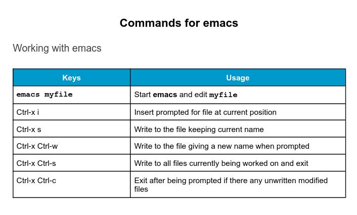

### Chapter Summary

You have completed Chapter 11. Let’s summarize the key concepts covered:

- Text editors (rather than word processing programs) are used quite often in Linux, for tasks such as creating or modifying system configuration files, writing scripts, developing source code, etc.
- nano is an easy-to-use text-based editor that utilizes on-screen prompts.
- gedit is a graphical editor, very similar to Notepad in Windows.
- The vi editor is available on all Linux systems and is very widely used. Graphical extension versions of vi are widely available as well.
- emacs is available on all Linux systems as a popular alternative to vi. emacs can support both a graphical user interface and a text mode interface.
- To access the vi tutorial, type vimtutor at a command line window.
- To access the emacs tutorial type Ctl-h and then t from within emacs.
- vi has three modes: Command, Insert, and Line. emacs has only one, but requires use of special keys, such as Control and Escape.
- Both editors use various combinations of keystrokes to accomplish tasks. The learning curve to master these can be long, but once mastered using either editor is extremely efficient.

### Identifying the Current User

As you know, Linux is a multi-user operating system, meaning more than one user can log on at the same time.

- To identify the current user, type whoami.
- To list the currently logged-on users, type who.

Giving who the -a option will give more detailed information.

### User Startup Files

In Linux, the command shell program (generally bash) uses one or more startup files to configure the user environment. Files in the /etc directory define global settings for all users, while initialization files in the user's home directory can include and/or override the global settings.

The startup files can do anything the user would like to do in every command shell, such as:

- Customizing the prompt
- Defining command line shortcuts and aliases
- Setting the default text editor
- Setting the path for where to find executable programs

### Order of the Startup Files

The standard prescription is that when you first login to Linux, /etc/profile is read and evaluated, after which the following files are searched (if they exist) in the listed order:

            ~/.bash_profile
            ~/.bash_login
            ~/.profile 

where ~/. denotes the user's home directory. The Linux login shell evaluates whatever startup file that it comes across first and ignores the rest. This means that if it finds ~/.bash_profile, it ignores ~/.bash_login and ~/.profile. Different distributions may use different startup files.

However, every time you create a new shell, or terminal window, etc., you do not perform a full system login; only a file named ~/.bashrc file is read and evaluated. Although this file is not read and evaluated along with the login shell, most distributions and/or users include the ~/.bashrc file from within one of the three user-owned startup files.

Most commonly, users only fiddle with ~/.bashrc, as it is invoked every time a new command line shell initiates, or another program is launched from a terminal window, while the other files are read and executed only when the user first logs onto the system.

Recent distributions sometimes do not even have .bash_profile and/or .bash_login, and some just do little more than include .bashrc.

### Creating Aliases

You can create customized commands or modify the behavior of already existing ones by creating aliases. Most often, these aliases are placed in your ~/.bashrc file so they are available to any command shells you create. unalias removes an alias.

Typing alias with no arguments will list currently defined aliases.

Please note there should not be any spaces on either side of the equal sign and the alias definition needs to be placed within either single or double quotes if it contains any spaces.

### Basics of Users and Groups

All Linux users are assigned a unique user ID (uid), which is just an integer; normal users start with a uid of 1000 or greater.

Linux uses groups for organizing users. Groups are collections of accounts with certain shared permissions. Control of group membership is administered through the /etc/group file, which shows a list of groups and their members. By default, every user belongs to a default or primary group. When a user logs in, the group membership is set for their primary group and all the members enjoy the same level of access and privilege. Permissions on various files and directories can be modified at the group level.

Users also have one or more group IDs (gid), including a default one which is the same as the user ID. These numbers are associated with names through the files /etc/passwd and /etc/group. Groups are used to establish a set of users who have common interests for the purposes of access rights, privileges, and security considerations. Access rights to files (and devices) are granted on the basis of the user and the group they belong to.

For example, /etc/passwd might contain `george:x:1002:1002:George Metesky:/home/george:/bin/bash` and /etc/group might contain `george:x:1002`.

### Adding and Removing Users

Distributions have straightforward graphical interfaces for creating and removing users and groups and manipulating group membership. However, it is often useful to do it from the command line or from within shell scripts. Only the root user can add and remove users and groups.

Adding a new user is done with useradd and removing an existing user is done with userdel. In the simplest form, an account for the new user bjmoose would be done with:

`$ sudo useradd bjmoose`

which, by default, sets the home directory to /home/bjmoose, populates it with some basic files (copied from /etc/skel) and adds a line to /etc/passwd such as:

`bjmoose:x:1002:1002::/home/bjmoose:/bin/bash`

and sets the default shell to /bin/bash. Removing a user account is as easy as typing userdel bjmoose. However, this will leave the /home/bjmoose directory intact. This might be useful if it is a temporary inactivation. To remove the home directory while removing the account one needs to use the -r option to userdel.

Typing id with no argument gives information about the current user, as in:

$ id
uid=1002(bjmoose) gid=1002(bjmoose) groups=106(fuse),1002(bjmoose)

If given the name of another user as an argument, id will report information about that other user.

### Adding and Removing Groups

Adding a new group is done with groupadd:

`$ sudo /usr/sbin/groupadd anewgroup`

The group can be removed with:

`$ sudo /usr/sbin/groupdel anewgroup`

Adding a user to an already existing group is done with usermod. For example, you would first look at what groups the user already belongs to:

`$ groups rjsquirrel`

        rjsquirrel : rjsquirrel

and then add the new group:

`$ sudo /usr/sbin/usermod -a -G anewgroup rjsquirrel`

`$ groups rjsquirrel`

        rjsquirrel: rjsquirrel anewgroup

These utilities update /etc/group as necessary. Make sure to use the -a option, for append, so as to avoid removing already existing groups. groupmod can be used to change group properties, such as the Group ID (gid) with the -g option or its name with then -n option.

Removing a user from the group is somewhat trickier. The -G option to usermod must give a complete list of groups. Thus, if you do:

`$ sudo /usr/sbin/usermod -G rjsquirrel rjsquirrel`

`$ groups rjsquirrel`

        rjsquirrel : rjsquirrel

only the rjsquirrel group will be left.

### The root Account

The root account is very powerful and has full access to the system. Other operating systems often call this the administrator account; in Linux, it is often called the superuser account. You must be extremely cautious before granting full root access to a user; it is rarely, if ever, justified. External attacks often consist of tricks used to elevate to the root account.

However, you can use sudo to assign more limited privileges to user accounts:

            Only on a temporary basis
            Only for a specific subset of commands.

### su and sudo

When assigning elevated privileges, you can use the command su (switch or substitute user) to launch a new shell running as another user (you must type the password of the user you are becoming). Most often, this other user is root, and the new shell allows the use of elevated privileges until it is exited. It is almost always a bad (dangerous for both security and stability) practice to use su to become root. Resulting errors can include deletion of vital files from the system and security breaches.

Granting privileges using sudo is less dangerous and is preferred. By default, sudo must be enabled on a per-user basis. However, some distributions (such as Ubuntu) enable it by default for at least one main user, or give this as an installation option.

In the Local Security Principles chapter we will describe and compare su and sudo in detail.

### Elevating to root Account

To temporarily become the superuser for a series of commands, you can type su and then be prompted for the root password.

To execute just one command with root privilege type sudo <command>. When the command is complete, you will return to being a normal unprivileged user.

sudo configuration files are stored in the /etc/sudoers file and in the /etc/sudoers.d/ directory. By default, the sudoers.d directory is empty.

### Deploying aliases

Typing long commands and file names over and over again gets rather tedious, and leads to a lot of trivial errors, such as typos.

Deploying aliases allows us to define shortcuts to alleviate the pain of all of this typing.

Suppose you are a member of a project team that works in a common, shared directory for your project. This directory is located in /home/staff/RandD/projects/projectX/src.

When you are working on Project X, you often need to create and modify your files in this directory. It does not take too long before typing in: 

cd /home/staff/RandD/projects/projectX/src

gets tedious.

Define and use an alias named "projx" to do the above cd command for you.

The alias line would look like this:

`student:/tmp> alias projx='cd /home/staff/RandD/projects/projectX/src'`

Note you can use double quotes instead of single quotes, or use no quotes at all since there is no white space in your defined alias. All you have to do now to change to the directory is

`student:/tmp> projx`

To make the alias persistent, just place it in your $HOME/.bashrc file.

### Environment Variables

Environment variables are quantities that have specific values which may be utilized by the command shell, such as bash, or other utilities and applications. Some environment variables are given preset values by the system (which can usually be overridden), while others are set directly by the user, either at the command line or within startup and other scripts. 

An environment variable is actually just a character string that contains information used by one or more applications. There are a number of ways to view the values of currently set environment variables; one can type set, env, or export. Depending on the state of your system, set may print out many more lines than the other two methods.

### Setting Environment Variables

By default, variables created within a script are only available to the current shell; child processes (sub-shells) will not have access to values that have been set or modified. Allowing child processes to see the values requires use of the export command.

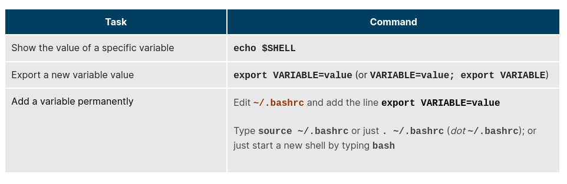

You can also set environment variables to be fed as a one shot to a command as in:

`$ SDIRS=s_0* KROOT=/lib/modules/$(uname -r)/build make modules_install`

which feeds the values of the SDIRS and KROOT environment variables to the command make modules_install.

### The HOME Variable

HOME is an environment variable that represents the home (or login) directory of the user. cd without arguments will change the current working directory to the value of HOME. Note the tilde character (~) is often used as an abbreviation for \$HOME. Thus, cd $HOME and cd ~ are completely equivalent statements.

The screenshot demonstrates this. 

### The PATH Variable

PATH is an ordered list of directories (the path) which is scanned when a command is given to find the appropriate program or script to run. Each directory in the path is separated by colons `(:)`. A null (empty) directory name (or ./) indicates the current directory at any given time.

- :path1:path2
- path1::path2

In the example :path1:path2, there is a null directory before the first colon `(:)`. Similarly, for path1::path2 there is a null directory between path1 and path2.

To prefix a private bin directory to your path:

`$ export PATH=$HOME/bin:$PATH`
`$ echo $PATH`

    /home/student/bin:/usr/local/bin:/usr/bin:/bin/usr

### The SHELL Variable

The environment variable SHELL points to the user's default command shell (the program that is handling whatever you type in a command window, usually bash) and contains the full pathname to the shell:

`$ echo $SHELL`
/bin/bash
`$`

### The PS1 Variable and the Command Line Prompt

Prompt Statement (PS) is used to customize your prompt string in your terminal windows to display the information you want. 

PS1 is the primary prompt variable which controls what your command line prompt looks like. The following special characters can be included in PS1:

\u - User name
\h - Host name
\w - Current working directory
\! - History number of this command
\d - Date

They must be surrounded in single quotes when they are used, as in the following example:

`$ echo $PS1`
`$`
`$ export PS1='\u@\h:\w$'`

student@example.com:~$ # new prompt

To revert the changes:

`student@example.com:~$ export PS1='$ '`
`$`

An even better practice would be to save the old prompt first and then restore, as in:

`$ OLD_PS1=$PS1`

change the prompt, and eventually change it back with:

`$ PS1=$OLD_PS1`
`$`

### Adding /tmp to Your Path

Create a small file /tmp/ls, which contains just the line:

`echo HELLO, this is the phony ls program.`

Then, make it executable by doing:

`$ chmod +x /tmp/ls`

1. Append /tmp to your path, so it is searched only after your usual path is considered. Type ls and see which program is run: /bin/ls or /tmp/ls?
2. Pre-pend /tmp to your path, so it is searched before your usual path is considered. Once again, type ls and see which program is run: /bin/ls or /tmp/ls?

What are the security considerations in altering the path this way?

First, create the phony ls program using an editor or just simply doing:

`student:/tmp>echo "echo HELLO, this is the phony ls program." > /tmp/ls`
`student:/tmp>chmod +x /tmp/ls`

For the next two steps, it is a good idea to work in another terminal window, or just start a new shell, so the changes do not persist on later issued commands. You can start a new shell by just typing bash.

1. ` student:/tmp>bash`
    `student:/tmp>PATH=$PATH:/tmp`
    `student:/tmp>ls /usr`

        bin etc games include lib lib64 libexec local sbin share src tmp

   ` student:/tmp>exit`
 

2.   `student:/tmp>bash`
     `student:/tmp>PATH=/tmp:$PATH`
     `student:/tmp>ls /usr`

            HELLO, this is the phony ls program.

    `student:/tmp>exit`

Note the second form is a very dangerous thing to do, and is a trivial way to insert a Trojan Horse program; if someone can put a malicious program in /tmp, they can trick you into running it accidentally.

### Changing the Command Line Prompt

It is nice to have your current working directory as part of your prompt so that a quick glance will give you some information without typing pwd every time.

If you often work on multiple computers, especially if you network from one into another with ssh, it is very convenient to have the computer name be part of your prompt.

1. Put your current working directory in your command line prompt.
2. Put your computer (machine) name in your prompt.
3. Put both your current directory and computer name in your prompt.

How can you make this persistent, so that whenever you start a bash command shell, this is your prompt? 

1. `$ echo $PWD`
   
    /tmp

    `$ PS1='\w>'`

    /tmp>

2. `PS1='\h>'`
   
    student>

3. `PS1='\h:\w>'`
    student:/tmp>

### Recalling Previous Commands

bash keeps track of previously entered commands and statements in a history buffer. You can recall previously used commands simply by using the Up and Down cursor keys. To view the list of previously executed commands, you can just type history at the command line.

The list of commands is displayed with the most recent command appearing last in the list. This information is stored in ~/.bash_history. If you have multiple terminals open, the commands typed in each session are not saved until the session terminates.

### Using History Environment Variables

Several associated environment variables can be used to get information about the history file.

- HISTFILE
            The location of the history file.
- HISTFILESIZE
            The maximum number of lines in the history file (default 500).
- HISTSIZE
            The maximum number of commands in the history file.
- HISTCONTROL
            How commands are stored.
- HISTIGNORE
            Which command lines can be unsaved.

For a complete description of the use of these environment variables, see man bash.

### Finding and Using Previous Commands

Specific keys to perform various tasks:

If you want to recall a command in the history list, but do not want to press the arrow key repeatedly, you can press CTRL-R to do a reverse intelligent search.

As you start typing, the search goes back in reverse order to the first command that matches the letters you have typed. By typing more successive letters, you make the match more and more specific.

The following is an example of how you can use the CTRL-R command to search through the command history:

`$^R `                                                           (This all happens on 1 line)
`(reverse-i-search)'s': sleep 1000`         (Searched for 's'; matched "sleep")
`$ sleep 1000`                                                     (Pressed Enter to execute the searched command)
`$`

### Executing Previous Commands

The table describes the syntax used to execute previously used commands:

All history substitutions start with !. When typing the command: ls -l /bin /etc /var, !$ will refer to /var, the last argument to the command.

Here are more examples:

`$ history`

1. `echo $SHELL`
2. `echo $HOME`
3. `echo $PS1`
4. `ls -a`
5. `ls -l /etc/ passwd`
6. `sleep 1000`
7. `history`

`$ !1`                              (Execute command #1 above)

echo $SHELL
/bin/bash

`$ !sl`                           (Execute the command beginning with "sl")
sleep 1000
`$`

### Keyboard Shortcuts

You can use keyboard shortcuts to perform different tasks quickly. The table lists some of these keyboard shortcuts and their uses. Note the case of the "hotkey" does not matter, e.g. doing CTRL-a is the same as doing CTRL-A .

### Command History

You have been busy working with your Linux workstation long enough to have typed in about 100 commands in one particular bash command shell.

At some point earlier, you used a new command, but the exact name has slipped your mind.

Or perhaps it was a pretty complicated command, with a bunch of options and arguments, and you do not want to go through the error prone process of figuring out what to type again.

How do you ascertain what the command was?

Once you find the command in your history, how do you easily issue the command again without having to type it all in at the prompt?

The history command is the way to display the commands you have typed in:

`student:/tmp> history`

1 cd /
2 ls
3 cd
4 pwd
5 echo $SHELL
6 ls /var/
7 ls /usr/bin
8 ls /usr/local/bin
9 man fstab
10 ls
. . .

In order to re-run a previous command, you have a few choices. Let's say that you wanted to re-run the man command you ran way back when you first logged in. You could type:

`student:/tmp> !9`

to re-run the command listed as #9. If this was the only man command that you typed in, you could also type:

`student:/tmp> !man`

now that you remember the command name that you typed. Finally, if you had typed a few man commands, you could use CTRL-R to search backward in your history to find the specific man command that you want to re-run and then just hit Return to execute it.

### File Ownership

In Linux and other UNIX-based operating systems, every file is associated with a user who is the owner. Every file is also associated with a group (a subset of all users) which has an interest in the file and certain rights, or permissions: read, write, and execute.

The following utility programs involve user and group ownership and permission setting: 

### File Permission Modes and chmod

Files have three kinds of permissions: read (r), write (w), execute (x). These are generally represented as in rwx. These permissions affect three groups of owners: user/owner (u), group (g), and others (o).

As a result, you have the following three groups of three permissions:

rwx:u    rwx:g  rwx:o

There are a number of different ways to use chmod. For instance, to give the owner and others execute permission and remove the group write permission:

`$ ls -l somefile`

-rw-rw-r-- 1 student student 1601 Mar 9 15:04 somefile

`$ chmod uo+x,g-w somefile`

`$ ls -l somefile`

-rwxr--r-x 1 student student 1601 Mar 9 15:04 somefile

where u stands for user (owner), o stands for other (world), and g stands for group.

This kind of syntax can be difficult to type and remember, so one often uses a shorthand which lets you set all the permissions in one step. This is done with a simple algorithm, and a single digit suffices to specify all three permission bits for each entity. This digit is the sum of:

            4 if read permission is desired
            2 if write permission is desired
            1 if execute permission is desired

Thus, 7 means read/write/execute, 6 means read/write, and 5 means read/execute.

When you apply this to the chmod command, you have to give three digits for each degree of freedom, such as in:

`$ chmod 755 somefile`
`$ ls -l somefile`

-rwxr-xr-x 1 student student 1601 Mar 9 15:04 somefile

### Example of chown

Let's see an example of changing file ownership using chown, as shown in the screenshot to the right. First, we create two empty files using touch.

Notice it requires sudo to change the owner of file2 to root. The second chown command changes both owner and group at the same time!

Finally, only the superuser can remove the files. 

### Example of chgrp

Now, let’s see an example of changing the group ownership using chgrp:

### Chapter Summary

You have completed Chapter 12. Let's summarize the key concepts covered:

- Linux is a multi-user system.
- To find the currently logged on users, you can use the who command.
- To find the current user ID, you can use the whoami command.
- The root account has full access to the system. It is never sensible to grant full root access to a user.
- You can assign root privileges to regular user accounts on a temporary basis using the sudo command.
- The shell program (bash) uses multiple startup files to create the user environment. Each file affects the interactive environment in a different way. /etc/profile provides the global settings.
- Advantages of startup files include that they customize the user's prompt, set the user's terminal type, set the command-line shortcuts and aliases, and set the default text editor, etc.
- An environment variable is a character string that contains data used by one or more applications. The built-in shell variables can be customized to suit your requirements.
- The history command recalls a list of previous commands, which can be edited and recycled.
- In Linux, various keyboard shortcuts can be used at the command prompt instead of long actual commands.
- You can customize commands by creating aliases. Adding an alias to ~/.bashrc will make it available for other shells.
- File permissions can be changed by typing chmod permissions filename.
- File ownership is changed by typing chown owner filename.
- File group ownership is changed by typing chgrp group filename.

### Command Line Tools for Manipulating Text Files

Irrespective of the role you play with Linux (system administrator, developer or user), you often need to browse through and parse text files, and/or extract data from them. These are file manipulation operations. Thus, it is essential for the Linux user to become adept at performing certain operations on files.

Most of the time, such file manipulation is done at the command line, which allows users to perform tasks more efficiently than while using a GUI. Furthermore, the command line is more suitable for automating often executed tasks.

Indeed, experienced system administrators write customized scripts to accomplish such repetitive tasks, standardized for each particular environment. We will discuss such scripting later in much detail.

In this section, we will concentrate on command line file and text manipulation-related utilities.

### cat

cat is short for concatenate and is one of the most frequently used Linux command line utilities. It is often used to read and print files, as well as for simply viewing file contents. To view a file, use the following command:

`$ cat <filename>`

For example, cat readme.txt will display the contents of readme.txt on the terminal. However, the main purpose of cat is often to combine (concatenate) multiple files together. You can perform the actions listed in the table using cat.

The tac command (cat spelled backwards) prints the lines of a file in reverse order. Each line remains the same, but the order of lines is inverted. The syntax of tac is exactly the same as for cat, as in:

`$ tac file`
`$ tac file1 file2 > newfile`

### Using cat Interactively

cat can be used to read from standard input (such as the terminal window) if no files are specified. You can use the > operator to create and add lines into a new file, and the >> operator to append lines (or files) to an existing file. We mentioned this when talking about how to create files without an editor.

To create a new file, at the command prompt type cat > <filename> and press the Enter key.

This command creates a new file and waits for the user to edit/enter the text. After you finish typing the required text, press CTRL-D at the beginning of the next line to save and exit the editing.

Another way to create a file at the terminal is cat > <filename> << EOF. A new file is created and you can type the required input. To exit, enter EOF at the beginning of a line.

Note that EOF is case sensitive. One can also use another word, such as STOP.

### echo 

echo simply displays (echoes) text. It is used simply, as in:

`$ echo string`

echo can be used to display a string on standard output (i.e. the terminal) or to place in a new file (using the > operator) or append to an already existing file (using the >> operator).

The –e option, along with the following switches, is used to enable special character sequences, such as the newline character or horizontal tab:

            \n represents newline
            \t represents horizontal tab.

echo is particularly useful for viewing the values of environment variables (built-in shell variables). For example, echo $USERNAME will print the name of the user who has logged into the current terminal.

The following table lists echo commands and their usage:

### Working with Large Files

System administrators need to work with configuration files, text files, documentation files, and log files. Some of these files may be large or become quite large as they accumulate data with time. These files will require both viewing and administrative updating. In this section, you will learn how to manage such large files.

For example, a banking system might maintain one simple large log file to record details of all of one day's ATM transactions. Due to a security attack or a malfunction, the administrator might be forced to check for some data by navigating within the file. In such cases, directly opening the file in an editor will cause issues, due to high memory utilization, as an editor will usually try to read the whole file into memory first. However, one can use less to view the contents of such a large file, scrolling up and down page by page, without the system having to place the entire file in memory before starting. This is much faster than using a text editor.

Viewing somefile can be done by typing either of the two following commands:

`$ less somefile`
`$ cat somefile | less`

By default, man pages are sent through the less command. You may have encountered the older more utility which has the same basic function but fewer capabilities: i.e. less is more!

### head

head reads the first few lines of each named file (10 by default) and displays it on standard output. You can give a different number of lines in an option.

For example, if you want to print the first 5 lines from /etc/default/grub, use the following command:

`$ head –n 5 /etc/default/grub`

You can also just say:

`head -5 /etc/default/grub`

### tail

tail prints the last few lines of each named file and displays it on standard output. By default, it displays the last 10 lines. You can give a different number of lines as an option. tail is especially useful when you are troubleshooting any issue using log files, as you probably want to see the most recent lines of output.

For example, to display the last 15 lines of somefile.log, use the following command:

`$ tail -n 15 somefile.log`

You can also just say:

`tail -15 somefile.log`

To continually monitor new output in a growing log file:

`$ tail -f somefile.log`

This command will continuously display any new lines of output in somefile.log as soon as they appear. Thus, it enables you to monitor any current activity that is being reported and recorded.

### Viewing Compressed Files

When working with compressed files, many standard commands cannot be used directly. For many commonly-used file and text manipulation programs, there is also a version especially designed to work directly with compressed files. These associated utilities have the letter "z" prefixed to their name. For example, we have utility programs such as zcat, zless, zdiff and zgrep.

Here is a table listing some z family commands:

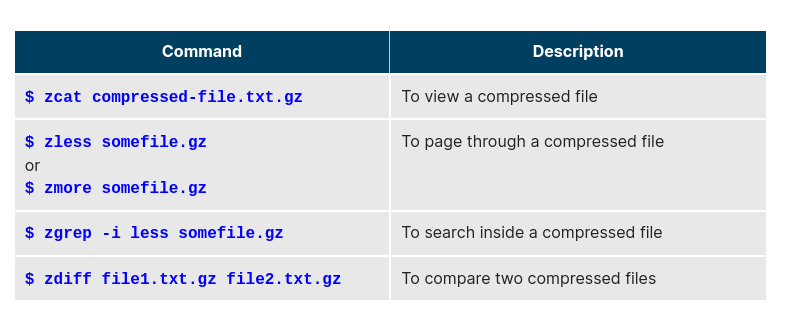

Note that if you run zless on an uncompressed file, it will still work and ignore the decompression stage. There are also equivalent utility programs for other compression methods besides gzip, for example, we have bzcat and bzless associated with bzip2, and xzcat and xzless associated with xz.

### Introduction to sed and awk

It is very common to create and then repeatedly edit and/or extract contents from a file. Let’s learn how to use sed and awk to easily perform such operations.

Note that many Linux users and administrators will write scripts using comprehensive scripting languages such as Python and perl, rather than use sed and awk (and some other utilities we will discuss later). Using such utilities is certainly fine in most circumstances; one should always feel free to use the tools one is experienced with. However, the utilities that are described here are much lighter; i.e. they use fewer system resources, and execute faster. There are situations (such as during booting the system) where a lot of time would be wasted using the more complicated tools, and the system may not even be able to run them. So, the simpler tools will always be needed.

### sed

sed is a powerful text processing tool and is one of the oldest, earliest and most popular UNIX utilities. It is used to modify the contents of a file or input stream, usually placing the contents into a new file or output stream. Its name is an abbreviation for stream editor.

sed can filter text, as well as perform substitutions in data streams.

Data from an input source/file (or stream) is taken and moved to a working space. The entire list of operations/modifications is applied over the data in the working space and the final contents are moved to the standard output space (or stream).

### sed Command Syntax

You can invoke sed using commands like those listed in the accompanying table.

The -e option allows you to specify multiple editing commands simultaneously at the command line. It is unnecessary if you only have one operation invoked.

### sed Basic Operations

Now that you know that you can perform multiple editing and filtering operations with sed, let’s explain some of them in more detail. The table explains some basic operations, where pattern is the current string and replace_string is the new string:

You must use the -i option with care, because the action is not reversible. It is always safer to use sed without the –i option and then replace the file yourself, as shown in the following example:

`$ sed s/pattern/replace_string/g file1 > file2`

The above command will replace all occurrences of pattern with replace_string in file1 and move the contents to file2. The contents of file2 can be viewed with cat file2. If you approve, you can then overwrite the original file with mv file2 file1.

Example: To convert 01/02/… to JAN/FEB/…

sed     -e 's/01/JAN/' -e 's/02/FEB/' -e 's/03/MAR/' -e 's/04/APR/' -e 's/05/MAY/' \
        -e 's/06/JUN/' -e 's/07/JUL/' -e 's/08/AUG/' -e 's/09/SEP/' -e 's/10/OCT/' \
        -e 's/11/NOV/' -e 's/12/DEC/'

### awk

awk is used to extract and then print specific contents of a file and is often used to construct reports. It was created at Bell Labs in the 1970s and derived its name from the last names of its authors: Alfred Aho, Peter Weinberger, and Brian Kernighan.

awk has the following features:

- It is a powerful utility and interpreted programming language.
- It is used to manipulate data files, and for retrieving and processing text.
- It works well with fields (containing a single piece of data, essentially a column) and records (a collection of fields, essentially a line in a file).

awk is invoked as shown in the following:

s with sed, short awk commands can be specified directly at the command line, but a more complex script can be saved in a file that you can specify using the -f option.

### awk Basic Operations

The table explains the basic tasks that can be performed using awk. The input file is read one line at a time, and, for each line, awk matches the given pattern in the given order and performs the requested action. The -F option allows you to specify a particular field separator character. For example, the /etc/passwd file uses ":" to separate the fields, so the -F: option is used with the /etc/passwd file.

The command/action in awk needs to be surrounded with apostrophes (or single-quote (')). awk can be used as follows:

### Using sed

Search for all instances of the user command interpreter (shell) equal to /sbin/nologin in /etc/passwd and replace them with /bin/bash.

To get output on standard out (terminal screen):

`student:/tmp> sed s/'\/sbin\/nologin'/'\/bin\/bash'/g /etc/passwd`

or to direct to a file:

`student:/tmp> sed s/'\/sbin\/nologin'/'\/bin\/bash'/g /etc/passwd > passwd_new`

Note this is kind of painful and obscure because we are trying to use the forward slash ( / ) as both a string and a delimiter between fields. One can do instead:

`student:/tmp> sed s:'/sbin/nologin':'/bin/bash':g /etc/passwd`

where we have used the colon ( : ) as the delimiter instead. (You are free to choose your delimiting character!) In fact when doing this, we do not even need the single quotes:

`student:/tmp> sed s:/sbin/nologin:/bin/bash:g /etc/passwd` 

works just fine.

### File Manipulation Utilities

In managing your files, you may need to perform tasks such as sorting data and copying data from one location to another. Linux provides numerous file manipulation utilities that you can use while working with text files. In this section, you will learn about the following file manipulation programs:

- sort
- uniq
- paste
- join
- split.

You will also learn about regular expressions and search patterns.

### sort

sort is used to rearrange the lines of a text file, in either ascending or descending order according to a sort key. You can also sort with respect to particular fields (columns) in a file. The default sort key is the order of the ASCII characters (i.e. essentially alphabetically).

sort can be used as follows:

When used with the -u option, sort checks for unique values after sorting the records (lines). It is equivalent to running uniq (which we shall discuss) on the output of sort.

### uniq

niq removes duplicate consecutive lines in a text file and is useful for simplifying the text display.

Because uniq requires that the duplicate entries must be consecutive, one often runs sort first and then pipes the output into uniq; if sort is used with the -u option, it can do all this in one step.

To remove duplicate entries from multiple files at once, use the following command:

`sort file1 file2 | uniq > file3`

or

`sort -u file1 file2 > file3`

To count the number of duplicate entries, use the following command:

`uniq -c filename`

### paste

Suppose you have a file that contains the full name of all employees and another file that lists their phone numbers and Employee IDs. You want to create a new file that contains all the data listed in three columns: name, employee ID, and phone number. How can you do this effectively without investing too much time?

paste can be used to create a single file containing all three columns. The different columns are identified based on delimiters (spacing used to separate two fields). For example, delimiters can be a blank space, a tab, or an Enter. In the image provided, a single space is used as the delimiter in all files.

paste accepts the following options:

- -d delimiters, which specify a list of delimiters to be used instead of tabs for separating consecutive values on a single line. Each delimiter is used in turn; when the list has been exhausted, paste begins again at the first delimiter.
- -s, which causes paste to append the data in series rather than in parallel; that is, in a horizontal rather than vertical fashion.

### Using paste 

paste can be used to combine fields (such as name or phone number) from different files, as well as combine lines from multiple files. For example, line one from file1 can be combined with line one of file2, line two from file1 can be combined with line two of file2, and so on.

To paste contents from two files one can do:

`$ paste file1 file2`

The syntax to use a different delimiter is as follows:

`$ paste -d, file1 file2`

Common delimiters are 'space', 'tab', '|', 'comma', etc.

### join

Suppose you have two files with some similar columns. You have saved employees’ phone numbers in two files, one with their first name and the other with their last name. You want to combine the files without repeating the data of common columns. How do you achieve this?

The above task can be achieved using join, which is essentially an enhanced version of paste. It first checks whether the files share common fields, such as names or phone numbers, and then joins the lines in two files based on a common field.

### Using join

To combine two files on a common field, at the command prompt type join file1 file2 and press the Enter key.

For example, the common field (i.e. it contains the same values) among the phonebook and cities files is the phone number, and the result of joining these two files is shown in the screen capture.

### split

split is used to break up (or split) a file into equal-sized segments for easier viewing and manipulation, and is generally used only on relatively large files. By default, split breaks up a file into 1000-line segments. The original file remains unchanged, and a set of new files with the same name plus an added prefix is created. By default, the x prefix is added. To split a file into segments, use the command split infile.

To split a file into segments using a different prefix, use the command split infile \<Prefix>.

### Using split

We will apply split to an American-English dictionary file of over 99,000 lines:

`$ wc -l american-english`
99171 american-english

where we have used wc (word count, soon to be discussed) to report on the number of lines in the file. Then, typing:

`$ split american-english dictionary`

will split the American-English file into 100 equal-sized segments named dictionaryxx. The last one will of course be somewhat smaller.

### Regular Expressions and Search Patterns

Regular expressions are text strings used for matching a specific pattern, or to search for a specific location, such as the start or end of a line or a word. Regular expressions can contain both normal characters or so-called meta-characters, such as * and $.

Many text editors and utilities such as vi, sed, awk, find and grep work extensively with regular expressions. Some of the popular computer languages that use regular expressions include Perl, Python and Ruby. It can get rather complicated and there are whole books written about regular expressions; thus, we will do no more than skim the surface here.

These regular expressions are different from the wildcards (or meta-characters) used in filename matching in command shells such as bash (which were covered in the Command-Line Operations chapter). The table lists search patterns and their usage.

### Using Regular Expressions and Search Patterns

For example, consider the following sentence: the quick brown fox jumped over the lazy dog.

Some of the patterns that can be applied to this sentence are as follows:

### Parsing Files with awk (and sort and uniq)

Generate a column containing a unique list of all the shells used for users in /etc/passwd.

You may need to consult the manual page for /etc/passwd as in:

`student:/tmp> man 5 passwd`

Which field in /etc/passwd holds the account’s default shell (user command interpreter)?

How do you make a list of unique entries (with no repeats)?

The field in /etc/passwd that holds the shell is number 7. To display the field holding the shell in /etc/passwd using awk and produce a unique list, do:

`$ awk -F: '{print $7}' /etc/passwd | sort -u`

or

`$ awk -F: '{print $7}' /etc/passwd | sort | uniq`

For example:

`$ awk -F: '{print $7}' /etc/passwd | sort -u`

/bin/bash
/bin/sync
/sbin/halt
/sbin/nologin
/sbin/shutdown

### grep

grep is extensively used as a primary text searching tool. It scans files for specified patterns and can be used with regular expressions, as well as simple strings, as shown in the table:

### strings

strings is used to extract all printable character strings found in the file or files given as arguments. It is useful in locating human-readable content embedded in binary files; for text files one can just use grep.

For example, to search for the string my_string in a spreadsheet:

`$ strings book1.xls | grep my_string`

The screenshot shows a search of a number of programs to see which ones have GPL licenses of various versions.

### Using grep

In the following we give some examples of things you can do with the grep command; your task is to experiment with these examples and extend them.

1. Search for your username in file /etc/passwd .
2. Find all entries in /etc/services that include the string ftp:
3. Restrict to those that use the tcp protocol.
4. Now restrict to those that do not use the tcp protocol, while printing out the line number
5. Get all strings that start with ts or end with st.
---
1. `student:/tmp> grep student /etc/passwd`
2. `student:/tmp> grep ftp /etc/services`
3. `student:/tmp> grep ftp /etc/services | grep tcp`
4. `student:/tmp> grep -n ftp /etc/services | grep -v tcp`
5. `student:/tmp> grep -e ^ts -e st$ /etc/services`

### tr

In this section, you will learn about some additional text utilities that you can use for performing various actions on your Linux files, such as changing the case of letters or determining the count of words, lines, and characters in a file.

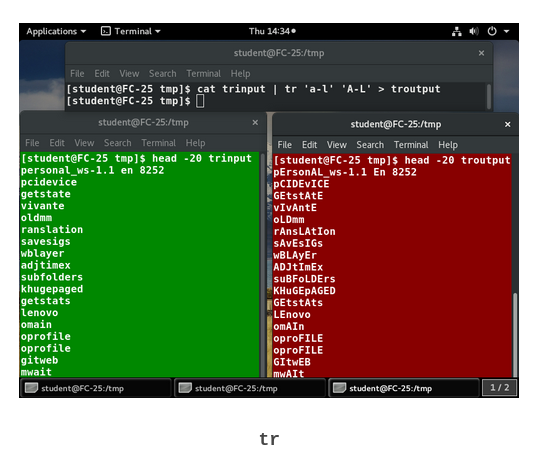

The tr utility is used to translate specified characters into other characters or to delete them. The general syntax is as follows:

`$ tr [options] set1 [set2]`

The items in the square brackets are optional. tr requires at least one argument and accepts a maximum of two. The first, designated set1 in the example, lists the characters in the text to be replaced or removed. The second, set2, lists the characters that are to be substituted for the characters listed in the first argument. Sometimes these sets need to be surrounded by apostrophes (or single-quotes (')) in order to have the shell ignore that they mean something special to the shell. It is usually safe (and may be required) to use the single-quotes around each of the sets as you will see in the examples below.

For example, suppose you have a file named city containing several lines of text in mixed case. To translate all lower case characters to upper case, at the command prompt type cat city | tr a-z A-Z and press the Enter key.

### tee

tee takes the output from any command, and, while sending it to standard output, it also saves it to a file. In other words, it tees the output stream from the command: one stream is displayed on the standard output and the other is saved to a file.

For example, to list the contents of a directory on the screen and save the output to a file, at the command prompt type ls -l | tee newfile and press the Enter key.

Typing cat newfile will then display the output of ls –l.

### wc

wc (word count) counts the number of lines, words, and characters in a file or list of files. Options are given in the table below.

By default, all three of these options are active.

For example, to print only the number of lines contained in a file, type wc -l filename and press the Enter key.

### cut

cut is used for manipulating column-based files and is designed to extract specific columns. The default column separator is the tab character. A different delimiter can be given as a command option.

For example, to display the third column delimited by a blank space, at the command prompt type ls -l | cut -d" " -f3 and press the Enter key.

### Using tee

The tee utility is very useful for saving a copy of your output while you are watching it being generated.

Execute a command such as doing a directory listing of the /etc directory:

`student:/tmp> ls -l /etc`

while both saving the output in a file and displaying it at your terminal.

`student:/tmp> ls -l /etc | tee /tmp/ls-output`
`student:/tmp> less /tmp/ls-output`

total 2948
drwxr-xr-x.  3 root root     4096 Nov  3 07:27 abrt
-rw-r--r--.  1 root root       16 Jan 15  2015 adjtime
-rw-r--r--   1 root root     1518 Jun  7  2013 aliases
-rw-r--r--.  1 root root    12288 Nov  3 07:49 aliases.db
drwxr-xr-x.  2 root root     4096 Nov  3 07:26 alsa
drwxr-xr-x.  2 root root     4096 Jan 20 07:28 alternatives
-rw-------   1 root root      541 Feb 23  2016 anacrontab
-rw-r--r--   1 root root       55 Jun  6  2016 asound.conf
-rw-r--r--   1 root root        1 May 23  2016 at.deny
drwxr-xr-x.  2 root root     4096 Nov  3 07:26 at-spi2
drwxr-x---.  3 root root     4096 Nov  3 07:26 audisp
drwxr-x---.  3 root root     4096 Nov  3 07:26 audit
drwxr-xr-x.  4 root root     4096 Nov  3 07:32 avahi
drwxr-xr-x.  2 root root     4096 Jan 18 06:59 bash_completion.d
-rw-r--r--   1 root root     2853 May  4  2016 bashrc
drwxr-xr-x.  2 root root     4096 Nov  7 10:20 binfmt.d
drwxr-xr-x   2 root root     4096 Nov  3 07:26 bluetooth
drwxr-xr-x.  2 root root     4096 Apr  9  2015 bonobo-activation
drwxr-xr-x   2 root root    12288 Nov  3 07:26 brltty
-rw-r--r--   1 root root    21929 May  6  2016 brltty.conf
-rw-r--r--   1 root root      676 Jun 23  2016 cgconfig.conf
:

### Using wc

Using wc (word count), find out how many lines, words, and characters there are in all the files in /var/log that have the .log extension.

s`tudent:/tmp> wc /var/log/*.log`

    325    2204   18114 /var/log/boot.log
      0       0       0 /var/log/pm-powersave.log
   3098   17871  125630 /var/log/systemtap.log
   5234  251967 4889056 /var/log/vbox-install.log
wc: /var/log/wpa_supplicant.log: Permission denied
   1313   15374   99968 /var/log/Xorg.0.log
    150    1185    8520 /var/log/Xorg.1.log
    318    2851   20868 /var/log/Xorg.9.log
wc: /var/log/yum.log: Permission denied
  10438  291452 5162156 total

### Chapter Summary

You have completed Chapter 13. Let’s summarize the key concepts covered:

- The command line often allows the users to perform tasks more efficiently than the GUI.
- cat, short for concatenate, is used to read, print, and combine files.
- echo displays a line of text either on standard output or to place in a file.
- sed is a popular stream editor often used to filter and perform substitutions on files and text data streams.
- awk is an interpreted programming language, typically used as a data extraction and reporting tool.
- sort is used to sort text files and output streams in either ascending or descending order.
- uniq eliminates duplicate entries in a text file.
- paste combines fields from different files. It can also extract and combine lines from multiple sources.
- join combines lines from two files based on a common field. It works only if files share a common field.
- split breaks up a large file into equal-sized segments.
- Regular expressions are text strings used for pattern matching. The pattern can be used to search for a specific location, such as the start or end of a line or a word.
- grep searches text files and data streams for patterns and can be used with regular expressions.
- tr translates characters, copies standard input to standard output, and handles special characters.
- tee saves a copy of standard output to a file while still displaying at the terminal.
- wc (word count) displays the number of lines, words, and characters in a file or group of files.
- cut extracts columns from a file.
- less views files a page at a time and allows scrolling in both directions.
- head displays the first few lines of a file or data stream on standard output. By default, it displays 10 lines.
- tail displays the last few lines of a file or data stream on standard output. By default, it displays 10 lines.
- strings extracts printable character strings from binary files.
- The z command family is used to read and work with compressed files.

### Introduction to Networking

A network is a group of computers and computing devices connected together through communication channels, such as cables or wireless media. The computers connected over a network may be located in the same geographical area or spread across the world.

A network is used to:

- Allow the connected devices to communicate with each other
- Enable multiple users to share devices over the network, such as music and video servers, printers and scanners.
- Share and manage information across computers easily.

Most organizations have both an internal network and an Internet connection for users to communicate with machines and people outside the organization. The Internet is the largest network in the world and can be called "the network of networks".

### IP Addresses

Devices attached to a network must have at least one unique network address identifier known as the IP (Internet Protocol) address. The address is essential for routing packets of information through the network.

Exchanging information across the network requires using streams of small packets, each of which contains a piece of the information going from one machine to another. These packets contain data buffers, together with headers which contain information about where the packet is going to and coming from, and where it fits in the sequence of packets that constitute the stream. Networking protocols and software are rather complicated due to the diversity of machines and operating systems they must deal with, as well as the fact that even very old standards must be supported.

### IPv4 and IPv6

There are two different types of IP addresses available: IPv4 (version 4) and IPv6 (version 6). IPv4 is older and by far the more widely used, while IPv6 is newer and is designed to get past limitations inherent in the older standard and furnish many more possible addresses.

IPv4 uses 32-bits for addresses; there are only 4.3 billion unique addresses available. Furthermore, many addresses are allotted and reserved, but not actually used. IPv4 is considered inadequate for meeting future needs because the number of devices available on the global network has increased enormously in recent years.

IPv6 uses 128-bits for addresses; this allows for 3.4 X 1038 unique addresses. If you have a larger network of computers and want to add more, you may want to move to IPv6, because it provides more unique addresses. However, it can be complex to migrate to IPv6; the two protocols do not always inter-operate well. Thus, moving equipment and addresses to IPv6 requires significant effort and has not been quite as fast as was originally intended. We will discuss IPv4 more than IPv6 as you are more likely to deal with it.

One reason IPv4 has not disappeared is there are ways to effectively make many more addresses available by methods such as NAT (Network Address Translation).  NAT enables sharing one IP address among many locally connected computers, each of which has a unique address only seen on the local network. While this is used in organizational settings, it is also used in simple home networks. For example, if you have a router hooked up to your Internet Provider (such as a cable system) it gives you one externally visible address, but issues each device in your home an individual local address.

### Decoding IPv4 Addresses

A 32-bit IPv4 address is divided into four 8-bit sections called octets.

Example:
IP address →            172  .          16  .          31  .         46
Bit format →     10101100.00010000.00011111.00101110

NOTE: Octet is just another word for byte.

Network addresses are divided into five classes: A, B, C, D and E. Classes A, B and C are classified into two parts: Network addresses (Net ID) and Host address (Host ID). The Net ID is used to identify the network, while the Host ID is used to identify a host in the network. Class D is used for special multicast applications (information is broadcast to multiple computers simultaneously) and Class E is reserved for future use. In this section you will learn about classes A, B and C.

### Class A Network Addresses

Class A addresses use the first octet of an IP address as their Net ID and use the other three octets as the Host ID. The first bit of the first octet is always set to zero. So you can use only 7-bits for unique network numbers. As a result, there are a maximum of 126 Class A networks available (the addresses 0000000 and 1111111 are reserved). Not surprisingly, this was only feasible when there were very few unique networks with large numbers of hosts. As the use of the Internet expanded, Classes B and C were added in order to accommodate the growing demand for independent networks.

Each Class A network can have up to 16.7 million unique hosts on its network. The range of host addresses is from 1.0.0.0 to 127.255.255.255.

NOTE: The value of an octet, or 8-bits, can range from 0 to 255. 

### Class B Network Addresses

Class B addresses use the first two octets of the IP address as their Net ID and the last two octets as the Host ID. The first two bits of the first octet are always set to binary 10, so there are a maximum of 16,384 (14-bits) Class B networks. The first octet of a Class B address has values from 128 to 191. The introduction of Class B networks expanded the number of networks but it soon became clear that a further level would be needed.

Each Class B network can support a maximum of 65,536 unique hosts on its network. The range of host addresses is from 128.0.0.0 to 191.255.255.255.

### Class C Network Addresses

Class C addresses use the first three octets of the IP address as their Net ID and the last octet as their Host ID. The first three bits of the first octet are set to binary 110, so almost 2.1 million (21-bits) Class C networks are available. The first octet of a Class C address has values from 192 to 223. These are most common for smaller networks which don't have many unique hosts.

Each Class C network can support up to 256 (8-bits) unique hosts. The range of host addresses is from 192.0.0.0 to 223.255.255.255.

### IP Address Allocation

Typically, a range of IP addresses are requested from your Internet Service Provider (ISP) by your organization's network administrator. Often, your choice of which class of IP address you are given depends on the size of your network and expected growth needs. If NAT is in operation, such as in a home network, you only get one externally visible address!

You can assign IP addresses to computers over a network either manually or dynamically. Manual assignment adds static (never changing) addresses to the network. Dynamically assigned addresses can change every time you reboot or even more often; the Dynamic Host Configuration Protocol (DHCP) is used to assign IP addresses.

### Name Resolution

Name Resolution is used to convert numerical IP address values into a human-readable format known as the hostname. For example, 104.95.85.15 is the numerical IP address that refers to the hostname whitehouse.gov. Hostnames are much easier to remember!

Given an IP address, you can obtain its corresponding hostname. Accessing the machine over the network becomes easier when you can type the hostname instead of the IP address.

You can view your system’s hostname simply by typing hostname with no argument.

NOTE: If you give an argument, the system will try to change its hostname to match it, however, only root users can do that.

The special hostname localhost is associated with the IP address 127.0.0.1 and describes the machine you are currently on (which normally has additional network-related IP addresses).

### Network Configuration Files

Network configuration files are essential to ensure that interfaces function correctly. They are located in the /etc directory tree. However, the exact files used have historically been dependent on the particular Linux distribution and version being used.

For Debian family configurations, the basic network configuration files could be found under /etc/network/, while for Red Hat and SUSE family systems one needed to inspect /etc/sysconfig/network.

Modern systems emphasize the use of Network Manager, which we briefly discussed when we considered graphical system administration, rather than try to keep up with the vagaries of the files in /etc. While the graphical versions of Network Manager do look somewhat different in different distributions, the nmtui utility (shown in the screenshot) varies almost not at all, as does the even more sparse nmcli (command line interface) utility. If you are proficient in the use of the GUIs, by all means, use them. If you are working on a variety of systems, the lower level utilities may make life easier.

Recent Ubuntu distributions include netplan, which is turned on by default, and supplants Network Manager. Since no other distribution has shown interest, and since it can easily be disabled if it bothers you, we will ignore it.

### Network Interfaces

Network interfaces are a connection channel between a device and a network. Physically, network interfaces can proceed through a network interface card (NIC), or can be more abstractly implemented as software. You can have multiple network interfaces operating at once. Specific interfaces can be brought up (activated) or brought down (deactivated) at any time.

Information about a particular network interface or all network interfaces can be reported by the ip and ifconfig utilities, which you may have to run as the superuser, or at least, give the full path, i.e. /sbin/ifconfig, on some distributions. ip is newer than ifconfig and has far more capabilities, but its output is uglier to the human eye. Some new Linux distributions do not install the older net-tools package to which ifconfig belongs, and  so you would have to install it if you want to use it.

### The ip Utility

To view the IP address:

`$ /sbin/ip addr show`

To view the routing information:

`$ /sbin/ip route show`

ip is a very powerful program that can do many things. Older (and more specific) utilities such as ifconfig and route are often used to accomplish similar tasks. A look at the relevant man pages can tell you much more about these utilities.

### ping

ping is used to check whether or not a machine attached to the network can receive and send data; i.e. it confirms that the remote host is online and is responding.

To check the status of the remote host, at the command prompt, type ping \<hostname>.

ping is frequently used for network testing and management; however, its usage can increase network load unacceptably. Hence, you can abort the execution of ping by typing CTRL-C, or by using the -c option, which limits the number of packets that ping will send before it quits. When execution stops, a summary is displayed.

### route

A network requires the connection of many nodes. Data moves from source to destination by passing through a series of routers and potentially across multiple networks. Servers maintain routing tables containing the addresses of each node in the network. The IP routing protocols enable routers to build up a forwarding table that correlates final destinations with the next hop addresses.

One can use the route utility or the newer ip route command to view or change the IP routing table to add, delete, or modify specific (static) routes to specific hosts or networks. The table explains some commands that can be used to manage IP routing:

### traceroute

traceroute is used to inspect the route which the data packet takes to reach the destination host, which makes it quite useful for troubleshooting network delays and errors. By using traceroute, you can isolate connectivity issues between hops, which helps resolve them faster.

To print the route taken by the packet to reach the network host, at the command prompt, type traceroute \<address>.

### More Networking Tools

Now, let’s learn about some additional networking tools. Networking tools are very useful for monitoring and debugging network problems, such as network connectivity and network traffic.

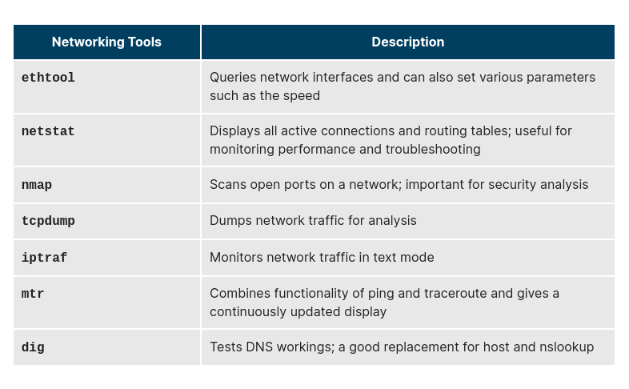

### Graphical and Non-Graphical Browsers

Browsers are used to retrieve, transmit, and explore information resources, usually on the World Wide Web. Linux users commonly use both graphical and non-graphical browser applications.

The common graphical browsers used in Linux are:

            Firefox
            Google Chrome
            Chromium
            Konqueror
            Opera

Sometimes, you either do not have a graphical environment to work in (or have reasons not to use it) but still need to access web resources. In such a case, you can use non-graphical browsers, such as the following:

### wget

Sometimes, you need to download files and information, but a browser is not the best choice, either because you want to download multiple files and/or directories, or you want to perform the action from a command line or a script. wget is a command line utility that can capably handle the following types of downloads:

- Large file downloads
- Recursive downloads, where a web page refers to other web pages and all are downloaded at once
- Password-required downloads
- Multiple file downloads.

To download a web page, you can simply type wget <url>, and then you can read the downloaded page as a local file using a graphical or non-graphical browser.

### curl

Besides downloading, you may want to obtain information about a URL, such as the source code being used. curl can be used from the command line or a script to read such information. curl also allows you to save the contents of a web page to a file, as does wget.

You can read a URL using `curl <URL>`. For example, if you want to read http://www.linuxfoundation.org, type `curl http://www.linuxfoundation.org`.

To get the contents of a web page and store it to a file, type `curl -o saved.html http://www.mysite.com`. The contents of the main index file at the website will be saved in saved.html.

### FTP (File Transfer Protocol)

When you are connected to a network, you may need to transfer files from one machine to another. File Transfer Protocol (FTP) is a well-known and popular method for transferring files between computers using the Internet. This method is built on a client-server model. FTP can be used within a browser or with stand-alone client programs.

FTP is one of the oldest methods of network data transfer, dating back to the early 1970s. As such, it is considered inadequate for modern needs, as well as being intrinsically insecure. However, it is still in use and when security is not a concern (such as with so-called anonymous FTP) it can make sense. However, many websites, such as kernel.org, have abandoned its use.

### FTP Clients

FTP clients enable you to transfer files with remote computers using the FTP protocol. These clients can be either graphical or command line tools. Filezilla, for example, allows use of the drag-and-drop approach to transfer files between hosts. All web browsers support FTP, all you have to do is give a URL like ftp://ftp.kernel.org where the usual http:// becomes ftp://.

Some command line FTP clients are:

- ftp
- sftp
- ncftp
- yafc (Yet Another FTP Client).

FTP has fallen into disfavor on modern systems, as it is intrinsically insecure, since passwords are user credentials that can be transmitted without encryption and are thus prone to interception. Thus, it was removed in favor of using rsync and web browser https access for example. As an alternative, sftp is a very secure mode of connection, which uses the Secure Shell (ssh) protocol, which we will discuss shortly. sftp encrypts its data and thus sensitive information is transmitted more securely. However, it does not work with so-called anonymous FTP (guest user credentials).

### SSH: Executing Commands Remotely

Secure Shell (SSH) is a cryptographic network protocol used for secure data communication. It is also used for remote services and other secure services between two devices on the network and is very useful for administering systems which are not easily available to physically work on, but to which you have remote access.

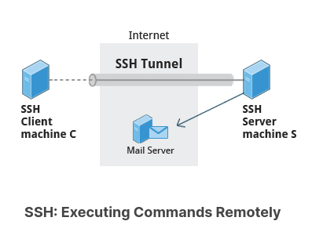

To login to a remote system using your same user name you can just type ssh some_system and press Enter. ssh then prompts you for the remote password. You can also configure ssh to securely allow your remote access without typing a password each time.

If you want to run as another user, you can do either ssh -l someone some_system or ssh someone@some_system. To run a command on a remote system via SSH, at the command prompt, you can type ssh some_system my_command.

### Copying Files Securely with scp

We can also move files securely using Secure Copy (scp) between two networked hosts. scp uses the SSH protocol for transferring data.

To copy a local file to a remote system, at the command prompt, type scp \<localfile> <user@remotesystem>:/home/user/ and press Enter.

You will receive a prompt for the remote password. You can also configure scp so that it does not prompt for a password for each transfer.

### Network Troubleshooting

Troubleshooting network problems is something that you will often encounter if you haven't already. We are going to practice some of the previously discussed tools, that can help you isolate, troubleshoot and fix problems in your network.

The solution file contains a step-by-step procedure for exercising many of the tools we have studied. Please repeat the steps, substituting your actual network interface names, alternative network addresses, and websites, etc.

Troubleshooting network problems is something that you will often encounter if you haven't already. We are going to practice some of the previously discussed tools that can help you isolate, troubleshoot, and fix problems in your network.

Suppose you need to perform an Internet search, but your web browser cannot find google.com, saying the host is unknown. Let's proceed step by step to fix this.

1. First, make certain your network is properly configured. If your Ethernet device is up and running, running ifconfig should display something like:

`student:/tmp> /sbin/ifconfig`

    eno167777 Link encap:Ethernet  HWaddr 00:0C:29:BB:92:C2
          inet addr:192.168.1.14  Bcast:192.168.1.255 
    Mask:255.255.255.0
          inet6 addr: fe80::20c:29ff:febb:92c2/64 Scope:Link
          UP BROADCAST RUNNING MULTICAST  MTU:1500  Metric:1
          RX packets:3244 errors:0 dropped:0 overruns:0 frame:0
          TX packets:2006 errors:0 dropped:0 overruns:0 carrier:0
          collisions:0 txqueuelen:1000
          RX bytes:4343606 (4.1 Mb)  TX bytes:169082 (165.1 Kb)

    lo        Link encap:Local Loopback
          inet addr:127.0.0.1  Mask:255.0.0.0
          inet6 addr: ::1/128 Scope:Host
          UP LOOPBACK RUNNING  MTU:65536  Metric:1
          RX packets:0 errors:0 dropped:0 overruns:0 frame:0
          TX packets:0 errors:0 dropped:0 overruns:0 carrier:0
          collisions:0 txqueuelen:0
          RX bytes:0 (0.0 b)  TX bytes:0 (0.0 b) 

On older systems, you probably will see a less cryptic name than eno167777, like eth0, or for a wireless connection, you might see something like wlan0 or wlp3s0. You can also show your IP address with:

`student:/tmp> ip addr show`

    1: lo:  mtu 65536 qdisc noqueue state UNKNOWN group default
        link/loopback 00:00:00:00:00:00 brd 00:00:00:00:00:00
        net 127.0.0.1/8 scope host lo
            valid_lft forever preferred_lft forever
        inet6 ::1/128 scope host
            valid_lft forever preferred_lft forever
    2: eno16777736:  mtu 1500 qdisc pfifo_fast state \
        UP group default qlen 1000
        link/ether 00:0c:29:bb:92:c2 brd ff:ff:ff:ff:ff:ff
    p    inet 192.168.1.14/24 brd 192.168.1.255 scope global dynamic
    eno16777736
       valid_lft 84941sec preferred_lft 84941sec
        inet 192.168.1.15/24 brd 192.168.1.255 scope global secondary
    dynamic eno16777736
       valid_lft 85909sec preferred_lft 85909sec
    inet6 fe80::20c:29ff:febb:92c2/64 scope link
       valid_lft forever preferred_lft forever      

Does the IP address look valid? Depending on where you are using this from, it is most likely a Class C IP address; in the above example, this is 192.168.1.14.

If it does not show a device with an IP address, you may need to start or restart the network and/or NetworkManager. Exactly how you do this depends on your system. For most distributions, one of the following commands will accomplish this:

`student:/tmp> sudo systemctl restart NetworkManager`
`student:/tmp> sudo systemctl restart network`
`student:/tmp> sudo service NetworkManager restart`
`student:/tmp> sudo service network restart     ` 

If your device was up but had no IP address, the above should have helped fix it, but you can try to get a fresh address with:

`student:/tmp> sudo dhclient eth0`

substituting the right name for the Ethernet device.

2. If your interface is up and running with an assigned IP address and you still cannot reach google.com, we should make sure you have a valid hostname assigned to your machine, with hostname:

`student:/tmp> hostname`

    openSUSE

It is rare you would have a problem here, as there is probably always at least a default hostname, such as localhost.

3. When you type in a name of a site such as google.com, that name needs to be connected to a known IP address. This is usually done employing the DNS server (Domain Name System)

First, see if the site is up and reachable with ping:

`student:/tmp> sudo ping -c 3 google.com`

    PING google.com (216.58.216.238) 56(84) bytes of data.
    64 bytes from ord31s22-in-f14.1e100.net (216.58.216.238): icmp_seq=1 ttl=51 time=21.7 ms
    64 bytes from ord31s22-in-f14.1e100.net (216.58.216.238): icmp_seq=2 ttl=51 time=23.8 ms
    64 bytes from ord31s22-in-f14.1e100.net (216.58.216.238): icmp_seq=3 ttl=51 time=21.3 ms

    --- google.com ping statistics —
    3 packets transmitted, 3 received, 0% packet loss, time 2002ms
    rtt min/avg/max/mdev = 21.388/22.331/23.813/1.074 ms

Note:

- We have used sudo for ping; recent Linux distributions have required this to avoid clueless or malicious users from flooding systems with such queries.
- We have used -c 3 to limit to 3 packets; otherwise ping would run forever until forcibly terminated, say with CTRL-C.

If the result was:

    ping: unknown host google.com

It is likely that something is wrong with your DNS setup. Note on some systems, you will never see the unknown host message, but you will get a suspicious result like:

`student:/tmp> sudo ping l89xl28vkjs.com`

    PING l89xl28vkjs.com.site (127.0.53.53) 56(84) bytes of data.
    64 bytes from 127.0.53.53: icmp_seq=1 ttl=64 time=0.016 ms
    ...      

where the 127.0.x.x address is a loop feeding back to the host machine you are on. You can eliminate this as being a valid address by doing:

`student:/tmp> host l89xl28vkjs.com`

        Host l89xl28vkjs.com not found: 3(NXDOMAIN)      

whereas a correct result would look like:

`student:/tmp> host google.com`

        google.com has address 216.58.216.206
        google.com has IPv6 address 2607:f8b0:4009:80b::200e
        google.com mail is handled by 20 alt1.aspmx.l.google.com.
        google.com mail is handled by 10 aspmx.l.google.com.
        google.com mail is handled by 30 alt2.aspmx.l.google.com.
        google.com mail is handled by 40 alt3.aspmx.l.google.com.
        google.com mail is handled by 50 alt4.aspmx.l.google.com.

The above command utilizes the DNS server configured in /etc/resolv.conf on your machine. If you wanted to override that, you could do:

`host 8.8.8.8`

        8.8.8.8.in-addr.arpa domain name pointer google-public-dns-a.google.com.
        student@linux:~> host google.com 8.8.8.8
        Using domain server:
        Name: 8.8.8.8
        Address: 8.8.8.8#53
        Aliases:

        google.com has address 216.58.216.110
        google.com has IPv6 address 2607:f8b0:4009:804::1002
        ...\

where we have used the publicly available DNS server provided by Google itself. (Using this or another public server can be a good trick sometimes if your network is up but DNS is ill; in that case you can also enter it in resolv.conf.)

Note that there is another file, /etc/hosts, where you can associate names with IP addresses, which is used before the DNS server is consulted. This is most useful for specifying nodes on your local network.

You could also use the dig utility if you prefer:

`student:/tmp> dig google.com`

        ; <<>> DiG 9.9.5-rpz2+rl.14038.05-P1 <<>> google.com
        ;; global options: +cmd
        ;; Got answer:
        ;; ->>HEADER<<- opcode: QUERY, status: NOERROR, id: 29613
        ;; flags: qr rd ra; QUERY: 1, ANSWER: 11, AUTHORITY: 0, ADDITIONAL: 1
        ;; OPT PSEUDOSECTION:
        ; EDNS: version: 0, flags:; MBZ: 1c20 , udp: 1280
        ;; QUESTION SECTION:
        ;google.com.                    IN      A
        ;; ANSWER SECTION:
        google.com.             244     IN      A       173.194.46.67
        google.com.             244     IN      A       173.194.46.65
        google.com.             244     IN      A       173.194.46.71
        google.com.             244     IN      A       173.194.46.73
        google.com.             244     IN      A       173.194.46.69
        google.com.             244     IN      A       173.194.46.68
        google.com.             244     IN      A       173.194.46.64
        google.com.             244     IN      A       173.194.46.72
        google.com.             244     IN      A       173.194.46.70
        google.com.             244     IN      A       173.194.46.66
        google.com.             244     IN      A       173.194.46.78

        ;; Query time: 22 msec
        ;; SERVER: 192.168.1.1#53(192.168.1.1)
        ;; WHEN: Mon Apr 20 08:58:58 CDT 2015
        ;; MSG SIZE  rcvd: 215      

4. Suppose host or dig fail to connect the name to an IP address. There are many reasons DNS can fail, some of which are:

- The DNS server is down. In this case try pinging it to see if it is alive (you should have the IP address in /etc/resolv.conf).
- The server can be up and running, but DNS may not be currently available on the machine.
- Your route to the DNS server may not be correct.

How can we test the route? Tracing the route to one of the public name server we mentioned before:

`student@linux:~> sudo traceroute 8.8.8.8`

        traceroute to 8.8.8.8 (8.8.8.8), 30 hops max, 60 byte packets
        1  192.168.1.1 (192.168.1.1)  0.405 ms  0.494 ms  0.556 ms
        2  10.132.4.1 (10.132.4.1)  15.127 ms  15.107 ms  15.185 ms
        3  dtr02ftbgwi-tge-0-6-0-3.ftbg.wi.charter.com (96.34.24.122)
                                                                15.243 ms 15.327 ms  17.878 ms
        4  crr02ftbgwi-bue-3.ftbg.wi.charter.com (96.34.18.116)  17.667 ms  17.734 ms  20.016 ms
        5  crr01ftbgwi-bue-4.ftbg.wi.charter.com (96.34.18.108)  22.017 ms 
        22.359 ms  22.052 ms
        6  crr01euclwi-bue-1.eucl.wi.charter.com (96.34.16.77)  29.430 ms 22.705 ms  22.076 ms
        7  bbr01euclwi-bue-4.eucl.wi.charter.com (96.34.2.4)  17.795 ms 
        25.542 ms  25.600 ms
        8  bbr02euclwi-bue-5.eucl.wi.charter.com (96.34.0.7)  28.227 ms 28.270 ms  28.303 ms
        9  bbr01chcgil-bue-1.chcg.il.charter.com (96.34.0.9)  33.114 ms 
        33.072 ms  33.175 ms
        10  prr01chcgil-bue-2.chcg.il.charter.com (96.34.3.9)  36.882 ms 
        36.794 ms  36.895 ms
        11  96-34-152-30.static.unas.mo.charter.com (96.34.152.30)  42.585 ms 
        42.326 ms  42.401 ms
        12  216.239.43.111 (216.239.43.111)  28.737 ms 216.239.43.113
        (216.239.43.113)
                                                                    24.558 ms  23.941 ms
        13  209.85.243.115 (209.85.243.115)  24.269 ms 209.85.247.17
        (209.85.247.17)
        25.758 ms 216.239.50.123 (216.239.50.123)  25.433 ms
        14  google-public-dns-a.google.com (8.8.8.8)  25.239 ms  24.003 ms  23.795 ms

Again, this should likely work for you, but what if you only got the first line in the traceroute output?

If this happens, most likely your default route is wrong. Try:

`student:/tmp> ip route show`

        efault via 192.168.1.1 dev eno16777736  proto static  metric 1024
        192.168.1.0/24 dev eno16777736  proto kernel  scope link  src 192.168.1.14

Most likely this is set to your network interface and the IP address of your router, DSL, or Cable Modem. Let's say that it is blank or simply points to your own machine. Here's your problem! At this point, you would need to add a proper default route and run some of the same tests we just did.

Note, an enhanced version of traceroute is supplied by mtr, which runs continuously (like top). Running it with the --report-cycles option to limit how long it runs:

`student:/tmp> sudo mtr --report-cycles 3 8.8.8.8`

                                    My traceroute  [v0.85]
        c7 (0.0.0.0)                                           Mon Apr 20 09:30:41 2015
        Unable to allocate IPv6 socket for nameserver communication: Address family not supported
                    by protocol                  Packets               Pings
        Host                                Loss%   Snt   Last   Avg  Best  Wrst StDev
                                            0.0%     3    0.3   0.3   0.2   0.3   0.0
        2. 10.132.4.1                        0.0%     3    6.3   7.1   6.3   8.4   0.7
        3. dtr02ftbgwi-tge-0-6-0-3.ftbg.wi.  0.0%     3    6.2   7.5   6.2  10.0   2.1
        4. dtr01ftbgwi-bue-1.ftbg.wi.charte  0.0%     3    8.9   8.5   6.2  10.4   2.0
        5. crr01ftbgwi-bue-4.ftbg.wi.charte  0.0%     3    8.9   9.7   8.9  10.4   0.0
        6. crr01euclwi-bue-1.eucl.wi.charte  0.0%     3   16.5  17.4  14.2  21.5   3.7
        7. bbr01euclwi-bue-4.eucl.wi.charte  0.0%     3   23.5  22.0  18.2  24.2   3.2
        8. bbr02euclwi-bue-5.eucl.wi.charte  0.0%     3   18.9  22.7  18.1  31.1   7.2
        9. bbr01chcgil-bue-1.chcg.il.charte  0.0%     3   22.9  23.0  22.9  23.1   0.0
        10. prr01chcgil-bue-2.chcg.il.charte  0.0%     3   21.4  24.1  20.8  30.2   5.2
        11. 96-34-152-30.static.unas.mo.char  0.0%     3   22.6  21.9  20.0  23.3   1.6
        12. 216.239.43.111                    0.0%     3   21.2  21.7  21.2  22.0   0.0
        13. 72.14.237.35                      0.0%     3   21.2  21.0  19.8  21.9   1.0
        14. google-public-dns-a.google.com    0.0%     3   26.7  23.0  21.0  26.7   3.2

Hopefully, running through some of these commands helped. It actually helps to see what the correct output for your system looks like. Practice using these commands; it is very likely that you will need them someday.

### Non-Graphical Browsers

There are times when a graphical browser is not available, but you need to look up or download a resource. In this exercise, we are going to experiment with using non-graphical web browsers. 

The solution file contains a step-by-step procedure for exercising the tools discussed. Please repeat the steps, substituting websites, etc.

We have discussed non-graphical browsers:

            lynx
            links and elinks
            w3m

There are times when you will not have a graphical window interface running on your Linux machine and you need to look something up on the web or download a driver (like a graphics driver in order to bring up a graphical window interface). So, it is a good idea to practice using a non-graphical web browser to do some work.

With links, you can use your mouse to click on the top line of the screen to get a menu. In this case, we want to go to google.com (or your favorite search engine), so you can just type g to go to a typed-in URL.

Pressing the TAB key will move your cursor to the OK button. You can then press the ENTER key.

You should now be at google.com (or your favorite search engine). Use the down-arrow key to move through the choices until you reach the blank line used to enter your search query. Now type Intel Linux graphics drivers in the search box. Use the down arrow key to move you to the Google Search button. With that highlighted, press the ENTER key.

Use your down arrow key to move to the entry: Intel(R) Graphics Drivers for Linux - Download Center. It may take several presses of the down arrow key. You can press the space bar to move down the page or the B key to move back up the page if needed. Once this line is highlighted, press the ENTER key. You will now go to the Intel Graphics Driver for Linux page. If you want, you can read the page. Remember, the space bar will page you down the page while the B key will move you back up the page. The Page Down and Page Up keys will do the same thing if you prefer. Find the URL under the line:

URL Location:      

Position your cursor at this line using the up arrow or down arrow key. Press the ENTER key to go to this location.

Page Down this page until you see the line:

Latest Releases

If you move your cursor with the arrow keys, find the latest version (with the most recent release date) under this section. If using your arrow keys, you should highlight Release Notes. Press the ENTER key.

This has installers for versions of Ubuntu and Fedora, along with the source code. You will need to page down a page or two, depending on the size of your screen.

Select one of the installers, perhaps for the version of Linux that you are running, or just a random one, and press the ENTER key.

You should see a text dialog box with choices of what to do. Save the package wherever you want to.

You can now quit your non-graphical browser. If you used links, then click on the top line of the screen, select the File drop-down menu item, and click on Exit. Confirm that you really want to exit Links. You should now see your shell prompt.

### Chapter Summary

You have completed Chapter 14. Let’s summarize the key concepts covered:

- The IP (Internet Protocol) address is a unique logical network address that is assigned to a device on a network.
- IPv4 uses 32-bits for addresses and IPv6 uses 128-bits for addresses.
- Every IP address contains both a network and a host address field.
- There are five classes of network addresses available: A, B, C, D & E.
- DNS (Domain Name System) is used for converting Internet domain and host names to IP addresses.
- The ifconfig program is used to display current active network interfaces.
- The commands ip addr show and ip route show can be used to view IP address and routing information.
- You can use ping to check if the remote host is alive and responding.
- You can use the route utility program to manage IP routing.
- You can monitor and debug network problems using networking tools.
- Firefox, Google Chrome, Chromium, and Epiphany are the main graphical browsers used in Linux.
- Non-graphical or text browsers used in Linux are Lynx, Links, and w3m.
- You can use wget to download webpages.
- You can use curl to obtain information about URLs.
- FTP (File Transfer Protocol) is used to transfer files over a network.
- ftp, sftp, ncftp, and yafc are command line FTP clients used in Linux.
                You can use ssh to run commands on remote systems.

### Shell Scripting

Suppose you want to look up a filename, check if the associated file exists, and then respond accordingly, displaying a message confirming or not confirming the file's existence. If you only need to do it once, you can just type a sequence of commands at a terminal. However, if you need to do this multiple times, automation is the way to go. In order to automate sets of commands, you will need to learn how to write shell scripts. Most commonly in Linux, these scripts are developed to be run under the bash command shell interpreter. The graphic illustrates several of the benefits of deploying scripts.

NOTE: Many of the topics discussed in this and the next chapter have already been introduced earlier, while discussing things that can be done at the command line. We have elected to repeat some of that discussion in order to make the sections on scripting stand on their own, so the repetition is intentional.

### Command Shell Choices

The command interpreter is tasked with executing statements that follow it in the script. Commonly used interpreters include: /usr/bin/perl, /bin/bash, /bin/csh, /usr/bin/python and /bin/sh.

Typing a long sequence of commands at a terminal window can be complicated, time consuming, and error prone. By deploying shell scripts, using the command line becomes an efficient and quick way to launch complex sequences of steps. The fact that shell scripts are saved in a file also makes it easy to use them to create new script variations and share standard procedures with several users.

Linux provides a wide choice of shells; exactly what is available on the system is listed in /etc/shells. Typical choices are:

    /bin/sh
    /bin/bash
    /bin/tcsh
    /bin/csh
    /bin/ksh
    /bin/zsh

Most Linux users use the default bash shell, but those with long UNIX backgrounds with other shells may want to override the default.

### History of Command Shells

To learn more about the UNIX shell, you can read this short article below.

sh was written by Steve Bourne at AT&T in 1977, and is often known as the Bourne Shell. All
other shells are descended from it in some fashion and it is available on all systems that have a
UNIX bloodline.
csh was written by Bill Joy at UC Berkeley and released in 1978. The internal syntax is quite
different than sh and is designed to resemble the C programming language, and hence the
name.
tcsh was originally developed by Ken Greer at Carnegie Mellon University in the late 1970's;
the t in tcsh stands for TENEX, an operating system that was used on some DEC PDP-10's. It
has many additional features as compared with csh and on virtually all modern systems csh is
just a link to tcsh.
ksh was written by David Korn at AT&T and appeared in 1982, and is often known as the Korn
shell. It was designed to be a major upgrade to sh and is backward compatible with it, and
brings in some of the features of tcsh, such as command line history recall. This shell has long
been a favorite of many system administrators.
bash is a product of the GNU project and was created in 1987. It was designed as a major
upgrade of sh; the name stands for Bourne Again Shell. It has full backward compatibility with
sh and partial compatibility with ksh.
On all Linux systems sh is just a link to bash, but scripts which are invoked as sh will only work
without the bash extensions. A similar relationship exists between csh and tcsh.

### Shell Scripts

Remember from our earlier discussion, a shell is a command line interpreter which provides the user interface for terminal windows. It can also be used to run scripts, even in non-interactive sessions without a terminal window, as if the commands were being directly typed in. For example, typing `find . -name "*.c" -ls` at the command line accomplishes the same thing as executing a script file containing the lines:

`#!/bin/bash`
`find . -name "*.c" -ls`

The first line of the script, which starts with #!, contains the full path of the command interpreter (in this case /bin/bash) that is to be used on the file. As we have noted, you have quite a few choices for the scripting language you can use, such as /usr/bin/perl, /bin/csh, /usr/bin/python, etc.

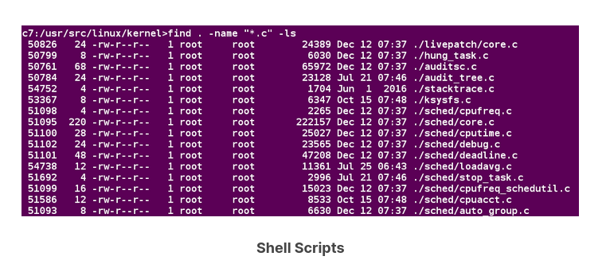

### A Simple bash Script

Let's write a simple bash script that displays a one line message on the screen. Either type:

`$ cat > hello.sh`

        #!/bin/bash
        echo "Hello Linux Foundation Student"

and press ENTER and CTRL-D to save the file, or just create hello.sh in your favorite text editor. Then, type `chmod +x hello.sh` to make the file executable by all users.

You can then run the script by typing `./hello.sh` or by doing:

`$ bash hello.sh`

        Hello Linux Foundation Student

NOTE: If you use the second form, you do not have to make the file executable.

### Interactive Example Using bash Scripts

Now, let's see how to create a more interactive example using a bash script. The user will be prompted to enter a value, which is then displayed on the screen. The value is stored in a temporary variable, name. We can reference the value of a shell variable by using a $ in front of the variable name, such as \$name. To create this script, you need to create a file named getname.sh in your favorite editor with the following content:

`#!/bin/bash`
`# Interactive reading of a variable`
`echo "ENTER YOUR NAME"`
`read name`
`# Display variable input`
`echo The name given was :$name`

Once again, make it executable by doing `chmod +x getname.sh.`

In the above example, when the user types `./getname.sh` and the script is executed, the user is prompted with the string ENTER YOUR NAME. The user then needs to enter a value and press the Enter key. The value will then be printed out.

NOTE: The hash-tag/pound-sign/number-sign (#) is used to start comments in the script and can be placed anywhere in the line (the rest of the line is considered a comment). However, note the special magic combination of #!, used on the first line, is a unique exception to this rule.

### Return Values

All shell scripts generate a return value upon finishing execution, which can be explicitly set with the exit statement. Return values permit a process to monitor the exit state of another process, often in a parent-child relationship. Knowing how the process terminates enables taking any appropriate steps which are necessary or contingent on success or failure.

### Viewing Return Values

As a script executes, one can check for a specific value or condition and return success or failure as the result. By convention, success is returned as 0, and failure is returned as a non-zero value. An easy way to demonstrate success and failure completion is to execute ls on a file that exists as well as one that does not, the return value is stored in the environment variable represented by $?:

`$ ls /etc/logrotate.conf`

        /etc/logrotate.conf

`$ echo $?`

        0

In this example, the system is able to locate the file /etc/logrotate.conf and ls returns a value of 0 to indicate success. When run on a non-existing file, it returns 2. Applications often translate these return values into meaningful messages easily understood by the user.

### Exit Status Codes

Write a script which:

1. Does ls for a non-existent file, and then displays the resulting exit status.
2. Creates a file and does ls for it, and then once again displays the resulting exit status.

Create a file named testls.sh, with the content below:

`#!/bin/bash`
`#`
`# check for non-existent file, exit status will be 2`
`#`
`ls SoMeFiLe.ext  `
`echo "status: $?"`

`# create file, and do again, exit status will be 0`
`touch SoMeFiLe.ext`
`ls SoMeFiLe.ext  `
`echo "status: $?"`

`# remove the file to clean up`
`rm SoMeFiLe.ext`

Make it executable and run it:

`student:/tmp> chmod +x testls.sh `
`student:/tmp> ./testls.sh`

        ls: cannot access SoMeFiLe.ext: No such file or directory
        status: 2
        SoMeFiLe.ext
        status: 0

### Basic Syntax and Special Characters

Scripts require you to follow a standard language syntax. Rules delineate how to define variables and how to construct and format allowed statements, etc. The table lists some special character usages within bash scripts:

There are other special characters and character combinations and constructs that scripts understand, such as (..), {..}, [..], &&, ||, ', ", $((...)), some of which we will discuss later.

### Splitting Long Commands Over Multiple Lines

Sometimes, commands are too long to either easily type on one line, or to grasp and understand (even though there is no real practical limit to the length of a command line).  

In this case, the concatenation operator (\), the backslash character, is used to continue long commands over several lines.

Here is an example of a command installing a long list of packages on a system using Debian package management:

`$~/> cd $HOME`
`$~/> sudo apt-get install autoconf automake bison build-essential \`
    `chrpath curl diffstat emacs flex gcc-multilib g++-multilib \ `
    `libsdl1.2-dev libtool lzop make mc patch \`
    `screen socat sudo tar texinfo tofrodos u-boot-tools unzip \`
    `vim wget xterm zip`

The command is divided into multiple lines to make it look readable and easier to understand. The \ operator at the end of each line causes the shell to combine (concatenate) multiple lines and executes them as one single command.

### Putting Multiple Commands on a Single Line

Users sometimes need to combine several commands and statements and even conditionally execute them based on the behavior of operators used in between them. This method is called chaining of commands.

There are several different ways to do this, depending on what you want to do. The ; (semicolon) character is used to separate these commands and execute them sequentially, as if they had been typed on separate lines. Each ensuing command is executed whether or not the preceding one succeeded.

Thus, the three commands in the following example will all execute, even if the ones preceding them fail:

`$ make ; make install ; make clean`

However, you may want to abort subsequent commands when an earlier one fails. You can do this using the && (and) operator as in:

`$ make && make install && make clean`

If the first command fails, the second one will never be executed. A final refinement is to use the || (or) operator, as in:

`$ cat file1 || cat file2 || cat file3`

In this case, you proceed until something succeeds and then you stop executing any further steps.

Chaining commands is not the same as piping them; in the later case succeeding commands begin operating on data streams produced by earlier ones before they complete, while in chaining each step exits before the next one starts.

### Output Redirection

Most operating systems accept input from the keyboard and display the output on the terminal. However, in shell scripting you can send the output to a file. The process of diverting the output to a file is called output redirection. We have already used this facility in our earlier sections on how to use the command line.

The > character is used to write output to a file. For example, the following command sends the output of free to /tmp/free.out:

`$ free > /tmp/free.out`

To check the contents of /tmp/free.out, at the command prompt type cat /tmp/free.out.

Two > characters (>>) will append output to a file if it exists, and act just like > if the file does not already exist.

### Input Redirection

Just as the output can be redirected to a file, the input of a command can be read from a file. The process of reading input from a file is called input redirection and uses the < character.

The following three commands (using wc to count the number of lines, words and characters in a file) are entirely equivalent and involve input redirection, and a command operating on the contents of a file:

`$ wc < /etc/passwd`
49  105 2678 /etc/passwd

`$ wc /etc/passwd`
49  105 2678 /etcpasswd

`$ cat /etc/passwd | wc`
49  105 2678

### Built-In Shell Commands

Shell scripts execute sequences of commands and other types of statements. These commands can be: 

- Compiled applications
- Built-in bash commands
- Shell scripts or scripts from other interpreted languages, such as perl and Python.

Compiled applications are binary executable files, generally residing on the filesystem in well-known directories such as /usr/bin. Shell scripts always have access to applications such as rm, ls, df, vi, and gzip, which are programs compiled from lower level programming languages such as C.

In addition, bash has many built-in commands, which can only be used to display the output within a terminal shell or shell script. Sometimes, these commands have the same name as executable programs on the system, such as echo, which can lead to subtle problems. bash built-in commands include cd, pwd, echo, read, logout, printf, let, and ulimit. Thus, slightly different behavior can be expected from the built-in version of a command such as echo as compared to /bin/echo.

A complete list of bash built-in commands can be found in the bash man page, or by simply typing help, as we review on the next page.

### 

We already enumerated which commands have versions built in to bash, in our earlier discussion of how to get help on Linux systems. Once again, here is a screenshot listing exactly which commands are available.

### Script Parameters

Users often need to pass parameter values to a script, such as a filename, date, etc. Scripts will take different paths or arrive at different values according to the parameters (command arguments) that are passed to them. These values can be text or numbers as in:

`$ ./script.sh /tmp`
`$ ./script.sh 100 200`

Within a script, the parameter or an argument is represented with a $ and a number or special character. The table lists some of these parameters.

### Using Script Parameters

If you type in the script shown in the figure, make the script executable with chmod +x param.sh. Then, run the script giving it several arguments, as shown. The script is processed as follows:

$0 prints the script name: param.sh

$1 prints the first parameter: one

$2 prints the second parameter: two

$3 prints the third parameter: three

$* prints all parameters: one two three four five

The final statement becomes: All done with param.sh

### Command Substitution

At times, you may need to substitute the result of a command as a portion of another command. It can be done in two ways:

- By enclosing the inner command in $( )
- By enclosing the inner command with backticks (`)

The second, backticks form, is deprecated in new scripts and commands. No matter which method is used, the specified command will be executed in a newly launched shell environment, and the standard output of the shell will be inserted where the command substitution is done.

Virtually any command can be executed this way. While both of these methods enable command substitution, the $( ) method allows command nesting. New scripts should always use this more modern method. For example:

`$ ls /lib/modules/$(uname -r)/`

In the above example, the output of the command uname –r (which will be something like 5.13.3), is inserted into the argument for the ls command.

### Environment Variables

Most scripts use variables containing a value, which can be used anywhere in the script. These variables can either be user or system-defined. Many applications use such environment variables (already covered in some detail in the User Environment chapter) for supplying inputs, validation, and controlling behavior.

As we discussed earlier, some examples of standard environment variables are HOME, PATH, and HOST. When referenced, environment variables must be prefixed with the \$ symbol, as in \$HOME. You can view and set the value of environment variables. For example, the following command displays the value stored in the PATH variable:

`$ echo $PATH`

However, no prefix is required when setting or modifying the variable value. For example, the following command sets the value of the MYCOLOR variable to blue:

`$ MYCOLOR=blue`

You can get a list of environment variables with the env, set, or printenv commands.

### Exporting Environment Variables

While we discussed the export of environment variables in the section on the "User Environment", it is worth reviewing this topic in the context of writing bash scripts.

By default, the variables created within a script are available only to the subsequent steps of that script. Any child processes (sub-shells) do not have automatic access to the values of these variables. To make them available to child processes, they must be promoted to environment variables using the export statement, as in:

`export VAR=value`

or

`VAR=value ; export VAR`

While child processes are allowed to modify the value of exported variables, the parent will not see any changes; exported variables are not shared, they are only copied and inherited.

Typing export with no arguments will give a list of all currently exported environment variables.

### Functions

A function is a code block that implements a set of operations. Functions are useful for executing procedures multiple times, perhaps with varying input variables. Functions are also often called subroutines. Using functions in scripts requires two steps:

1. Declaring a function
2. Calling a function

The function declaration requires a name which is used to invoke it. The proper syntax is:

        function_name () {
        command...
        }

For example, the following function is named display:

        display () {
        echo "This is a sample function"
        }

The function can be as long as desired and have many statements. Once defined, the function can be called later as many times as necessary. In the full example shown in the figure, we are also showing an often-used refinement: how to pass an argument to the function. The first argument can be referred to as \$1, the second as \$2, etc.

### Working with Files and Directories in a Script

Write a script which:

1. Prompts the user for a directory name and then creates it with mkdir.
2. Changes to the new directory and prints out where it is using pwd.
3. Using touch, creates several empty files and runs ls on them to verify they are empty.
4. Puts some content in them using echo and redirection.
5. Displays their content using cat.
6. Says goodbye to the user and cleans up after itself.

Create a file named testfile.sh, with the content below:

`#!/bin/bash`

`# Prompts the user for a directory name and then creates it  with mkdir.`

`echo "Give a directory name to create:" `
`read NEW_DIR`

`# Save original directory so we can return to it (could also just use pushd, popd)`

`ORIG_DIR=$(pwd)`

`# check to make sure it doesn't already exist!`

`[[ -d $NEW_DIR ]] && echo $NEW_DIR already exists, aborting && exit `
`mkdir $NEW_DIR`

`# Changes to the new directory and prints out where it is using pwd.  `

`cd $NEW_DIR`
`pwd`

`# Using touch, creates several empty files and runs ls on them to verify they are empty.`

`for n in 1 2 3 4`
`do `
    `touch file$n `
`done`

`ls file?`

`# (Could have just done touch file1 file2 file3 file4, just want to show do loop!)`

`# Puts some content in them using echo and redirection.`

`for names in file? ` 
`do `
    `echo This file is named $names > $names`
`done`

`# Displays their content using cat`

`cat file?`

`# Says goodbye to the user and cleans up after itself `

`cd $ORIG_DIR `
`rm -rf $NEW_DIR `
`echo "Goodbye My Friend!"`

Make it executable and run it:

`$ chmod +x testfile.sh`
`./testfile.sh`

Give a directory name to create:

`/tmp/SOME_DIR`

`/tmp/SOME_DIR`

        file1  file2  file3  file4
        This file is named file1
        This file is named file2
        This file is named file3
        This file is named file4
        Goodbye My Friend

### Passing Arguments

Write a script that takes exactly one argument, and prints it back out to standard output. Make sure the script generates a usage message if it is run without giving an argument.

Create a file named testarg.sh, with the content below:

`#!/bin/bash`
`#`
`# check for an argument, print a usage message if not supplied.`
`#`
`if [ $# -eq 0 ] ; then`

      echo "Usage: $0 argument"
      exit 1
`fi`
`echo $1`
`exit 0`

Make it executable and run it:

`student:/tmp> chmod +x testarg.sh `
`student:/tmp> ./testarg.sh Hello`

        Hello

`student:/tmp>./testarg.sh `

        Usage: ./testarg.sh argument
        student:/tmp>

### Environment Variables

Write a script which:

1. Asks the user for a number, which should be "1" or "2". Any other input should lead to an error report.
2. Sets an environmental variable to be "Yes" if it is "1", and "No" if it is "2".
3. Exports the environmental variable and displays it.

Create a file named testenv.sh, with the content below:

`#!/bin/bash`

`echo "Enter 1 or 2, to set the environmental variable EVAR to Yes or No"
read ans`

`# Set up a return code`
`RC=0`

`if [ $ans -eq 1 ]  `
`then `

    `export EVAR="Yes"`
`else`

    `if [ $ans -eq 2 ]`
    `then`
	`export EVAR="No"`
    `else`
`# can only reach here with a bad answer`

	`export EVAR="Unknown"`
	`RC=1`
    `fi`  
`fi`
`echo "The value of EVAR is: $EVAR"`
`exit $RC`

Make it executable and run it:

`student:/tmp> chmod +x testenv.sh `
`student:/tmp> ./testenv.sh`

Enter 1 or 2, to set the environmental variable EVAR to Yes or No

1

The value of EVAR is: Yes

`student:/tmp> ./testenv.sh `

Enter 1 or 2, to set the environmental variable EVAR to Yes or No

2

The value of EVAR is: No

`student:/tmp> ./testenv.sh `

Enter 1 or 2, to set the environmental variable EVAR to Yes or No

3

The value of EVAR is: Unknown

### Working with Functions

Write a script which:

1. Asks the user for a number (1, 2 or 3).
2. Calls a function with that number in its name. The function should display a message with its name included.

Create a file named testfun.sh, with the content below:

`#!/bin/bash`

`# Functions (must be defined before use)`

    func1() {
    echo " This message is from function 1"
    }

    func2() {
    echo " This message is from function 2" 
    }

    func3() { 
    echo " This message is from function 3" 
    }

`# Beginning of the main script`

`# prompt the user to get their choice`

    echo "Enter a number from 1 to 3"
    read n

`# Call the chosen function`

    func$n

Make it executable and run it:

`student:/tmp> chmod +x testfun.sh `
`student:/tmp> ./testfun.sh`

Enter a number from 1 to 3

2

 This message is from function 2

`$ ./testfun.sh`

Enter a number from 1 to 3

7

./testfun.sh: line 21: func7: command not found

### The if Statement

Conditional decision making, using an if statement, is a basic construct that any useful programming or scripting language must have.

When an if statement is used, the ensuing actions depend on the evaluation of specified conditions, such as:

- Numerical or string comparisons
- Return value of a command (0 for success)
- File existence or permissions

In compact form, the syntax of an if statement is:

`if TEST-COMMANDS; then CONSEQUENT-COMMANDS; fi`

A more general definition is:

if condition

then

       statements
else

       statements
fi

### Using the if Statement

In the following example, an if statement checks to see if a certain file exists, and if the file is found, it displays a message indicating success or failure:

`if [ -f "$1" ]`

`then`

    echo file "$1 exists" 
`else`

    echo file "$1" does not exist
`fi`

We really should also check first that there is an argument passed to the script ($1) and abort if not.

Notice the use of the square brackets ([]) to delineate the test condition. There are many other kinds of tests you can perform, such as checking whether two numbers are equal to, greater than, or less than each other and make a decision accordingly; we will discuss these other tests.

In modern scripts, you may see doubled brackets as in \[[ -f /etc/passwd ]]. This is not an error. It is never wrong to do so and it avoids some subtle problems, such as referring to an empty environment variable without surrounding it in double quotes; we will not talk about this here.

### The elif Statement

You can use the elif statement to perform more complicated tests, and take action appropriate actions. The basic syntax is:

if [ sometest ] ; then

    echo Passed test1 
elif [ somothertest ] ; then

    echo Passed test2 
fi

In the example shown we use strings tests which we will explain shortly, and show how to pull in an environment variable with the read statement. 

### Testing for Files

bash provides a set of file conditionals, that can be used with the if statement, including those in the table.

You can use the if statement to test for file attributes, such as:

- File or directory existence
- Read or write permission
- Executable permission.

For example, in the following example:

if [ -x /etc/passwd ] ; then

    ACTION
fi

the if statement checks if the file /etc/passwd is executable, which it is not. Note the very common practice of putting:

; then

on the same line as the if statement.

You can view the full list of file conditions typing:

man 1 test.

### Boolean Expressions

Boolean expressions evaluate to either TRUE or FALSE, and results are obtained using the various Boolean operators listed in the table.

Note that if you have multiple conditions strung together with the && operator, processing stops as soon as a condition evaluates to false. For example, if you have A && B && C and A is true but B is false, C will never be executed.

Likewise, if you are using the || operator, processing stops as soon as anything is true. For example, if you have A || B || C and A is false and B is true, you will also never execute C.

### Tests in Boolean Expressions

Boolean expressions return either TRUE or FALSE. We can use such expressions when working with multiple data types, including strings or numbers, as well as with files. For example, to check if a file exists, use the following conditional test:

[ -e \<filename> ]

Similarly, to check if the value of number1 is greater than the value of number2, use the following conditional test:

[ $number1 -gt \$number2 ]

The operator -gt returns TRUE if number1 is greater than number2.

### Example of Testing of Strings

You can use the if statement to compare strings using the operator == (two equal signs). The syntax is as follows:

    if [ string1 == string2 ] ; then
    ACTION
    fi

Note that using one = sign will also work, but some consider it deprecated usage. Let’s now consider an example of testing strings.

In the example illustrated here, the if statement is used to compare the input provided by the user and accordingly display the result.

### Numerical Tests

You can use specially defined operators with the if statement to compare numbers. The various operators that are available are listed in the table:

The syntax for comparing numbers is as follows:

    exp1 -op exp2

### Example of Testing for Numbers

Let us now consider an example of comparing numbers using the various operators:

### Arithmetic Expressions

Arithmetic expressions can be evaluated in the following three ways (spaces are important!):

- Using the expr utility
expr is a standard but somewhat deprecated program. The syntax is as follows:

            expr 8 + 8
            echo $(expr 8 + 8)

- Using the $((...)) syntax
            This is the built-in shell format. The syntax is as follows:

            echo $((x+1))

- Using the built-in shell command let. The syntax is as follows:

            let x=( 1 + 2 ); echo $x

In modern shell scripts, the use of expr is better replaced with var=$((...)).

### Arithmetic and Functions

Write a script that will act as a simple calculator for add, subtract, multiply and divide.

1. Each operation should have its own function.
2. Any of the three methods for bash arithmetic, ($((..)), let, or expr) may be used.
3. The user should give 3 arguments when executing the script:
            - The first should be one of the letters a, s, m, or d to specify which math operation.
            - The second and third arguments should be the numbers that are being operated on.
4. The script should detect for bad or missing input values and display the results when done.

Create a file named testmath.sh, with the content below:

`#!/bin/bash`

`# Functions.  must be before the main part of the script`

`# in each case method 1 uses $((..))`
`#              method 2 uses let`
`#              method 3 uses expr`

    add() {
        answer1=$(($1 + $2))
        let answer2=($1 + $2)
        answer3=`expr $1 + $2`
    }
    sub() {
        answer1=$(($1 - $2))
        let answer2=($1 - $2)
        answer3=`expr $1 - $2`
    }
    mult() {
        answer1=$(($1 * $2))
        let answer2=($1 * $2)
        answer3=`expr $1 \* $2`
    }
    div() {
        answer1=$(($1 / $2))
        let answer2=($1 / $2)
        answer3=`expr $1 / $2`
    }

`# End of functions`
`#`
`# Main part of the script`
`# need 3 arguments, and parse to make sure they are valid types`

    op=$1 ; arg1=$2 ; arg2=$3
    [[ $# -lt 3 ]] && \
        echo "Usage: Provide an operation (a,s,m,d) and two numbers" && exit 1
    [[ $op != a ]] && [[ $op != s ]] && [[ $op != d ]] && [[ $op != m ]] && \
        echo operator must be a, s, m, or d, not $op as supplied

`# ok, do the work!`

    if [[ $op == a ]] ; then add $arg1 $arg2
    elif [[ $op == s ]] ; then sub $arg1 $arg2
    elif [[ $op == m ]] ; then mult $arg1 $arg2
    elif [[ $op == d ]] ; then div $arg1 $arg2
    else
    echo $op is not a, s, m, or d, aborting ; exit 2 
    fi

`# Show the answers`

    echo $arg1 $op $arg2 :
    echo 'Method 1, $((..)),' Answer is  $answer1
    echo 'Method 2, let,    ' Answer is  $answer2
    echo 'Method 3, expr,   ' Answer is  $answer3

Make it executable and run it:

`student:/tmp> chmod +x testmath.sh `
`student:/tmp> ./testmath.sh`
`student:/tmp> for n in a s m d x ; do ./testmath.sh $n 21 7 ; done`

    21 a 7 :
    Method 1, $((..)), Answer is 28
    Method 2, let,
    Answer is 28
    Method 3, expr,
    Answer is 28
    21 s 7 :
    Method 1, $((..)), Answer is 14
    Method 2, let,
    Answer is 14
    Method 3, expr,
    Answer is 14
    21 m 7 :
    Method 1, $((..)), Answer is 147
    Method 2, let,
    Answer is 147
    Method 3, expr,
    Answer is 147
    21 d 7 :
    Method 1, $((..)), Answer is 3
    Method 2, let,
    Answer is 3
    Method 3, expr,
    Answer is 3
    operator must be a, s, m, or d, not x as supplied
    x is not a, s, m, or d, aborting

### Chapter Summary

You have completed Chapter 15. Let’s summarize the key concepts covered:

- Scripts are a sequence of statements and commands stored in a file that can be executed by a shell. The most commonly used shell in Linux is bash.
- Command substitution allows you to substitute the result of a command as a portion of another command.
- Functions or routines are a group of commands that are used for execution.
- Environmental variables are quantities either preassigned by the shell or defined and modified by the user.
- To make environment variables visible to child processes, they need to be exported.
- Scripts can behave differently based on the parameters (values) passed to them.
- The process of writing the output to a file is called output redirection.
- The process of reading input from a file is called input redirection.
- The if statement is used to select an action based on a condition.
- Arithmetic expressions consist of numbers and arithmetic operators, such as +, -, and *.

### String Manipulation

Let’s go deeper and find out how to work with strings in scripts.

A string variable contains a sequence of text characters. It can include letters, numbers, symbols and punctuation marks. Some examples include: abcde, 123, abcde 123, abcde-123, &acbde=%123.

String operators include those that do comparison, sorting, and finding the length. The following table demonstrates the use of some basic string operators:

### Example of String Manipulation

In the first example, we compare the first string with the second string and display an appropriate message using the if statement.

In the second example, we pass in a file name and see if that file exists in the current directory or not.

### Parts of a String

At times, you may not need to compare or use an entire string. To extract the first n characters of a string we can specify: ${string:0:n}. Here, 0 is the offset in the string (i.e. which character to begin from) where the extraction needs to start and n is the number of characters to be extracted.

To extract all characters in a string after a dot (.), use the following expression: ${string#*.}.

### String Tests and Operations

Write a script which reads two strings as arguments and then:

1. Tests to see if the first string is of zero length, and if the other is of non-zero length, telling the user of both results.
2. Determines the length of each string, and reports on which one is longer or if they are of equal length.
3. Compares the strings to see if they are the same, and reports on the result.

Create a file named teststrings.sh, with the content below:

`#!/bin/bash`

`# check two string arguments were given`

    [[ $# -lt 2 ]] && \
        echo "Usage: Give two strings as arguments" && exit 1
    str1=$1
    str2=$2

------------------------------------
`## test command`

    echo "Is string 1 zero length? Value of 1 means FALSE"
    [ -z "$str1" ]
    echo $?
    # note if $str1 is empty, the test [ -z $str1 ] would fail
    #                              but [[ -z $str1 ]] succeeds
    #         i.e., with [[ ]] it works even without the quotes
    echo "Is string 2 nonzero length? Value of 0 means TRUE;"
    [ -n $str2 ]
    echo $?

`## comparing the lengths of two string`

    len1=${#str1}
    len2=${#str2}
    echo length of string1 = $len1, length of string2 = $len2

    if [ $len1 -gt $len2 ]
    then
        echo "String 1 is longer than string 2"
    else
        if [ $len2 -gt $len1 ]
        then
        echo "String 2 is longer than string 1"
        else
        echo "String 1 is the same length as string 2"
        fi
    fi

`## compare the two strings to see if they are the same`

    if [[ $str1 == $str2 ]]
    then
        echo "String 1 is the same as string 2"
    else
        if [[ $str1 != $str2 ]]
        then
        echo "String 1 is not the same as string 2"
        fi
    fi

`student:/tmp> chmod +x teststrings.sh `
`student:/tmp> ./teststrings.sh str1 str2`

    Is string 1 zero length? Value of 1 means FALSE
    1
    Is string 2 nonzero length? Value of 0 means TRUE;
    0
    length of string1 = 4, length of string2 = 4
    String 1 is the same length as string 2
    String 1 is not the same as string 2

`student:/tmp>./teststrings.sh str1 str2long`

    Is string 1 zero length? Value of 1 means FALSE
    1
    Is string 2 nonzero length? Value of 0 means TRUE;
    0
    length of string1 = 4, length of string2 = 8
    String 2 is longer than string 1
    String 1 is not the same as string 2

`student:/tmp>`

### The case Statement

The case statement is used in scenarios where the actual value of a variable can lead to different execution paths. case statements are often used to handle command-line options.

Below are some of the advantages of using the case statement:

- It is easier to read and write.
- It is a good alternative to nested, multi-level if-then-else-fi code blocks.
- It enables you to compare a variable against several values at once.
- It reduces the complexity of a program.

### Structure of the case Statement

Here is the basic structure of the case statement:

    case expression in
        pattern1) execute commands;;
        pattern2) execute commands;;
        pattern3) execute commands;;
        pattern4) execute commands;;
        * )       execute some default commands or nothing ;;
    esac

### Example of Use of the case Construct

Here is an example of the use of a case construct. Note you can have multiple possibilities for each case value that take the same action.

### Using the case Statement

Write a script that takes as an argument a month in numerical form (i.e. between 1 and 12), and translates this to the month name and displays the result on standard out (the terminal).

If no argument is given, or a bad number is given, the script should report the error and exit.

Create a file named testcase.sh, with the content below:

`#!/bin/bash`

`# Accept a number between 1 and 12 as`
`# an argument to this script, then return the`
`# the name of the month that corresponds to that number.`

`# Check to see if the user passed a parameter.`

    if [ $# -eq 0 ]
    then
    echo "Error. Give as an argument a number between 1 and 12."
    exit 1
    fi

`# set month equal to argument passed for use in the script`

    month=$1

################################################
`# The example of a case statement:`

    case $month in

      1)  echo "January"   ;;
      2)  echo "February"  ;;
      3)  echo "March"     ;;
      4)  echo "April"     ;;
      5)  echo "May"       ;;
      6)  echo "June"      ;;
      7)  echo "July"      ;;
      8)  echo "August"    ;;
      9)  echo "September" ;;
      10) echo "October"   ;;
      11) echo "November"  ;;
      12) echo "December"  ;;
      *)
          echo "Error. No month matches: $month"
          echo "Please pass a number between 1 and 12."
          exit 2
          ;;
    esac
    exit 0

Make it executable and run it:

`student:/tmp> chmod +x testcase.sh `
`student:/tmp> ./testcase.sh 5`

    May

`student:/tmp> ./testcase.sh 12`

    December

`student:/tmp> ./testcase.sh 99`

    Error. No month matches: 99
    Please pass a number between 1 and 12
    student:/tmp> 

### Looping Constructs

By using looping constructs, you can execute one or more lines of code repetitively, usually on a selection of values of data such as individual files. Usually, you do this until a conditional test returns either true or false, as is required.

Three types of loops are often used in most programming languages:

- for
- while
- until

All these loops are easily used for repeating a set of statements until the exit condition is true.

### The for Loop

The for loop operates on each element of a list of items. The syntax for the for loop is:

    for variable-name in list
    do
        execute one iteration for each item in the list until the list is finished
    done

In this case, variable-name and list are substituted by you as appropriate (see examples). As with other looping constructs, the statements that are repeated should be enclosed by do and done.

The screenshot here shows an example of the for loop to print the sum of numbers 1 to 10.

### The while Loop

The while loop repeats a set of statements as long as the control command returns true. The syntax is:

    while condition is true
    do
        Commands for execution
        ----
    done

The set of commands that need to be repeated should be enclosed between do and done. You can use any command or operator as the condition. Often, it is enclosed within square brackets ([]).

The screenshot here shows an example of the while loop that calculates the factorial of a number. Do you know why the computation of 21! gives a bad result?

### The until Loop

The until loop repeats a set of statements as long as the control command is false. Thus, it is essentially the opposite of the while loop. The syntax is:

    until condition is false
    do
        Commands for execution
        ----
    done

Similar to the while loop, the set of commands that need to be repeated should be enclosed between do and done. You can use any command or operator as the condition.

The screenshot here shows an example of the until loop that once again computes factorials; it is only slightly different than the test case for the while loop.

### Debugging bash Scripts

While working with scripts and commands, you may run into errors. These may be due to an error in the script, such as an incorrect syntax, or other ingredients, such as a missing file or insufficient permission to do an operation. These errors may be reported with a specific error code, but often just yield incorrect or confusing output. So, how do you go about identifying and fixing an error?

Debugging helps you troubleshoot and resolve such errors, and is one of the most important tasks a system administrator performs.

### Script Debug Mode

You can run a bash script in debug mode either by doing bash –x ./script_file, or bracketing parts of the script with set -x and set +x. The debug mode helps identify the error because:

- It traces and prefixes each command with the + character.
- It displays each command before executing it.
- It can debug only selected parts of a script (if desired) with:

            set -x    # turns on debugging
            ...
            set +x    # turns off debugging

The screenshot shown here demonstrates a script which runs in debug mode if run with any argument on the command line.

### Redirecting Errors to File and Screen

In UNIX/Linux, all programs that run are given three open file streams when they are started as listed in the table: 

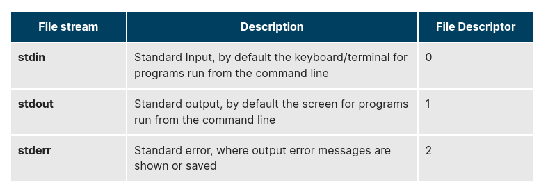

Using redirection, we can save the stdout and stderr output streams to one file or two separate files for later analysis after a program or command is executed.

The screenshot shows a shell script with a simple bug, which is then run and the error output is diverted to error.log. Using cat to display the contents of the error log adds in debugging. Do you see how to fix the script?

### Creating Temporary Files and Directories

Consider a situation where you want to retrieve 100 records from a file with 10,000 records. You will need a place to store the extracted information, perhaps in a temporary file, while you do further processing on it.

Temporary files (and directories) are meant to store data for a short time. Usually, one arranges it so that these files disappear when the program using them terminates. While you can also use touch to create a temporary file, in some circumstances this may make it easy for hackers to gain access to your data. This is particularly true if the name and the file location of the temporary file are predictable.

The best practice is to create random and unpredictable filenames for temporary storage. One way to do this is with the mktemp utility, as in the following examples.

The XXXXXXXX is replaced by mktemp with random characters to ensure the name of the temporary file cannot be easily predicted and is only known within your program.

### Example of Creating a Temporary File and Directory

Sloppiness in creation of temporary files can lead to real damage, either by accident or if there is a malicious actor. For example, if someone were to create a symbolic link from a known temporary file used by root to the /etc/passwd file, like this:

`$ ln -s /etc/passwd /tmp/tempfile`

There could be a big problem if a script run by root has a line in it like this:

`echo $VAR > /tmp/tempfile`

The password file will be overwritten by the temporary file contents.

To prevent such a situation, make sure you randomize your temporary file names by replacing the above line with the following lines:

`TEMP=$(mktemp /tmp/tempfile.XXXXXXXX)`
`echo $VAR > $TEMP`

Note the screen capture shows similarly named temporary files from different days, but with randomly generated characters in them.

### Discarding Output with /dev/null

Certain commands (like find) will produce voluminous amounts of output, which can overwhelm the console. To avoid this, we can redirect the large output to a special file (a device node) called /dev/null. This pseudofile is also called the bit bucket or black hole.

All data written to it is discarded and write operations never return a failure condition. Using the proper redirection operators, it can make the output disappear from commands that would normally generate output to stdout and/or stderr:

`$ ls -lR /tmp > /dev/null`

In the above command, the entire standard output stream is ignored, but any errors will still appear on the console. However, if one does:

`$ ls -lR /tmp >& /dev/null`

both stdout and stderr will be dumped into /dev/null.

### Random Numbers and Data

It is often useful to generate random numbers and other random data when performing tasks such as:

- Performing security-related tasks
- Reinitializing storage devices
- Erasing and/or obscuring existing data
- Generating meaningless data to be used for tests

Such random numbers can be generated by using the $RANDOM environment variable, which is derived from the Linux kernel’s built-in random number generator, or by the OpenSSL library function, which uses the FIPS140 (Federal Information Processing Standard) algorithm to generate random numbers for encryption

To learn about FIPS140, read Wikipedia's "FIPS 140-2" article.

The example shows you how to easily use the environmental variable method to generate random numbers.

### How the Kernel Generates Random Numbers

Some servers have hardware random number generators that take as input different types of noise signals, such as thermal noise and photoelectric effect. A transducer converts this noise into an electric signal, which is again converted into a digital number by an A-D converter. This number is considered random. However, most common computers do not contain such specialized hardware and, instead, rely on events created during booting to create the raw data needed.

Regardless of which of these two sources is used, the system maintains a so-called entropy pool of these digital numbers/random bits. Random numbers are created from this entropy pool.

The Linux kernel offers the /dev/random and /dev/urandom device nodes, which draw on the entropy pool to provide random numbers which are drawn from the estimated number of bits of noise in the entropy pool.

/dev/random is used where very high quality randomness is required, such as one-time pad or key generation, but it is relatively slow to provide values. /dev/urandom is faster and suitable (good enough) for most cryptographic purposes.

Furthermore, when the entropy pool is empty, /dev/random is blocked and does not generate any number until additional environmental noise (network traffic, mouse movement, etc.) is gathered, whereas /dev/urandom reuses the internal pool to produce more pseudo-random bits.

### Using Random Numbers

Write a script which:

1. Takes a word as an argument.
2. Appends a random number to it.
3. Displays the answer.

Create a file named testrandom.sh, with the content below:

`#!/bin/bash`
`##`
`# check to see if the user supplied in the parameter.`

`[[ $# -eq 0 ]] && echo "Usage: $0 word" && exit 1`

`echo "$1-$RANDOM`
`exit 0`

Make it executable and run it:

`student:/tmp> chmod +x testrandom.sh `
`student:/tmp> ./testrandom.sh strA`

    strA-29294

`student:/tmp>./testrandom.sh strB`

    strB-23911

`student:/tmp>./testrandom.sh strC`

    strC-27782
    student:/tmp>

### Chapter Summary

You have completed Chapter 16. Let’s summarize the key concepts covered:

- You can manipulate strings to perform actions such as comparison, sorting, and finding length.
- You can use Boolean expressions  when working with multiple data types, including strings or numbers, as well as files.
- The output of a Boolean expression is either true or false.
- Operators used in Boolean expressions include the && (AND), || (OR), and ! (NOT) operators.
- We looked at the advantages of using the case statement in scenarios where the value of a variable can lead to different execution paths.
- Script debugging methods help troubleshoot and resolve errors.
- The standard and error outputs from a script or shell commands can easily be redirected into the same file or separate files to aid in debugging and saving results.
- Linux allows you to create temporary files and directories, which store data for a short duration, both saving space and increasing security.
- Linux provides several different ways of generating random numbers, which are widely used.

### Printing on Linux

To manage printers and print directly from a computer or across a networked environment, you need to know how to configure and install a printer. Printing itself requires software that converts information from the application you are using to a language your printer can understand. The Linux standard for printing software is the Common UNIX Printing System (CUPS).

Modern Linux desktop systems make installing and administering printers pretty simple and intuitive, and not unlike how it is done on other operating systems. Nevertheless, it is instructive to understand the underpinnings of how it is done in Linux.

### CUPS Overview

CUPS is the underlying software almost all Linux systems use to print from applications like a web browser or LibreOffice. It converts page descriptions produced by your application (put a paragraph here, draw a line there, and so forth) and then sends the information to the printer. It acts as a print server for both local and network printers.

Printers manufactured by different companies may use their own particular print languages and formats. CUPS uses a modular printing system which accommodates a wide variety of printers and also processes various data formats. This makes the printing process simpler; you can concentrate more on printing and less on how to print.

Generally, the only time you should need to configure your printer is when you use it for the first time. In fact, CUPS often figures things out on its own by detecting and configuring any printers it locates.

### How Does CUPS Work? 

CUPS carries out the printing process with the help of its various components:

- Configuration files
- Scheduler
- Job files
- Log files
- Filter
- Printer drivers
- Backend.

You will learn about each of these components on the next few pages.

### Scheduler

CUPS is designed around a print scheduler that manages print jobs, handles administrative commands, allows users to query the printer status, and manages the flow of data through all CUPS components.

We will look at the browser-based interface that can be used with CUPS,  which allows you to view and manipulate the order and status of pending print jobs.

### Configuration Files

The print scheduler reads server settings from several configuration files, the two most important of which are cupsd.conf and printers.conf. These and all other CUPS related configuration files are stored under the /etc/cups/ directory.

cupsd.conf is where most system-wide settings are located; it does not contain any printer-specific details. Most of the settings available in this file relate to network security, i.e. which systems can access CUPS network capabilities, how printers are advertised on the local network, what management features are offered, and so on.

printers.conf is where you will find the printer-specific settings. For every printer connected to the system, a corresponding section describes the printer’s status and capabilities. This file is generated or modified only after adding a printer to the system, and should not be modified by hand.

You can view the full list of configuration files by typing ls -lF /etc/cups.

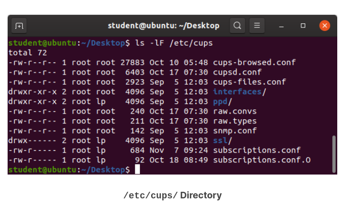

### Job Files

CUPS stores print requests as files under the /var/spool/cups directory (these can actually be accessed before a document is sent to a printer). Data files are prefixed with the letter d while control files are prefixed with the letter c.

After a printer successfully handles a job, data files are automatically removed. These data files belong to what is commonly known as the print queue.

### Log Files

Log files are placed in /var/log/cups and are used by the scheduler to record activities that have taken place. These files include access, error, and page records.

To view what log files exist, type:

`$ sudo ls -l /var/log/cups`

Note on some distributions permissions are set such that you do not need to use sudo. You can view the log files with the usual tools.

### Filters, Printer Drivers, and Backends

CUPS uses filters to convert job file formats to printable formats. Printer drivers contain descriptions for currently connected and configured printers, and are usually stored under /etc/cups/ppd/. The print data is then sent to the printer through a filter, and via a backend that helps to locate devices connected to the system.

So, in short, when you execute a print command, the scheduler validates the command and processes the print job, creating job files according to the settings specified in the configuration files. Simultaneously, the scheduler records activities in the log files. Job files are processed with the help of the filter, printer driver, and backend, and then sent to the printer.

### Managing CUPS

Assuming CUPS has been installed you'll need to start and manage the CUPS daemon so that CUPS is ready for configuring a printer. Managing the CUPS daemon is simple; all management features can be done with the systemctl utility:

`$ systemctl status cups`

`$ sudo systemctl [enable|disable] cups`

`$ sudo systemctl [start|stop|restart] cups`

NOTE: The next screen demonstrates this on Ubuntu, but is the same for all major current Linux distributions. 

### Configuring a Printer from the GUI

Each Linux distribution has a GUI application that lets you add, remove, and configure local or remote printers. Using this application, you can easily set up the system to use both local and network printers. The following screens show how to find and use the appropriate application in each of the distribution families covered in this course.

When configuring a printer, make sure the device is currently turned on and connected to the system; if so it should show up in the printer selection menu. If the printer is not visible, you may want to troubleshoot using tools that will determine if the printer is connected. For common USB printers, for example, the lsusb utility will show a line for the printer. Some printer manufacturers also require some extra software to be installed in order to make the printer visible to CUPS, however, due to the standardization these days, this is rarely required.

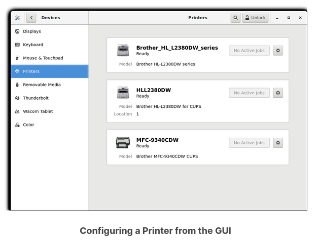

### Adding Printers from the CUPS Web Interface

A fact that few people know is that CUPS also comes with its own web server, which makes a configuration interface available via a set of CGI scripts.

This web interface allows you to:

- Add and remove local/remote printers
- Configure printers:

        – Local/remote printers 

        – Share a printer as a CUPS server 

- Control print jobs:
  
        – Monitor jobs 

        – Show completed or pending jobs 

        – Cancel or move jobs. 

The CUPS web interface is available on your browser at: http://localhost:631.

Some pages require a username and password to perform certain actions, for example to add a printer. For most Linux distributions, you must use the root password to add, modify, or delete printers or classes.

### Printing from the Graphical Interface

Many graphical applications allow users to access printing features using the CTRL-P shortcut. To print a file, you first need to specify the printer (or a file name and location if you are printing to a file instead) you want to use; and then select the page setup, quality, and color options. After selecting the required options, you can submit the document for printing. The document is then submitted to CUPS. You can use your browser to access the CUPS web interface at http://localhost:631/ to monitor the status of the printing job. Now that you have configured the printer, you can print using either the Graphical or Command Line interfaces.

The screenshot shows the GUI interface for CTRL-P for CentOS, other Linux distributions appear virtually identical.

### Printing from the Command-Line Interface

CUPS provides two command-line interfaces, descended from the System V and BSD flavors of UNIX. This means that you can use either lp (System V) or lpr (BSD) to print. You can use these commands to print text, PostScript, PDF, and image files.

These commands are useful in cases where printing operations must be automated (from shell scripts, for instance, which contain multiple commands in one file). 

lp is just a command line front-end to the lpr utility that passes input to lpr. Thus, we will discuss only lp in detail. In the example shown here, the task is to print $HOME/.emacs.

### Using lp

lp and lpr accept command line options that help you perform all operations that the GUI can accomplish. lp is typically used with a file name as an argument.

Some lp commands and other printing utilities you can use are listed in the table:

lpoptions can be used to set printer options and defaults. Each printer has a set of tags associated with it, such as the default number of copies and authentication requirements. You can type lpoptions help to obtain a list of supported options. lpoptions can also be used to set system-wide values, such as the default printer.

### Managing Print Jobs

You send a file to the shared printer. But when you go there to collect the printout, you discover another user has just started a 200 page job that is not time sensitive. Your file cannot be printed until this print job is complete. What do you do now?

In Linux, command line print job management commands allow you to monitor the job state as well as managing the listing of all printers and checking their status, and canceling or moving print jobs to another printer.

Some of these commands are listed in the table. 

### Working with PostScript and PDF

PostScript is a standard  page description language. It effectively manages scaling of fonts and vector graphics to provide quality printouts. It is purely a text format that contains the data fed to a PostScript interpreter. The format itself is a language that was developed by Adobe in the early 1980s to enable the transfer of data to printers.

Features of PostScript are:

- It can be used on any printer that is PostScript-compatible; i.e. any modern printer
- Any program that understands the PostScript specification can print to it
- Information about page appearance, etc. is embedded in the page.

Postscript has been for the most part superseded by the PDF format (Portable Document Format) which produces far smaller files in a compressed format for which support has been integrated into many applications. However, one still has to deal with postscript documents, often as an intermediate format on the way to producing final documents.

### Working with enscript

enscript is a tool that is used to convert a text file to PostScript and other formats. It also supports Rich Text Format (RTF) and HyperText Markup Language (HTML). For example, you can convert a text file to two columns (-2) formatted PostScript using the command:

`$ enscript -2 -r -p psfile.ps textfile.txt`

This command will also rotate (-r) the output to print so the width of the paper is greater than the height (aka landscape mode) thereby reducing the number of pages required for printing.

The commands that can be used with enscript are listed in the table below (for a file called textfile.txt).

### Converting between PostScript and PDF

Most users today are far more accustomed to working with files in PDF format, viewing them easily either on the Internet through their browser or locally on their machine. The PostScript format is still important for various technical reasons that the general user will rarely have to deal with.

From time to time, you may need to convert files from one format to the other, and there are very simple utilities for accomplishing that task. ps2pdf and pdf2ps are part of the ghostscript package installed on or available on all Linux distributions. As an alternative, there are pstopdf and pdftops which are usually part of the poppler package, which may need to be added through your package manager. Unless you are doing a lot of conversions or need some of the fancier options (which you can read about in the man pages for these utilities), it really does not matter which ones you use.

Another possibility is to use the very powerful convert program, which is part of the ImageMagick package. Some newer distributions have replaced this with Graphics Magick, and the command to use is gm convert.

Some usage examples:

### Viewing PDF Content

Linux has many standard programs that can read PDF files, as well as many applications that can easily create them, including all available office suites, such as LibreOffice.

The most common Linux PDF readers are:

1. evince is available on virtually all distributions and is the most widely used program.
2. okular is based on the older kpdf and is available on any distribution that provides the KDE environment.

These open source PDF readers support and can read files following the PostScript standard. The proprietary Adobe Acrobat Reader, which was once widely used on Linux systems, is fortunately no longer available, as it did defective rendering and was unstable and poorly maintained.

### Manipulating PDFs

At times, you may want to merge, split, or rotate PDF files; not all of these operations can be achieved while using a PDF viewer. Some of these operations include:

- Merging/splitting/rotating PDF documents
- Repairing corrupted PDF pages
- Pulling single pages from a file
- Encrypting and decrypting PDF files
- Adding, updating, and exporting a PDF’s metadata
- Exporting bookmarks to a text file
- Filling out PDF forms.

In order to accomplish these tasks there are several programs available:

- qpdf
- pdftk
- ghostscript.

qpdf is widely available on Linux distributions and is very full-featured. pdftk was once very popular but depends on an obsolete unmaintained package (libgcj) and a number of distributions have dropped it; thus we recommend avoiding it. Ghostscript (often invoked using gs) is widely available and well-maintained. However, its usage is a little complex.

### Using qpdf

You can accomplish a wide variety of tasks using qpdf including:

### Using pdftk

pdftk has now been ported to Java! Marc Vinyals has developed and maintained a port to Java for pdftk which can be found here, together with instructions for installation. Some distributions such as Ubuntu, may install this version only. 

You can accomplish a wide variety of tasks using pdftk including:

### Encrypting PDF Files with pdftk

If you’re working with PDF files that contain confidential information and you want to ensure that only certain people can view the PDF file, you can apply a password to it using the user_pw option. One can do this by issuing a command such as:

`$ pdftk public.pdf output private.pdf user_pw PROMPT`

When you run this command, you will receive a prompt to set the required password, which can have a maximum of 32 characters. A new file, private.pdf, will be created with the identical content as public.pdf, but anyone will need to type the password to be able to view it.

### Using Ghostscript

Ghostscript is widely available as an interpreter for the Postscript and PDF languages. The executable program associated with it is abbreviated to gs.

This utility can do most of the operations pdftk can, as well as many others; see man gs for details. Use is somewhat complicated by the rather long nature of the options. For example:

- Combine three PDF files into one:

    `$ gs -dBATCH -dNOPAUSE -q -sDEVICE=pdfwrite  -sOutputFile=all.pdf file1.pdf file2.pdf file3.pdf`

- Split pages 10 to 20 out of a PDF file:

    `$ gs -sDEVICE=pdfwrite -dNOPAUSE -dBATCH -dDOPDFMARKS=false -dFirstPage=10 -dLastPage=20\
            -sOutputFile=split.pdf file.pdf`

### Using Additional Tools

You can use other tools to work with PDF files, such as:

- pdfinfo 
            It can extract information about PDF files, especially when the files are very large or when a graphical interface is not available.
- flpsed 
            It can add data to a PostScript document. This tool is specifically useful for filling in forms or adding short comments into the document.
- pdfmod 
            It is a simple application that provides a graphical interface for modifying PDF documents. Using this tool, you can reorder, rotate, and remove pages; export images from a document; edit the title, subject, and author; add keywords; and combine documents using drag-and-drop action.

For example, to collect the details of a document, you can use the following command:

`$ pdfinfo /usr/share/doc/readme.pdf`

### Creating PostScript and PDF from Text Files

1. Check to see if the enscript package has been installed on your system, and if not, install it.
2. Using enscript, convert the text file /var/dmesg to PostScript format and name the result /tmp/dmesg.ps. As an alternative, you can use any large text file on your system. Make sure you can read the PostScript file (for example with evince) and compare to the original file. NOTE: On some systems, evince may have problems with the PostScript file, but the PDF file you produce from it will be fine for viewing.
3. Convert the PostScript document to PDF format, using ps2pdf. Make sure you can read the resulting PDF file. Does it look identical to the PostScript version?
4. Is there a way you can go straight to the PDF file without producing a PostScript file on the disk along the way?
5. Using pdfinfo, determine what is the PDF version used to encode the file, the number of pages, the page size, and other metadata about the file. If you do not have pdfinfo you probably need to install the poppler-utils package.

-------------------------------------------------------------------------

1. Try

    `which enscript   `

        /usr/bin/enscript

    If you do not get a positive result, install with whichever command is appropriate for your Linux distribution:

        apt-get install enscript
        yum install enscript
        zypper install enscript

2. `enscript -p /tmp/dmesg.ps /var/log/dmesg`
    `evince /tmp/dmesg.ps`
     

3. `ps2pdf /tmp/dmesg.ps`
    `ls -lh /var/log/dmesg /tmp/dmesg.ps /tmp/dmesg.pdf`

        -rw-rw-r-- 1 coop coop 28K Apr 22 13:00 /tmp/dmesg.pdf
        -rw-rw-r-- 1 coop coop 80K Apr 22 12:59 /tmp/dmesg.ps
        -rw-r--r-- 1 root root 53K Apr 22 11:48 /var/log/dmesg

    `evince /tmp/dmesg.ps /tmp/dmesg.pdf`

    Note the difference in sizes. PostScript files tend to be large, while PDF is a compressed format.
     

4. You may want to scan the man pages for enscript and ps2pdf to figure out how to use standard input or standard output instead of files.

    `student:/tmp> enscript -p - /var/log/dmesg  | ps2pdf -  dmesg_direct.pdf`         

        [ 15 pages * 1 copy ] left in -
        85 lines were wrapped

    `student:/tmp> ls -l dmesg*pdf  ` 

        -rw-rw-r-- 1 coop coop 28177 Apr 22 13:20 dmesg_direct.pdf
        -rw-rw-r-- 1 coop coop 28177 Apr 22 13:00 dmesg.pdf

5. `student:/tmp> pdfinfo dmesg.pdf  `
     
        Title:          Enscript Output
        Author:         Theodore Cleaver
        Creator:        GNU Enscript 1.6.6
        Producer:       GPL Ghostscript 9.07
        CreationDate:   Wed Apr 22 13:00:26 2015
        ModDate:        Wed Apr 22 13:00:26 2015
        Tagged:         no
        Form:           none
        Pages:          15
        Encrypted:      no
        Page size:      612 x 792 pts (letter)
        Page rot:       0
        File size:      28177 bytes

### Combining PDFs

You can convert two text files (you can create them or use ones that already exist since this is non-destructive) into PDFs, or you can use two pre-existing ones. Combine them into one PDF, and view the result.

If pdftk is not installed, you can try to install. However, if you are on a system for which it is not available (such as RHEL7/CentOS7 or OpenSUSE), you will have to use qpdf or gs.

First, we can create two PDFs to play with, using enscript and then ps2pdf:

    cd /var/log
    enscript -p dmesg.ps /var/log/dmesg
    enscript -p boot.ps /var/log/boot.log
    ps2dpf dmesg.ps
    ps2dpf boot.ps 

Of course, you may use two pre-existing PDF files and substitute their names below.

- Method 1: Using qpdf:
  
    `qpdf --empty --pages dmesg.pdf boot.pdf -- method1.pdf`

- Method 2: Using pdftk:
  
    `pdftk dmesg.pdf boot.pdf cat output method2.pdf`

- Method 3: Using gs:

    `gs -dBATCH -dNOPAUSE -q -sDEVICE=pdfwrite -sOutputFile=method3.pdf dmesg.pdf boot.pdf`

Now view them:

`ls -l method1.pdf method2.pdf`
`evince method1.pdf method2.pdf`

How do the files compare?

### Chapter Summary

You have completed Chapter 17. Let’s summarize the key concepts covered:

- CUPS provides two command-line interfaces: the System V and BSD.
- The CUPS interface is available at http://localhost:631.
- lp and lpr are used to submit a document to CUPS directly from the command line.
- lpoptions can be used to set printer options and defaults.
- PostScript effectively manages scaling of fonts and vector graphics to provide quality prints.
- enscript is used to convert a text file to PostScript and other formats.
- Portable Document Format (PDF) is the standard format used to exchange documents while ensuring a certain level of consistency in the way the documents are viewed.
- pdftk joins and splits PDFs; pulls single pages from a file; encrypts and decrypts PDF files; adds, updates, and exports a PDF’s metadata; exports bookmarks to a text file; adds or removes attachments to a PDF; fixes a damaged PDF; and fills out PDF forms.
- pdfinfo can extract information about PDF documents.
- flpsed can add data to a PostScript document.
- pdfmod is a simple application with a graphical interface that you can use to modify PDF documents.

### User Accounts

The Linux kernel allows properly authenticated users to access files and applications. While each user is identified by a unique integer (the user id or UID), a separate database associates a username with each UID. Upon account creation, new user information is added to the user database and the user's home directory must be created and populated with some essential files. Command line programs such as useradd and userdel as well as GUI tools are used for creating and removing accounts. 

For each user, the following seven fields are maintained in the /etc/passwd file: 

### Types of Accounts

By default, Linux distinguishes between several account types in order to isolate processes and workloads. Linux has four types of accounts:

- root
- System
- Normal
- Network

For a safe working environment, it is advised to grant the minimum privileges possible and necessary to accounts, and remove inactive accounts. The last utility, which shows the last time each user logged into the system, can be used to help identify potentially inactive accounts which are candidates for system removal.

Keep in mind that practices you use on multi-user business systems are more strict than practices you can use on personal desktop systems that only affect the casual user. This is especially true with security. We hope to show you practices applicable to enterprise servers that you can use on all systems, but understand that you may choose to relax these rules on your own personal system.

### Understanding the root Account

root is the most privileged account on a Linux/UNIX system. This account has the ability to carry out all facets of system administration, including adding accounts, changing user passwords, examining log files, installing software, etc. Utmost care must be taken when using this account. It has no security restrictions imposed upon it.

When you are signed in as, or acting as root, the shell prompt displays '#' (if you are using bash and you have not customized the prompt, as we have discussed previously). This convention is intended to serve as a warning to you of the absolute power of this account.

### Operations Requiring root Privileges

root privileges are required to perform operations such as:

- Creating, removing and managing user accounts
- Managing software packages
- Removing or modifying system files
- Restarting system services.

Regular account users of Linux distributions might be allowed to install software packages, update some settings, use some peripheral devices, and apply various kinds of changes to the system. However, root privilege is required for performing administration tasks such as restarting most services, manually installing packages and managing parts of the filesystem that are outside the normal user’s directories.

### Operations Not Requiring root Privileges

A regular account user can perform some operations requiring special permissions; however, the system configuration must allow such abilities to be exercised.

SUID (Set owner User ID upon execution - similar to the Windows "run as" feature) is a special kind of file permission given to a file. Use of SUID provides temporary permissions to a user to run a program with the permissions of the file owner (which may be root) instead of the permissions held by the user.

The table provides examples of operations which do not require root privileges:

### Comparing sudo and su

In Linux you can use either su or sudo to temporarily grant root access to a normal user. However, these methods are actually quite different. Listed below are the differences between the two commands:

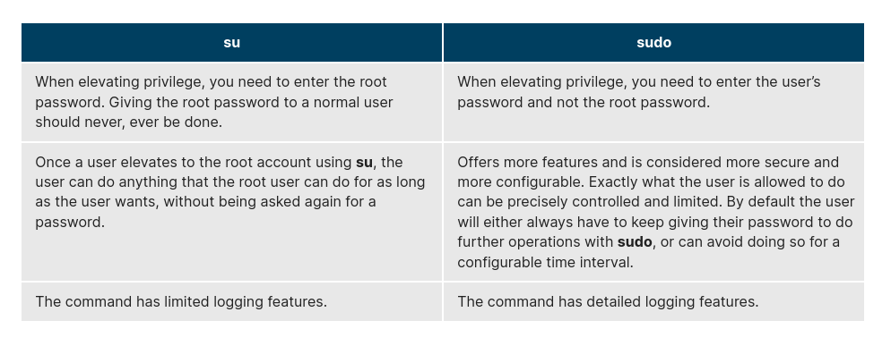

### sudo Features

sudo has the ability to keep track of unsuccessful attempts at gaining root access. Users' authorization for using sudo is based on configuration information stored in the /etc/sudoers file and in the /etc/sudoers.d directory.

A message such as the following would appear in a system log file (usually /var/log/secure) when trying to execute sudo for badperson without successfully authenticating the user:

`badperson : user NOT in sudoers ; TTY=pts/4 ; PWD=/var/log ; USER=root ; COMMAND=/usr/bin/tail secure`

### The sudoers File

Whenever sudo is invoked, a trigger will look at /etc/sudoers and the files in /etc/sudoers.d to determine if the user has the right to use sudo and what the scope of their privilege is. Unknown user requests and requests to do operations not allowed to the user even with sudo are reported. The basic structure of entries in these files is:

`who where = (as_whom) what`

/etc/sudoers contains a lot of documentation in it about how to customize. Most Linux distributions now prefer you add a file in the directory /etc/sudoers.d with a name the same as the user. This file contains the individual user's sudo configuration, and one should leave the master configuration file untouched except for changes that affect all users.

You should edit any of these configuration files by using visudo, which ensures that only one person is editing the file at a time, has the proper permissions, and refuses to write out the file and exit if there are syntax errors in the changes made. The editing can be accomplished by doing a command such as the following ones:

`# visudo /etc/sudoers`
`# visudo -f /etc/sudoers.d/student`

The actual specific editor invoked will depend on the setting of your EDITOR environment variable.

### Command Logging

By default, sudo commands and any failures are logged in /var/log/auth.log under the Debian distribution family, and in /var/log/messages and/or /var/log/secure on other systems. This is an important safeguard to allow for tracking and accountability of sudo use. A typical entry of the message contains:

- Calling username
- Terminal info
- Working directory
- User account invoked
- Command with arguments

Running a command such as sudo whoami results in a log file entry such as:

`Dec 8 14:20:47 server1 sudo: op : TTY=pts/6 PWD=/var/log USER=root COMMAND=/usr/bin/whoami`

### Process Isolation

Linux is considered to be more secure than many other operating systems because processes are naturally isolated from each other. One process normally cannot access the resources of another process, even when that process is running with the same user privileges. Linux thus makes it difficult (though certainly not impossible) for viruses and security exploits to access and attack random resources on a system.

More recent additional security mechanisms that limit risks even further include:

- Control Groups (cgroups)
            Allows system administrators to group processes and associate finite resources to each cgroup.
- Containers
            Makes it possible to run multiple isolated Linux systems (containers) on a single system by relying on cgroups.
- Virtualization
            Hardware is emulated in such a way that not only processes can be isolated, but entire systems are run simultaneously as isolated and insulated guests (virtual machines) on one physical host.

### Hardware Device Access

Linux limits user access to non-networking hardware devices in a manner that is extremely similar to regular file access. Applications interact by engaging the filesystem layer (which is independent of the actual device or hardware the file resides on). This layer will then open a device special file (often called a device node) under the /dev directory that corresponds to the device being accessed. Each device special file has standard owner, group and world permission fields. Security is naturally enforced just as it is when standard files are accessed.

Hard disks, for example, are represented as /dev/sd*. While a root user can read and write to the disk in a raw fashion, for example, by doing something like:

`# echo hello world > /dev/sda1`

The standard permissions as shown in the figure, make it impossible for regular users to do so. Writing to a device in this fashion can easily obliterate the filesystem stored on it in a way that cannot be repaired without great effort, if at all. The normal reading and writing of files on the hard disk by applications is done at a higher level through the filesystem, and never through direct access to the device node.

### Keeping Current

When security problems in either the Linux kernel or applications and libraries are discovered, Linux distributions have a good record of reacting quickly and pushing out fixes to all systems by updating their software repositories and sending notifications to update immediately. The same thing is true with bug fixes and performance improvements that are not security related.

However, it is well known that many systems do not get updated frequently enough and problems which have already been cured are allowed to remain on computers for a long time; this is particularly true with proprietary operating systems where users are either uninformed or distrustful of the vendor's patching policy as sometimes updates can cause new problems and break existing operations. Many of the most successful attack vectors come from exploiting security holes for which fixes are already known but not universally deployed.

So the best practice is to take advantage of your Linux distribution's mechanism for automatic updates and never postpone them. It is extremely rare that such an update will cause new problems.

### sudo

- Create a new user, using useradd, and give the user an initial password with passwd.
- Configure this user to be able to use sudo.
- Login as or switch to this new user and make sure you can execute a command that requires root privilege.

For example, a trivial command requiring root privilege could be:

`$ ls /root`

1. `sudo useradd newuser`
`sudo passwd newuser`

    (give the password for this user when prompted)

2. With root privilege, (use sudo visudo) add this line to /etc/sudoers:

        newuser      ALL=(ALL)     ALL

    Alternatively, create a file named /etc/sudoers.d/newuser with just that one line as content.

3. You can login by doing:

`sudo su newuser`

    or

`ssh newuser@localhost`

which will require giving newuser's password, and is probably a better solution. Instead of localhost you can give your hostname, IP address or 127.0.0.1. Then as newuser just type:

`sudo ls /root`

### How Passwords Are Stored

The system verifies authenticity and identity using user credentials.

Originally, encrypted passwords were stored in the /etc/passwd file, which was readable by everyone. This made it rather easy for passwords to be cracked.

On modern systems, passwords are actually stored in an encrypted format in a secondary file named /etc/shadow. Only those with root access can read or modify this file.

### Password Algorithm

Protecting passwords has become a crucial element of security. Most Linux distributions rely on a modern password encryption algorithm called SHA-512 (Secure Hashing Algorithm 512 bits), developed by the U.S. National Security Agency (NSA) to encrypt passwords.

The SHA-512 algorithm is widely used for security applications and protocols. These security applications and protocols include TLS, SSL, PHP, SSH, S/MIME and IPSec. SHA-512 is one of the most tested hashing algorithms.

For example, if you wish to experiment with SHA-512 encoding, the word "test" can be encoded using the program sha512sum to produce the SHA-512 form (see graphic):

### Good Password Practices

IT professionals follow several good practices for securing the data and the password of every user.

- Password aging is a method to ensure that users get prompts that remind them to create a new password after a specific period. This can ensure that passwords, if cracked, will only be usable for a limited amount of time. This feature is implemented using chage, which configures the password expiry information for a user.
- Another method is to force users to set strong passwords using Pluggable Authentication Modules (PAM). PAM can be configured to automatically verify that a password created or modified using the passwd utility is sufficiently strong. PAM configuration is implemented using a library called pam_cracklib.so, which can also be replaced by pam_passwdqc.so to take advantage of more options.
- One can also install password cracking programs, such as John The Ripper, to secure the password file and detect weak password entries. It is recommended that written authorization be obtained before installing such tools on any system that you do not own.

### Password Aging

With the newly created user from the previous exercise, look at the password aging for the user.

Modify the expiration date for the user, setting it to be something that has passed, and check to see what has changed.

When you are finished and wish to delete the newly created account, use userdel, as in:

`$ sudo userdel newuser`

`chage --list newuser`
`sudo chage -E 2014-31-12 newuser`
`chage --list newuser`
`sudo userdel newuser  ` 

Note: The example solution works in the US. chage -E uses the default date format for the local keyboard setting.

### Requiring Boot Loader Passwords

You can secure the boot process with a secure password to prevent someone from bypassing the user authentication step. This can work in conjunction with password protection for the BIOS. Note that while using a bootloader password alone will stop a user from editing the bootloader configuration during the boot process, it will not prevent a user from booting from an alternative boot media such as optical disks or pen drives. Thus, it should be used with a BIOS password for full protection.

For the older GRUB 1 boot method, it was relatively easy to set a password for grub. However, for the GRUB 2 version, things became more complicated. However, you have more flexibility, and can take advantage of more advanced features, such as user-specific passwords (which can be their normal login ones).

Furthermore, you never edit grub.cfg directly; instead, you can modify the configuration files in /etc/grub.d and /etc/defaults/grub, and then run update-grub, or grub2-mkconfig and save the new configuration file.

### Hardware Vulnerability

When hardware is physically accessible, security can be compromised by:

- Key logging
            Recording the real time activity of a computer user including the keys they press. The captured data can either be stored locally or transmitted to remote machines.
- Network sniffing
            Capturing and viewing the network packet level data on your network.
- Booting with a live or rescue disk
- Remounting and modifying disk content.

Your IT security policy should start with requirements on how to properly secure physical access to servers and workstations. Physical access to a system makes it possible for attackers to easily leverage several attack vectors, in a way that makes all operating system level recommendations irrelevant.

The guidelines of security are:

- Lock down workstations and servers.
- Protect your network links such that it cannot be accessed by people you do not trust.
- Protect your keyboards where passwords are entered to ensure the keyboards cannot be tampered with.
- Ensure a password protects the BIOS in such a way that the system cannot be booted with a live or rescue DVD or USB key.

For single user computers and those in a home environment some of the above features (like preventing booting from removable media) can be excessive, and you can avoid implementing them. However, if sensitive information is on your system that requires careful protection, either it shouldn't be there or it should be better protected by following the above guidelines.

### Software Vulnerability

Like all software, hackers occasionally find weaknesses in the Linux ecosystem. The strength of the Linux (and open source community in general) is the speed with which such vulnerabilities are exposed and remediated. Specific coverage of vulnerabilities is beyond the scope of this course, but the Discussion Board can be used to carry out further discussion.

### Chapter Summary

You have completed Chapter 18. Let’s summarize the key concepts covered:

- The root account has authority over the entire system.
- root privileges may be required for tasks, such as restarting services, manually installing packages and managing parts of the filesystem that are outside your home directory.
- In order to perform any privileged operations such as system-wide changes, you need to use either su or sudo.
- Calls to sudo trigger a lookup in the /etc/sudoers file, or in the /etc/sudoers.d directory, which first validates that the calling user is allowed to use sudo and that it is being used within permitted scope.
- One of the most powerful features of sudo is its ability to log unsuccessful attempts at gaining root access. By default, sudo commands and failures are logged in /var/log/auth.log under the Debian family and /var/log/messages in other distribution families.
- One process cannot access another process’ resources, even when that process is running with the same user privileges.
- Using the user credentials, the system verifies the authenticity and identity.
- The SHA-512 algorithm is typically used to encode passwords. They can be encrypted, but not decrypted.
- Pluggable Authentication Modules (PAM) can be configured to automatically verify that passwords created or modified using the passwd utility are strong enough (what is considered strong enough can also be configured).
- Your IT security policy should start with requirements on how to properly secure physical access to servers and workstations.
- Keeping your systems updated is an important step in avoiding security attacks.

